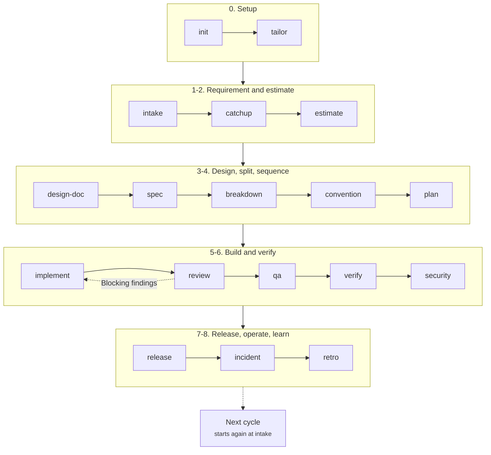

# AI Team Kit (`atk`)

Twenty-three skills covering the software delivery lifecycle of a **company project team**. Every skill
assumes work has an author and a separate reviewer, decisions have an owner, and artifacts are read
by someone who was not in the conversation that produced them. Those are roles rather than a
headcount: a solo developer holding all of them gets the same gates, and still approves by hand.

Compatible with Claude Code, Cursor, and OpenAI Codex CLI.

Walkthrough of what each skill means and when to use it:
[docs/skills-overview.md](docs/skills-overview.md) (English) /
[docs/vi/skills-overview.md](docs/vi/skills-overview.md) (Tiếng Việt).

## Lifecycle



Three skills answer an event rather than a phase: `fix` when a defect is reported, at any point;
`onboard` when someone joins; `handover` when someone leaves or a phase ends. `help` answers a
question instead: which of the others to run, read from the state of the project.

How the phases map to roles and approval gates: [docs/flow/project-flow.md](docs/flow/project-flow.md)
([Tiếng Việt](docs/vi/flow/project-flow.md)). What each skill consumes and produces:
[docs/flow/skill-chain.md](docs/flow/skill-chain.md)
([Tiếng Việt](docs/vi/flow/skill-chain.md)). How one skill runs and when it reaches for another:
[docs/flow/skill-lifecycle.md](docs/flow/skill-lifecycle.md)
([Tiếng Việt](docs/vi/flow/skill-lifecycle.md)).

Run `/atk:init` when a team first installs the kit in a project, and again when the project has
moved on from what the profile says. It writes `.atk/profile.md`, the file the skills that touch code
read to learn this project's test, build and lint commands, its layer layout, and who approves what.

## Skills

| Skill | What it produces |
|-------|------------------|
| `atk:help` | No file: the skill to run next with the line to type, the evidence in the project behind it, what that skill needs first, who approves what it produces, and what is still waiting on a named approver. Also routes a question to one skill, or explains one skill. |
| `atk:init` | The project profile at `.atk/profile.md`: commands, layer layout, docs roots, tracker, and who approves what, detected from the repository first and asked about only where no file answers. |
| `atk:tailor` | What this team wants a skill to do differently, written to `.atk/overrides/<skill>.md` in the project rather than edited into the kit, with the role that owns the output named as approver. |
| `atk:intake` | A raw request, or a Figma design, turned into user stories, testable acceptance criteria, non-goals, and open questions with an owner each. |
| `atk:catchup` | A brief for someone who was not in the conversation: scope in and out, what the work touches and where it is in the code, who decides, the unfamiliar terms, and the understanding check a developer answers before writing code. |
| `atk:estimate` | Sizes with a stated basis and confidence, net capacity after leave and ceremonies, a sprint commitment, and the overflow that did not fit. |
| `atk:design-doc` | A technical design reviewable without a meeting: cited current state, compared options, data and API changes, rollback, plus the ADR. With `--spike`, a time-boxed investigation of the one question a design cannot choose without, ending in a recommendation for the Tech Lead. With `--challenge`, one agent per signing role raises objections against the draft before the real reviewers see it. |
| `atk:spec` | Reference documents that stay true: the API contract per resource, the schema per table, the behaviour per feature, and the components of each screen read from its Figma design, updated in place and checked against the code, and the design, for drift. |
| `atk:breakdown` | An epic split into owned tasks with a dependency graph, parallel lanes with file ownership, and a definition of done per task. |
| `atk:convention` | The team's real conventions derived from the code, grouped by each language and technology it detects, each classified as enforced by tooling, checked in review, or merely aspirational. A project with nothing written gets one standards document per technology under `docs/standards/`. With `--suggest` it also proposes rules from published standards for that stack, each one waiting for the Tech Lead. Offers to draft the collaboration files the project has none of, and writes only the ones you pick. |
| `atk:plan` | Phases that each end in something reviewable, steps inside a phase that leave the tree working, what every step touches and how it is checked, and what is out of scope. Reads the written plan back against the repository, and reviews one somebody else wrote. |
| `atk:implement` | The code, written to the project's own conventions and reference modules, verified layer by layer with the project's own commands, and put through review before handover. |
| `atk:fix` | The failure captured verbatim, the cause proven before a line changes, a stop after three ruled-out hypotheses rather than a guess, the smallest change that removes it, and a report of what was checked and what was not. |
| `atk:review` | A pull request reviewed against requirement, design, and conventions, with blocking findings separated from preferences, written to a report and summarised in the session. |
| `atk:qa` | A test plan, test cases traced to acceptance criteria, negative and boundary coverage, a justified regression matrix, and entry and exit criteria. |
| `atk:verify` | The feature exercised against a running system, side effects asserted in the data rather than the status code, and escalation by name after three rounds. |
| `atk:security` | A security record a Tech Lead can sign and a client can read: assets and trust boundaries, the project's own scanners run, threats walked per boundary, every finding traced from entry point to impact, a client or company checklist answered item by item, and residual risk left for a named person to accept. Also the threat model of a feature, kept current. |
| `atk:git` | Finished work carried into the repository: the diff read before anything is staged, a scan that stops on a credential, commits that revert one at a time, and push, pull request and merge each behind a yes given for that action. |
| `atk:release` | Release notes per audience, a checklist with an owner per step, migration reversibility, and a rollback path written before the deploy. |
| `atk:incident` | A timestamped incident timeline, a root cause supported by evidence, a blameless postmortem, follow-up actions with owners, and the runbook. |
| `atk:retro` | Last retro's actions verified first, sprint evidence from git and the tracker, at most three new actions, and the status report. |
| `atk:onboard` | Setup verified against the repository, an access list with who grants what, a code map by owner, and a first week ending in the contribution the joiner's role makes. |
| `atk:handover` | In-flight work with its true state, the decisions and traps that live in one head, access transfer, and a receiver who validates before signing. |

## Invocation

Every skill is its own slash command, namespaced `atk:`. There is no separate command layer.

```bash
/atk:help [question|skill]                # --lang
/atk:init                                 # --audit --lang --out
/atk:tailor [<skill>]                     # --audit --feedback --out
/atk:intake <request-file|ticket|text>    # --design --interview|--no-interview --lang --out
/atk:catchup <epic-url|pr-url>            # --no-check --lang --out
/atk:estimate <backlog|epic>              # --points|--days --sprint --capacity --out
/atk:design-doc <requirement|topic>       # --adr|--no-adr --options --spike --challenge --lang --out
/atk:spec [subject]                       # --kind --from --design --sync --check --lang --out
/atk:breakdown <design|epic>              # --members --parallel --tdd --out
/atk:convention                           # --audit|--init|--sync|--scaffold --suggest --scope --lang --out
/atk:plan <ticket|design|text|plan-path>  # --inline --review --comment --layer --out
/atk:implement <plan|ticket|description>  # --layer --tdd --no-review --out
/atk:fix <issue|report|description>       # --layer --investigate-only --out
/atk:review <pr|branch|paths>             # --against --comment --strict --parallel --out
/atk:qa <requirement|feature|cases>       # --plan|--cases|--regression|--update --lang --out
/atk:verify <module|paths|ticket>         # --ui --report-only --out
/atk:security <branch|range|paths>        # --threat-model --checklist --lang --out
/atk:git                                  # --commit|--pr|--merge|--rebase|--resolve|--stack --lang --out
/atk:release <version|range>              # --notes|--checklist --audience --env --out
/atk:incident                             # --live|--postmortem|--runbook --out
/atk:retro <sprint|range>                 # --data-only|--report --audience --lang --out
/atk:onboard                              # --role --refresh|--audit --lang --out
/atk:handover --from <a> --to <b>         # --scope --phase|--offboard --lang --out
```

## Where the output goes

Artifacts are Markdown, written into the **target project** under `docs/`, one folder per lifecycle
stage. The full path table, the naming rules, and the shared front matter live in
[shared/artifact-paths.md](shared/artifact-paths.md).

Not every artifact has the same fate. A reference document is updated in place forever, a record is
never edited and rarely deleted, and one directory is safe to delete or leave out of git entirely.
Which is which, what each deletion costs, and the three policies a team can choose between:
[docs/artifact-lifecycle.md](docs/artifact-lifecycle.md)
([Tiếng Việt](docs/vi/artifact-lifecycle.md)).

`atk` is tool-agnostic: the Markdown artifact is the source of truth and a tracker holds a pointer
to it. [shared/ticket-adapters.md](shared/ticket-adapters.md) maps the vocabulary to GitHub Issues,
Jira, Backlog, and Redmine, and no skill creates tickets without showing the list and getting a yes.

The role vocabulary every skill shares is in [shared/team-roles.md](shared/team-roles.md).

The skills that touch code read one file that the kit does not ship for the project it is installed
into: `.atk/profile.md`, written by `/atk:init` into the target project and committed with it.
`atk:implement`, `atk:fix` and `atk:verify` stop without it rather than guess a test command.
`atk:plan` continues and says in the artifact which commands and paths it had to infer. Every other
skill runs without it. What the profile holds, which skills are meant to degrade rather than stop,
and why the kit's own copy of that file travels with an install without ever being read for your
project, is in [shared/project-profile.md](shared/project-profile.md).

`atk:convention` and `atk:review` share one more file,
[shared/review-checklist.md](shared/review-checklist.md), so a team rule is written once and
enforced in the same words: `convention` records each rule with an ID and a default severity, and
`review` cites that ID in its findings instead of restating the rule from memory.

Where the harness offers capabilities of its own, the skills use them. `atk:implement`, `atk:fix`
and `atk:verify` tidy a change through the host's code clean-up capability, `/simplify` in Claude
Code, after the verification passes and before anyone reviews it; `atk:review` puts several
independent passes over a large diff when the host can run agents in parallel, and
`atk:design-doc --challenge` puts one agent per signing role over a draft design. None of it is
required: on a harness without them the step runs by hand, against the same list in
[shared/tidy-pass.md](shared/tidy-pass.md), and the artifact says which way it ran. The rules are in
[shared/host-capabilities.md](shared/host-capabilities.md).

## Installation

### Claude Code

```bash
/plugin marketplace add lamngockhuong/aiteamkit
/plugin install atk@atk
```

### Cursor

In Cursor Agent chat:

```
/add-plugin atk
```

### OpenAI Codex CLI

Open plugin search with `/plugins`, search for "atk", then Install Plugin.

## Local development install

```bash
git clone https://github.com/lamngockhuong/aiteamkit
cd aiteamkit
/plugin marketplace add .
/plugin install atk@atk
```

## Relationship to other kits

`atk` stands on its own. Every skill runs on what the kit ships plus the project it was installed
into, and no skill hands work to a command from another kit. Where a skill stops, its `## Scope`
section names the `atk` skill that takes over, or says the work belongs to a person.

Installing `atk` beside another kit is fine. Neither needs to know about the other.

## License

MIT. See [LICENSE](LICENSE).
