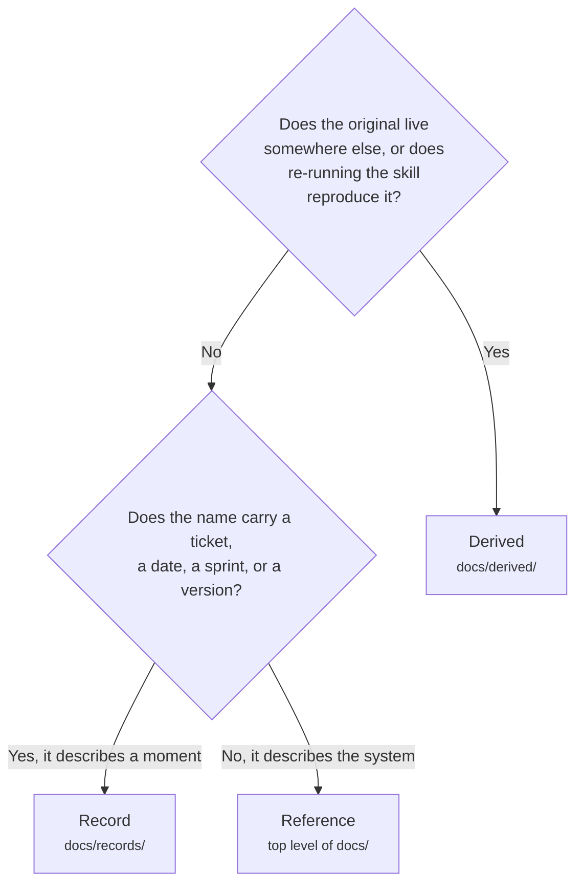

# Artifact Lifecycle

Every skill in this kit that writes a file writes Markdown into your repository, with one exception
named below; `atk:help` writes nothing, because it answers in the session. A team adopting `atk`
asks two questions in its first week: do we commit all of this, and may we delete any of it later. This
document answers both and says what each answer costs, so the team decides rather than guesses.

Where each artifact is written is in [shared/artifact-paths.md](../shared/artifact-paths.md), and
that file is the authority whenever the two disagree. This one is about what happens to a file after
the work that produced it is merged.

## Three questions place any artifact

The deciding question is not what a document is about. It is whether the document is the only copy
of something, and whether it claims to describe the present.

## The three groups

| Group | What is in it | Commit | Change it later | Delete it later |
|-------|---------------|--------|-----------------|-----------------|
| Reference | `docs/api/`, `docs/database/`, `docs/features/`, `docs/screens/`, `docs/qa/`, `docs/security/`, `docs/standards/` and `docs/conventions.md`, the onboarding documents, `docs/runbooks/`, `.atk/profile.md`, `.atk/overrides/` | Yes, except under the `workspace` shape, where the project root belongs to no repository and nothing tracks them | Always, in place | No. It is the only statement of what the system does today, or, under `Contract: first`, is agreed to do |
| Record | everything under `docs/records/`, plus `docs/adr/` | Yes | No. Supersede it instead | Only as a decision somebody owns, never as a blanket rule |
| Derived | everything under `docs/derived/` | Optional | Run the skill again | Yes, freely |

## The three files that are not in any group

`atk:convention` can draft `CONTRIBUTING.md`, a pull request template, and `CODEOWNERS`, and only
when you pick them. These are not artifacts of the kit and no group above classifies them. They are
your project's own collaboration files, the way your linter config is: your code host reads them,
people who never installed `atk` are bound by them, and one of them is not Markdown.

What that means in practice is short. **Commit them**, always. Change them whenever the team decides
to, in place, by hand or through another run of the skill that drafted them. Deleting one costs
whatever the host stops doing for you: no template means reviewers see a diff and nothing else, and
no `CODEOWNERS` means reviews stop routing themselves.

## A record that names an open vulnerability

A security record written by `atk:security` is a record like any other, committed and never edited,
with one difference: until its findings are fixed, it tells whoever reads it where the system is
weak. Commit it where the people allowed to know can read it and nobody else can. In a repository the
client or the public can read, that may mean a private repository or the team's private tracker
instead, and the skill asks its approver before the commit rather than after. Once every finding in
it is fixed or accepted, it is an ordinary record again.

## What deleting each one costs

**Reference.** You lose the answer to "what does this endpoint do today", and the team goes back to
reading the implementation to find out. That is the cost the reference document exists to remove.
Nothing else in the repository makes the same claim, which is also why a stale line in one of these
is wrong rather than merely old.

**Record.** You lose the answer to "why is it built like this". Code does not carry that, and a
reference document has no room for the option that lost. The question comes back in concrete forms:
a newcomer proposes the approach a design already rejected for a reason nobody can now name; a
client asks what shipped in version 1.4.2; an auditor asks for the postmortem and the follow-up
actions; the person who handed over left six months ago and their handover file was the only thing
that survived them.

**Derived.** Nothing. The implementation record and the shipping record are copies of what lives on
the pull request, a feedback record is a copy of what was filed on the kit repository, a catchup
brief is rebuilt by running `atk:catchup` again, a review report by running `atk:review` again, or
`atk:plan --review` where what was reviewed was a plan, or `atk:qa --review` where it was a cases
file, and a setup-defect report by running
`atk:onboard` again against the repository as it stands then. Any of those review runs, made
without a `--comment`, posts nothing to the pull request, so until it is rebuilt its report is the
only written copy: a reason to keep the directory, not a reason to fear deleting it. Four skills
read one of the six, and all four read the review report: a second `atk:review` over the same target
reads the one already there, to carry its finding identifiers forward, and numbers from 1 and says so
when there is none; `atk:plan --review` reads the one already there for the same plan, for the same
identifiers and to tell a result the author has already declined from one a week of commits has just
created; `atk:qa --review` reads the newest one for the same cases file, for the same identifiers;
and `atk:convention` reads its `Convention gaps` section, which is how a rule the review
wanted reaches the file that records it. Deleting that report costs the next review a set of
identifiers and the gaps it would have carried across, not a step in the chain.

## Git history is not a fallback

Deleting a file from the working tree and relying on `git log` to recover it sounds safe and is not.
Finding it again requires knowing that such a file once existed and guessing what it was called.
Somebody who joined last month searches the tree, finds nothing, and concludes that nobody ever
considered the question.

ADRs fail this way most visibly. Their numbers are never reused, so a gap in the sequence is a
decision that vanished without leaving a note saying what it had decided.

## The one directory you may leave untracked

`docs/derived/` is the only part of the tree the kit says a project may keep out of git. One line in
`.gitignore` and the copies stop accumulating. Nothing in the skill chain breaks, because every
original is still on the pull request or a single command away.

Do not extend the same line to `docs/records/`, for two reasons that have nothing to do with disk
space:

- **An uncommitted artifact cannot be approved.** Every artifact carries a `status` and an approver
  who is not its author. A requirement document sitting at `IN REVIEW` on one laptop is not in
  review; nobody else can see it.
- **Skills read records while the work is in flight.** `atk:qa` traces test cases back to the
  acceptance criteria in the requirement document, `atk:breakdown` reads the design, and
  `atk:review` checks the change against both. A rule that hides the directory cannot tell this
  sprint's documents from the ones three years old.

## Retiring a record without deleting it

A record that has been replaced keeps its content and takes `status: SUPERSEDED`, with a link to
what replaced it and a link back. The content stays true about the moment it describes; only its
claim to be current is withdrawn. Two files that both read as current is the failure this prevents,
and it costs two links.

Use this whenever a second design covers ground the first one covered, or a requirement is rewritten
after the scope was renegotiated. It is the answer to "this file is out of date", and it is a better
answer than deletion because it survives the question "was this ever considered".

## Three policies a team can adopt

| Policy | What it is for | What it gives up |
|--------|----------------|------------------|
| Commit everything | The default. Teams with clients, audits, turnover, or anyone who will read the repository without having been in the conversation | Nothing, at the price of a larger docs tree |
| Commit everything except `docs/derived/` | Teams whose review and implementation history already lives on the pull request and who do not want a second copy in the repository | The local copies. Reading them means opening the pull request |
| Prune records case by case | A repository old enough that some records are genuinely dead, for example a design for a module that no longer exists | Requires a person to decide per file. It is not a scheduled job |

The third one is a decision, not a policy that can be automated. A rule that deletes every record
older than a year cannot tell a dead design from the postmortem that explains why an alarm exists.
If a directory has grown uncomfortable, sort it into years before sorting it into a bin.

## What this does not change

A project that already keeps these documents somewhere else keeps them there. The layout above is
the kit's default for an empty tree, not a migration to perform on a project that has been writing
to `docs/design/` for a year. Splitting one directory in half is worse than either shape, and
`atk` reads the project's own layout first.
