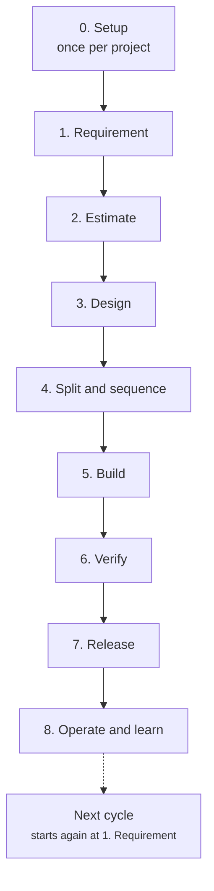
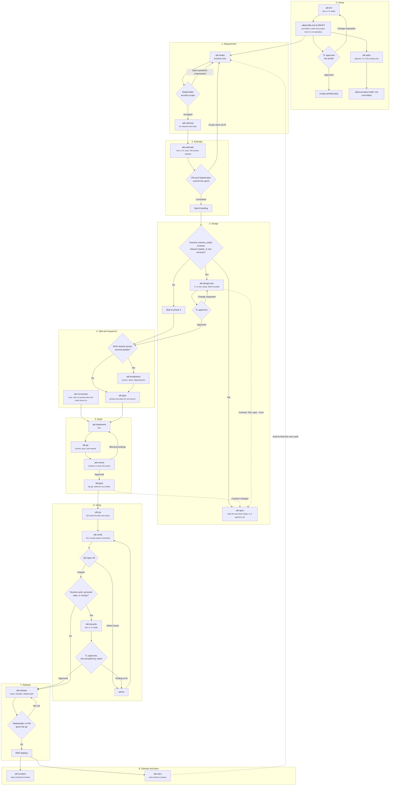
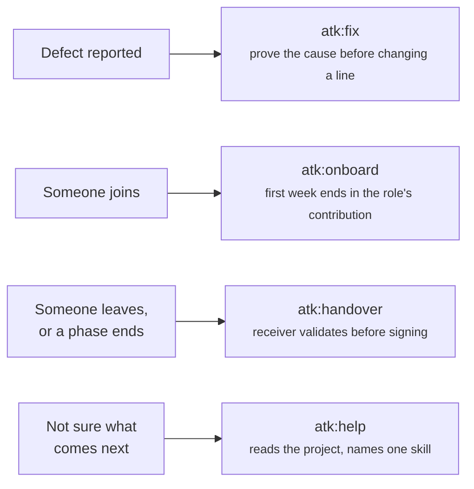

# Project Flow

How the 23 skills fall into a team's delivery cycle: which phase each one belongs to, who authors
its artifact, and who has to accept it before the next phase starts.

Companion documents: [skill-chain.md](./skill-chain.md) for what each skill consumes and produces,
[skill-lifecycle.md](./skill-lifecycle.md) for how one skill runs and when it reaches for another,
[../skills-overview.md](../skills-overview.md) for when to use a skill and when not to.

Roles are the ones in `shared/team-roles.md`: PM, BrSE/BA, TL, Dev, QA, SRE, and Stakeholder. A
small team maps several of them onto one person; the point of naming them separately is that the
author of an artifact and its approver are two entries, even when they resolve to the same face.

## Phase overview

## The cycle in detail

Every diamond is a person accepting or rejecting an artifact, never a skill deciding. A rejected
artifact goes back to its author, which is the loop each phase is drawn with.

## Phase reference

| Phase | Skill | Author | Accepted by | Artifact state at the gate |
|-------|-------|--------|-------------|-----------------------------|
| 0. Setup | `atk:init` | Dev or TL, with PM on the tracker and team sections | TL, before the profile stops being a draft; the skills it unblocks run meanwhile | `DRAFT` to `APPROVED`, committed at `DRAFT` unless a `workspace` shape leaves no repository to commit it to |
| 0. Setup | `atk:tailor` | TL, or whoever owns the skill's output | The role that owns what the tailored skill produces | `IN REVIEW` to `APPROVED` |
| 1. Requirement | `atk:intake` | BrSE/BA | Stakeholder, on scope and criteria | `IN REVIEW` to `APPROVED` |
| 1. Requirement | `atk:catchup` | Whoever joins | Nobody; the understanding check is self-marked | `DRAFT` |
| 2. Estimate | `atk:estimate` | Dev or TL on sizes, PM on capacity | PM and Stakeholder together | `IN REVIEW` to `APPROVED` |
| 3. Design | `atk:design-doc` | TL or Dev | TL, who owns the final technical call | `IN REVIEW` to `APPROVED` |
| 3. Design | `atk:spec` | Dev, and BrSE/BA for `screen` | TL for `api` and `db`, BrSE/BA for `feature` and `screen` | `IN REVIEW` to `APPROVED`, then updated in place forever |
| 4. Split | `atk:breakdown` | TL or PM | Dev owners accept their own tasks | `IN REVIEW` to `APPROVED` |
| 4. Sequence | `atk:plan` | Dev | The author, unless the plan gate raised it to TL | `DRAFT` |
| 4. Rules | `atk:convention` | TL | Team agreement, recorded per rule | `IN REVIEW` to `APPROVED` |
| 5. Build | `atk:implement` | Dev | The reviewer, in the next row | n/a |
| 5. Build | `atk:review` | Reviewer, never the author | TL when the loop hits its ceiling | n/a |
| 5. Build | `atk:git` | Dev | The reviewer, who approves the pull request it opens | n/a |
| 6. Verify | `atk:qa` | QA | QA lead or TL | `IN REVIEW` to `APPROVED` |
| 6. Verify | `atk:qa --run`, `--retest` | QA who ran the cases | QA lead or TL | `IN REVIEW` to `APPROVED` |
| 6. Verify | `atk:verify` | Dev or QA | QA sign-off before the ticket moves | `DRAFT` |
| 6. Verify | `atk:security` | Dev or TL | TL, or the security officer where the team has one; each unfixed finding accepted by the PM or the Stakeholder | `IN REVIEW` to `APPROVED` |
| 7. Release | `atk:release` | PM with SRE | Stakeholder or PM gives the go decision | `IN REVIEW` to `APPROVED` |
| 8. Operate | `atk:incident` | Incident Commander | TL and PM on the follow-up actions | `IN REVIEW` to `APPROVED` |
| 8. Learn | `atk:retro` | PM or the team | The team, on the three actions | `IN REVIEW` to `APPROVED` |

## By role

The same gates read from the other side: what a person in each role writes, what waits on their
acceptance, and where a skill asks them to read or answer without owning the artifact. All three
columns draw on both the phase reference above and each skill's own `## Roles` section. Anyone can
run `atk:help`, and it is in no row.

| Role | Authors | Accepts | Reviews or answers in |
|------|---------|---------|------------------------|
| PM | `estimate` capacity, with TL and Dev on sizes; `breakdown`, or TL; `release`, with SRE; `retro`, or the team | `estimate`, with the Stakeholder; the go in `release`, or the Stakeholder; the follow-up actions in `incident`, with TL; an unfixed finding in `security`, or the Stakeholder; a `tailor` override of `intake`, `estimate`, `breakdown`, `release`, or `retro` | `init` tracker and team sections, which PM writes; `intake`, which PM leads with BrSE/BA; `catchup`, answering what a newcomer asks; `qa` exit criteria; `incident` client communication; access in `onboard` and `handover` |
| BrSE/BA | `intake`; `spec` of kind `screen` | `spec` of kinds `feature` and `screen`; a `tailor` override of `design-doc` or `spec` | `catchup`, answering what a newcomer asks; `design-doc`, that it still meets the requirement; `qa`, that the cases match the intent |
| TL | `init`, or Dev; `tailor`; `estimate` sizes, with Dev; `design-doc`, or Dev; `breakdown`, or PM; `convention`; `security`, or Dev | `init`; `design-doc`; `spec` of kinds `api` and `db`; `plan`, when it touches a schema, a public contract, or two services; `qa`, or the QA lead; `security`, unless the team has a security officer; the follow-up actions in `incident`, with PM; a `tailor` override of any skill not listed for PM, BrSE/BA, or QA, and any override touching how code is written or reviewed | `intake` feasibility; `implement`, at the large gate and the review ceiling; `fix`, when the intent check stops; `review`, on a disputed blocking finding; `verify`, at the ceiling; `release` technical risk; `incident` root cause; a buddy for `onboard`; gaps in `handover` |
| Dev | `init`, or TL; `estimate` sizes; `design-doc`, or TL; `spec`; `plan`; `implement`; `fix`; `review` of someone else's change; `verify`, or QA; `security`, or TL; `git` | Their own tasks in `breakdown`; their own `plan`, below the TL boundary | `catchup`, as the reader who takes the understanding check; `convention`, agreeing rule by rule; `qa` handoff and test data |
| QA | `qa`, the plan, the cases, and the run records of the cases they ran; `verify`, or Dev; its own test effort in `estimate` | `qa`, as QA lead, run records included; the sign-off in `verify` before the ticket moves; a `tailor` override of `qa` | `intake`, that each criterion is testable; `catchup`, as a reader joining work in flight; its own test tasks in `breakdown`; `fix`, that the symptom is gone against the reproduction; `review` test adequacy; `security`, read at sign-off; `release` test result |
| SRE | `release`, with PM | Nothing in the cycle | `design-doc` deployment, data, and capacity; `verify` environment; `security` configuration, infrastructure, and secrets; `release` execution and rollback; `incident` mitigation |
| Stakeholder | Nothing in the cycle | `intake` scope and criteria; `estimate`, with PM; the go in `release`, or PM; an unfixed finding in `security`, or PM | Open questions `intake` names them against |

Some skills name a person by what they are doing, whatever their role: whoever joins reads
`catchup` and walks through `onboard`, the leaver writes `handover` and the receiver accepts it, the
Incident Commander writes `incident`, and the whole team accepts the actions in `retro`.

## Outside the cycle

Three skills answer an event rather than a phase, and one answers a question. All four can fire at
any point above.

`atk:help` has no gate and no approver, because it writes no artifact. It reads the gates above
instead: an artifact still `IN REVIEW` is reported as waiting on its approver, never as ready for the
next phase.

`atk:fix` is the one that reaches back into the cycle: a defect found in phase 6 returns to phase 6
after the fix, and one found after release opens phase 8 instead.

`atk:git` is drawn in phase 5 because that is where most work reaches a pull request, but it is not
tied to the phase. Every skill that finishes something hands off to it, so an artifact written in
phase 1 and a fix made in phase 8 both close the same way.

`atk:spec` is drawn in phase 3 because that is where a team first writes down what an area does, but
the dotted edge from the merge is the one that fires most often. A change altering a contract carries
its reference document in the same pull request, per `shared/spec-docs.md`, which is why the document
outlives the phase it was first written in. Under `Contract: first` phase 3 is also where it is
written from the design while that design is in review, so the contract and the decision are
reviewed together and the phases after it build against the same page.

## What this flow does not say

It does not set your sprint length, your branch strategy, or who your approvers are by name. Those
are team decisions, and the kit records them rather than choosing them: approvers per artifact type
go in `.atk/profile.md` (see `shared/project-profile.md`), and branch and commit rules are whatever
`atk:convention` finds in the repository.
