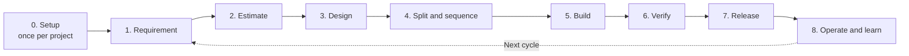
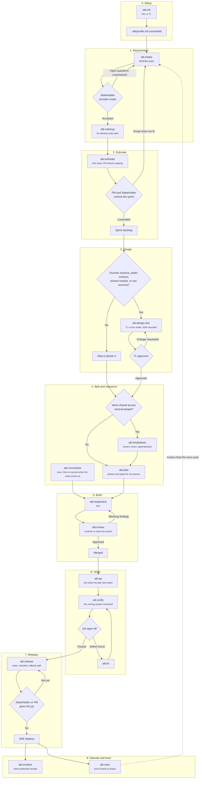
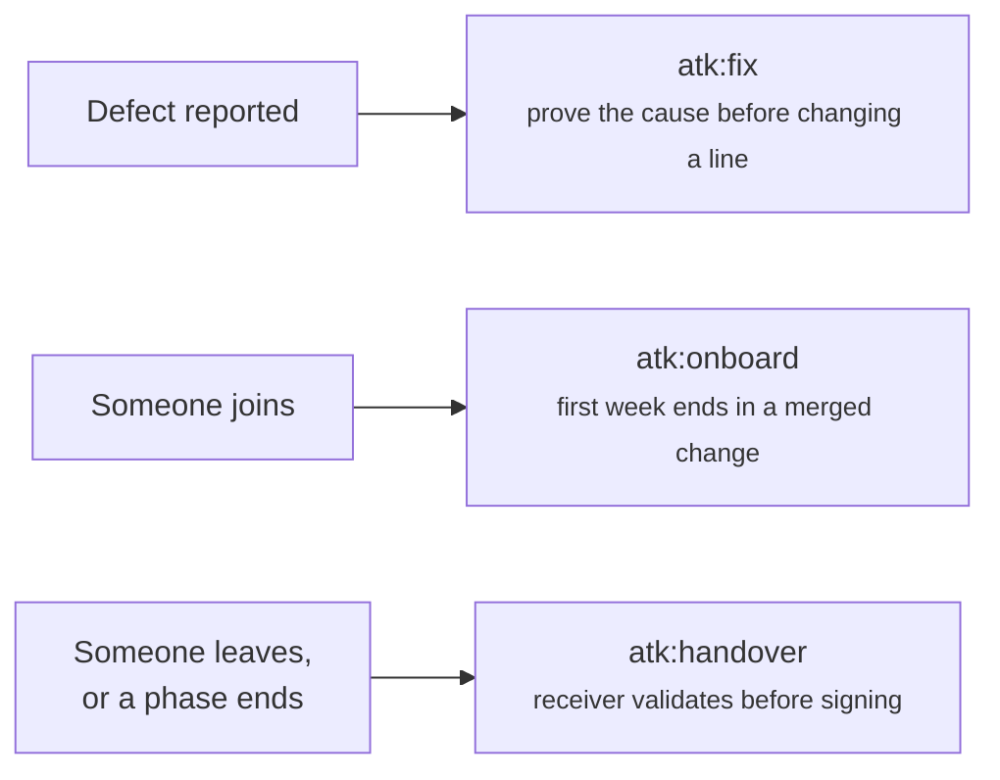

# Project Flow

How the 18 skills fall into a team's delivery cycle: which phase each one belongs to, who authors
its artifact, and who has to accept it before the next phase starts.

Companion documents: [skill-chain.md](./skill-chain.md) for what each skill consumes and produces,
[../skills-overview.md](../skills-overview.md) for when to use a skill and when not to.

Roles are the ones in `shared/team-roles.md`: PM, BrSE/BA, TL, Dev, QA, SRE, and Stakeholder. A
small team maps several of them onto one person; the point of naming them separately is that the
author of an artifact and its approver are two entries, even when they resolve to the same face.

## Phase overview

## The cycle in detail

Every diamond is a person accepting or rejecting an artifact, never a skill deciding. A rejected
artifact goes back to its author, which is the loop each phase is drawn with.

## Phase reference

| Phase | Skill | Author | Accepted by | Artifact state at the gate |
|-------|-------|--------|-------------|-----------------------------|
| 0. Setup | `atk:init` | Dev or TL | Committed with the repository, no separate approval | n/a |
| 1. Requirement | `atk:intake` | BrSE/BA | Stakeholder, on scope and criteria | `IN REVIEW` to `APPROVED` |
| 1. Requirement | `atk:catchup` | Whoever joins | Nobody; the understanding check is self-marked | `DRAFT` |
| 2. Estimate | `atk:estimate` | Dev, with PM on capacity | PM and Stakeholder together | `IN REVIEW` to `APPROVED` |
| 3. Design | `atk:design-doc` | TL or Dev | TL, who owns the final technical call | `IN REVIEW` to `APPROVED` |
| 4. Split | `atk:breakdown` | TL or PM | Dev owners accept their own tasks | `IN REVIEW` to `APPROVED` |
| 4. Sequence | `atk:plan` | Dev | The author, unless the plan gate raised it to TL | `DRAFT` |
| 4. Rules | `atk:convention` | TL | Team agreement, recorded per rule | `IN REVIEW` to `APPROVED` |
| 5. Build | `atk:implement` | Dev | The reviewer, in the next row | n/a |
| 5. Build | `atk:review` | Reviewer, never the author | TL when the loop hits its ceiling | n/a |
| 6. Verify | `atk:qa` | QA | QA lead or TL | `IN REVIEW` to `APPROVED` |
| 6. Verify | `atk:verify` | Dev or QA | QA sign-off before the ticket moves | `DRAFT` |
| 7. Release | `atk:release` | PM with SRE | Stakeholder or PM gives the go decision | `IN REVIEW` to `APPROVED` |
| 8. Operate | `atk:incident` | Incident Commander | TL and PM on the follow-up actions | `IN REVIEW` to `APPROVED` |
| 8. Learn | `atk:retro` | PM or the team | The team, on the three actions | `IN REVIEW` to `APPROVED` |

## Outside the cycle

Three skills answer an event rather than a phase, and can fire at any point above.

`atk:fix` is the one that reaches back into the cycle: a defect found in phase 6 returns to phase 6
after the fix, and one found after release opens phase 8 instead.

## What this flow does not say

It does not set your sprint length, your branch strategy, or who your approvers are by name. Those
are team decisions, and the kit records them rather than choosing them: approvers per artifact type
go in `.atk/profile.md` (see `shared/project-profile.md`), and branch and commit rules are whatever
`atk:convention` finds in the repository.
