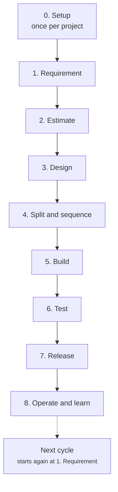
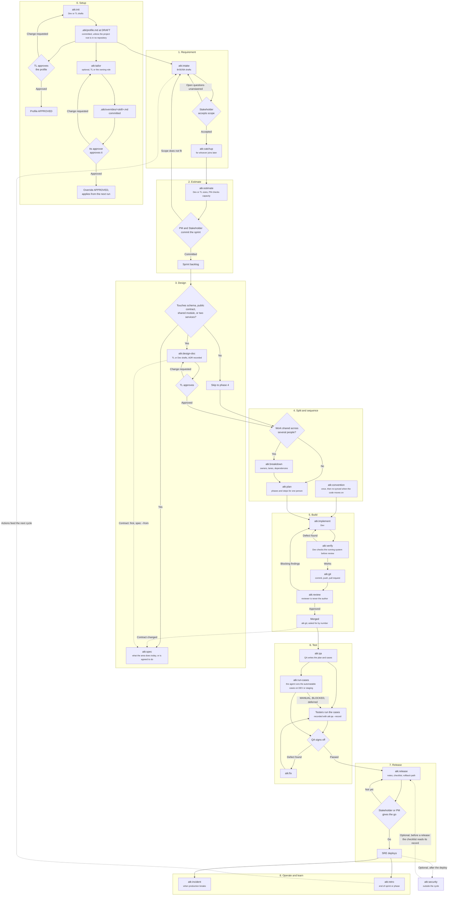
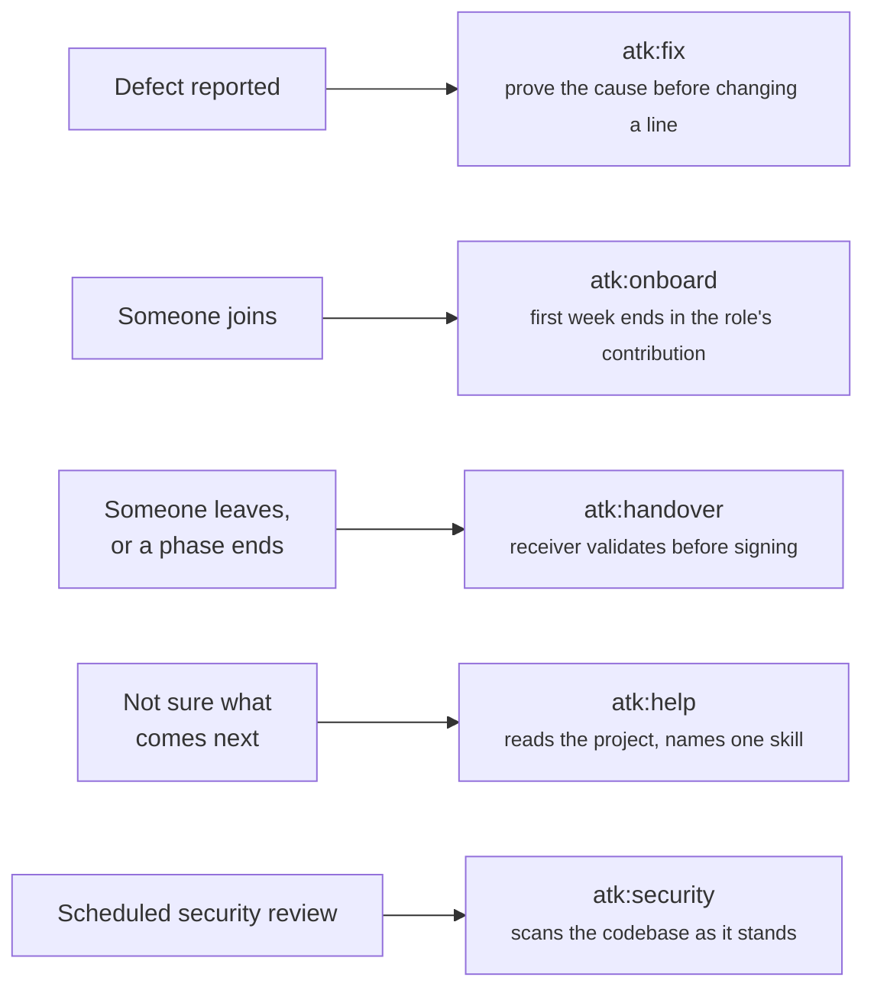

# Project Flow

How the 24 skills fall into a team's delivery cycle: which phase each one belongs to, who authors
its artifact, and who has to accept it before the next phase starts.

Companion documents: [skill-chain.md](./skill-chain.md) for what each skill consumes and produces,
[skill-lifecycle.md](./skill-lifecycle.md) for how one skill runs and when it reaches for another,
[../skills-overview.md](../skills-overview.md) for when to use a skill and when not to.

Roles are the ones in `plugins/atk/shared/team-roles.md`: PM, BrSE/BA, TL, Dev, QA, SRE, and Stakeholder. A
small team maps several of them onto one person; the point of naming them separately is that the
author of an artifact and its approver are two entries, even when they resolve to the same face.

## Phase overview

```mermaid
flowchart TD
    P0["0. Setup<br/>once per project"] --> P1["1. Requirement"]
    P1 --> P2["2. Estimate"]
    P2 --> P3["3. Design"]
    P3 --> P4["4. Split and sequence"]
    P4 --> P5["5. Build"]
    P5 --> P6["6. Test"]
    P6 --> P7["7. Release"]
    P7 --> P8["8. Operate and learn"]
    P8 -.-> NC["Next cycle<br/><small>starts again at 1. Requirement</small>"]
```

## The cycle in detail

Every diamond is a person accepting or rejecting an artifact, never a skill deciding. A rejected
artifact goes back to its author, which is the loop each phase is drawn with.

```mermaid
flowchart TD
    subgraph S0["0. Setup"]
        I0["atk:init<br/><small>Dev or TL drafts</small>"] --> I1[".atk/profile.md at DRAFT<br/><small>committed, unless the project root is in no repository</small>"]
        I1 --> IA{"TL approves<br/>the profile"}
        IA -->|Change requested| I0
        IA -->|Approved| IP["Profile APPROVED"]
        I1 --> I2["atk:tailor<br/><small>optional, TL or the owning role</small>"]
        I2 --> I3[".atk/overrides/&lt;skill&gt;.md committed"]
        I3 --> IB{"Its approver<br/>approves it"}
        IB -->|Change requested| I2
        IB -->|Approved| IO["Override APPROVED,<br/>applies from the next run"]
    end

    subgraph S1["1. Requirement"]
        R0["atk:intake<br/><small>BrSE/BA drafts</small>"] --> R1{"Stakeholder<br/>accepts scope"}
        R1 -->|Open questions unanswered| R0
        R1 -->|Accepted| R2["atk:catchup<br/><small>for whoever joins later</small>"]
    end

    subgraph S2["2. Estimate"]
        E0["atk:estimate<br/><small>Dev or TL sizes, PM checks capacity</small>"] --> E1{"PM and Stakeholder<br/>commit the sprint"}
        E1 -->|Scope does not fit| R0
        E1 -->|Committed| E2["Sprint backlog"]
    end

    subgraph S3["3. Design"]
        D0{"Touches schema, public contract,<br/>shared module, or two services?"}
        D0 -->|No| N0["Skip to phase 4"]
        D0 -->|Yes| D1["atk:design-doc<br/><small>TL or Dev drafts, ADR recorded</small>"]
        D1 --> D2{"TL approves"}
        D2 -->|Change requested| D1
        D3["atk:spec<br/><small>what the area does today, or is agreed to do</small>"]
    end

    subgraph S4["4. Split and sequence"]
        B0{"Work shared across<br/>several people?"}
        B0 -->|Yes| B1["atk:breakdown<br/><small>owners, lanes, dependencies</small>"]
        B0 -->|No| B2["atk:plan<br/><small>phases and steps for one person</small>"]
        B1 --> B2
        C0["atk:convention<br/><small>once, then re-synced when the code moves on</small>"]
    end

    subgraph S5["5. Build"]
        M0["atk:implement<br/><small>Dev</small>"] --> MV["atk:verify<br/><small>Dev checks the running system before review</small>"]
        MV -->|Defect found| M0
        MV -->|Works| MG["atk:git<br/><small>commit, push, pull request</small>"]
        MG --> M1["atk:review<br/><small>reviewer is never the author</small>"]
        M1 -->|Blocking findings| M0
        M1 -->|Approved| M2["Merged<br/><small>atk:git, asked for by number</small>"]
    end

    subgraph S6["6. Test"]
        V0["atk:qa<br/><small>QA writes the plan and cases</small>"] --> V1["Testers run the cases<br/><small>recorded with atk:qa --record</small>"]
        V0 --> VR["atk:run-cases<br/><small>the agent runs the automatable cases on DEV or staging</small>"]
        V1 --> V2{"QA signs off"}
        VR --> V2
        VR -->|MANUAL, BLOCKED, deferred| V1
        V2 -->|Defect found| F0["atk:fix"]
        F0 --> V1
    end

    subgraph S7["7. Release"]
        L0["atk:release<br/><small>notes, checklist, rollback path</small>"] --> L1{"Stakeholder or PM<br/>gives the go"}
        L1 -->|Not yet| L0
        L1 -->|Go| L2["SRE deploys"]
    end

    subgraph S8["8. Operate and learn"]
        O0["atk:incident<br/><small>when production breaks</small>"]
        O1["atk:retro<br/><small>end of sprint or phase</small>"]
    end

    I1 --> R0
    R2 --> E0
    E2 --> D0
    N0 --> B0
    D2 -->|Approved| B0
    C0 --> M0
    B2 --> M0
    D0 -->|Yes| D3
    M2 -.->|Contract changed| D3
    D1 -.->|Contract: first, spec --from| D3
    M2 --> V0
    V2 -->|Passed| L0
    SC["atk:security<br/><small>outside the cycle</small>"] -.->|Optional, before a release:<br/>the checklist reads its record| L0
    L2 -.->|Optional, after the deploy| SC
    L2 --> O0
    L2 --> O1
    O1 -.->|Actions feed the next cycle| R0
```

## Phase reference

| Phase | Skill | Author | Accepted by | Artifact state at the gate |
|-------|-------|--------|-------------|-----------------------------|
| 0. Setup | `atk:init` | Dev or TL, with PM on the tracker and team sections | TL, before the profile stops being a draft; the skills it unblocks run meanwhile | `DRAFT` to `APPROVED`, committed at `DRAFT` unless a `workspace` shape leaves no repository to commit it to |
| 0. Setup | `atk:tailor` | TL, or whoever owns the skill's output | The role that owns what the tailored skill produces | `IN REVIEW` to `APPROVED` |
| 1. Requirement | `atk:intake` | BrSE/BA | Stakeholder, on scope and criteria | `IN REVIEW` to `APPROVED` |
| 1. Requirement | `atk:catchup` | Whoever joins | Nobody; the understanding check is self-marked | `DRAFT` |
| 2. Estimate | `atk:estimate` | Dev or TL on sizes, PM on capacity | PM and Stakeholder together | `DRAFT` while a capacity input is owed, then `IN REVIEW` to `APPROVED` |
| 3. Design | `atk:design-doc` | TL or Dev | TL, who owns the final technical call | `IN REVIEW` to `APPROVED` |
| 3. Design | `atk:spec` | Dev, and BrSE/BA for `screen` | TL for `api` and `db`, BrSE/BA for `feature` and `screen` | `IN REVIEW` to `APPROVED`, then updated in place forever |
| 4. Split | `atk:breakdown` | TL or PM | Dev owners accept their own tasks | `IN REVIEW` to `APPROVED` |
| 4. Sequence | `atk:plan` | Dev | The author, unless the plan gate raised it to TL | `DRAFT` |
| 4. Rules | `atk:convention` | TL | Team agreement, recorded per rule | `IN REVIEW` to `APPROVED` |
| 5. Build | `atk:implement` | Dev | The reviewer of the change, through `atk:review` | n/a |
| 5. Build | `atk:verify` | Dev | The reviewer of the change, before approving it | `IN REVIEW` to `APPROVED` |
| 5. Build | `atk:review` | Reviewer, never the author | TL when the loop hits its ceiling | n/a |
| 5. Build | `atk:git` | Dev | The reviewer, who approves the pull request it opens | n/a |
| 6. Test | `atk:qa` | QA | QA lead or TL | `IN REVIEW` to `APPROVED` |
| 6. Test | `atk:qa --record`, `--retest` | QA who ran the cases | QA lead or TL | `IN REVIEW` to `APPROVED` |
| 6. Test | `atk:run-cases` | QA who started the run | QA lead or TL | `IN REVIEW` to `APPROVED` |
| Any time: scheduled, or before or after a release | `atk:security` | Dev or TL | TL, or the security officer where the team has one; each unfixed finding accepted by the PM or the Stakeholder | `IN REVIEW` to `APPROVED` |
| 7. Release | `atk:release` | PM with SRE | Stakeholder or PM gives the go decision | `IN REVIEW` to `APPROVED` |
| 8. Operate | `atk:incident` | Incident Commander | TL and PM on the follow-up actions | `IN REVIEW` to `APPROVED` |
| 8. Learn | `atk:retro` | PM or the team | The team, on the three actions | `IN REVIEW` to `APPROVED` |

## By role

The table of what each role writes, accepts, and reviews is read by `atk:init` when it proposes
the `Approves` column of a profile, so it ships with the kit, in
[`plugins/atk/skills/init/references/role-defaults.md`](../../plugins/atk/skills/init/references/role-defaults.md),
and is written in English. Its columns are collected from each skill's own `## Roles` section.

## Outside the cycle

Four skills answer an event rather than a phase, and one answers a question. All five can fire at
any point above.

```mermaid
flowchart LR
    X1["Defect reported"] --> X2["atk:fix<br/><small>prove the cause before changing a line</small>"]
    X3["Someone joins"] --> X4["atk:onboard<br/><small>first week ends in the role's contribution</small>"]
    X5["Someone leaves,<br/>or a phase ends"] --> X6["atk:handover<br/><small>receiver validates before signing</small>"]
    X7["Not sure what<br/>comes next"] --> X8["atk:help<br/><small>reads the project, names one skill</small>"]
    X9["Scheduled security review"] --> X10["atk:security<br/><small>scans the codebase as it stands</small>"]
```

`atk:help` has no gate and no approver, because it writes no artifact. It reads the gates above
instead: an artifact still `IN REVIEW` is reported as waiting on its approver, never as ready for the
next phase.

`atk:fix` is the one that reaches back into the cycle: a defect found in phase 6 returns to phase 6
after the fix, and one found after release opens phase 8 instead.

`atk:security` is not a step every change passes through. A team runs it on a schedule against the
codebase as it stands, and may also run it around a release: before one that touches authentication,
personal data, payments, or an external integration, where `atk:release` reads its record while
drafting the checklist, and after the deploy. Those are the two dotted edges in the cycle diagram,
into the release of phase 7 and from the deploy, and both are optional. A finding it leaves to fix
goes to `atk:fix` like any other defect.

`atk:git` is drawn in phase 5 because that is where most work reaches a pull request, but it is not
tied to the phase. Every skill that finishes something hands off to it, so an artifact written in
phase 1 and a fix made in phase 8 both close the same way.

`atk:spec` is drawn in phase 3 because that is where a team first writes down what an area does, but
the dotted edge from the merge is the one that fires most often. A change altering a contract carries
its reference document in the same pull request, per `plugins/atk/shared/spec-docs.md`, which is why the document
outlives the phase it was first written in. Under `Contract: first` phase 3 is also where it is
written from the design while that design is in review, so the contract and the decision are
reviewed together and the phases after it build against the same page.

## What this flow does not say

It does not set your sprint length, your branch strategy, or who your approvers are by name. Those
are team decisions, and the kit records them rather than choosing them: approvers per artifact type
go in `.atk/profile.md` (see `plugins/atk/shared/project-profile.md`), and branch and commit rules are whatever
`atk:convention` finds in the repository.
