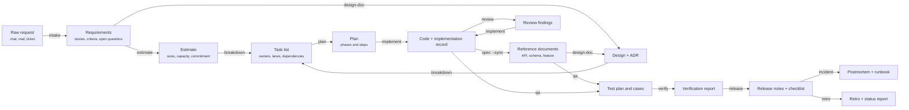

# Skill Chain

What each skill reads, what it leaves behind, and which skill picks that up next. The phases and the
approval gates between them are in [project-flow.md](./project-flow.md), and how one skill runs and
calls another is in [skill-lifecycle.md](./skill-lifecycle.md); this document is about the
artifacts.

Exact output paths are not repeated here. They live in one place, `shared/artifact-paths.md`, and
that file is the authority when the two disagree.

## The chain

Nodes are artifacts. Edge labels are the skill that turns one into the next.

Three skills sit beside the chain rather than in it, because they read the whole of it instead of
one link: `catchup` summarises any of these for a newcomer, `onboard` walks a new member through the
repository, and `handover` records the true state of everything still in flight.

Three more feed the chain without being produced by it: `init` writes the profile every
code-touching skill reads, `convention` writes the rules `implement` follows and `review` enforces,
and `tailor` writes the override file each skill reads before its first step.

`spec` is the one node the chain returns to rather than passes through. Its documents are an input to
the next design and the next test plan, and an output of every change that alters a contract, which
is why the arrow into them comes from the code rather than from the design that proposed it.

## What each skill consumes

| Skill | Reads | Produces | Next skill that uses it |
|-------|-------|----------|-------------------------|
| `init` | The repository | Project profile | Every skill that runs a command |
| `tailor` | A shipped `SKILL.md`, and what the team says it wants different | Project override for that skill | The skill it is named after |
| `intake` | A raw request | Requirements with open questions | `estimate`, `design-doc`, `qa` |
| `catchup` | An epic or a pull request | A brief plus an understanding check | The person, not a skill |
| `estimate` | Requirements or an epic | Sizes, capacity, sprint commitment | `breakdown` |
| `design-doc` | Requirements, and the reference documents for the area | Design plus ADR | `breakdown`, `plan`, `implement` |
| `spec` | The code, and the documents already in `docs/api/`, `docs/database/`, `docs/features/` | Reference documents kept current, or a drift report | `design-doc`, `qa`, `implement`, `review` |
| `breakdown` | A design or an epic | Owned tasks, lanes, dependency graph | `plan`, `implement` |
| `convention` | The code and its history | Conventions classified by how they are enforced | `implement`, `review` |
| `plan` | A ticket, design, or description | Phases and steps | `implement` |
| `implement` | A plan, ticket, or description | Code plus the record that becomes the PR body | `review`, `qa` |
| `fix` | A defect report | A proven cause and the smallest change | `verify`, `review` |
| `review` | A pull request or branch | Findings ranked blocking, should fix, nit | `implement`, `fix` |
| `qa` | Acceptance criteria and the change | Test plan, cases, regression matrix | `verify` |
| `verify` | The running system | What was proven, and what was not | `release` |
| `release` | The diff since the last version | Notes, checklist, rollback path | `incident`, `retro` |
| `incident` | Logs, metrics, the timeline | Postmortem plus runbook | `retro`, `fix` |
| `retro` | Git, the tracker, the team | Verified actions, evidence, status report | The next cycle |
| `onboard` | The repository and the access list | Setup, code map, first week | The new member |
| `handover` | Everything in flight | State, decisions, traps, access transfer | The receiver |

## Where a chain breaks

A link is only as good as the artifact behind it, and four breaks are common enough to name.

**No profile.** Skills that run the project's own commands stop and ask for `atk:init` rather than
guessing a test command. Skills that only read a diff carry on and record that the profile was
absent. `shared/project-profile.md` says which skill does which.

**An artifact that was never approved.** A design at `DRAFT` is a proposal, and building from it
means the first review comment is about the design. Check the `status` field in the front matter
before consuming an artifact, not the file's existence.

**A reference document nobody carried.** A contract changed and its document did not, so the next
person designing against it designs against something that stopped being true. `atk:review` raises
this as a blocking finding, and `atk:spec --check` finds the ones that got through. The obligation
and the five changes that trigger it are in `shared/spec-docs.md`.

**A superseded artifact still looking current.** Planning the same work twice makes a second
directory, and nothing marks the first one dead automatically. The rule for retiring it is at the
end of `shared/artifact-paths.md`.
