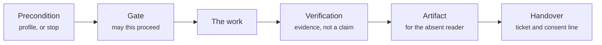
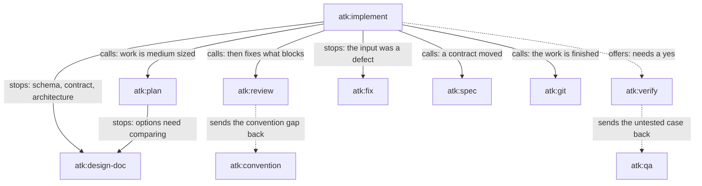

# Skill Lifecycle

How one skill runs, from the moment it is invoked to the moment it hands the work on, and when a
skill reaches for another one instead of carrying on alone.

Companion documents: [project-flow.md](./project-flow.md) for which phase a skill belongs to and who
accepts its artifact, [skill-chain.md](./skill-chain.md) for what each skill consumes and produces,
[../skills-overview.md](../skills-overview.md) for when to use one and when not to.

## What a skill is made of

One `SKILL.md`, in the same section order every time, so a reader who has read one knows where to
look in the next.

| Section | Answers |
|---------|---------|
| Front matter | The name, the description the harness matches on, and the flags |
| Intro | What this skill is for, in a paragraph |
| Scope | What it handles, and what it deliberately does not |
| Roles | Who authors, who approves, who is escalated to |
| Invocation | Every way to call it, and what it requires before it will run |
| Workflow | The pipeline, then the numbered steps |
| Output | The artifact, where it goes, and what it must contain |
| Ticket | What is offered to the tracker, and what is never done to it |
| Definition of done | The checklist a reviewer can hold the run to |

Longer detail sits in `skills/<name>/references/*.md` and is opened only by the step that needs it.
Rules shared with other skills sit in `shared/*.md` and are opened only when cited. Nothing else
loads: the body of a `SKILL.md` on invocation, a reference when a step reaches it, and
`.atk/profile.md` once per run in the skills that need project facts.

## The shape of a run

Not every skill has all five, and the ones it skips are as informative as the ones it runs.

**Precondition.** The skills that run project commands read `.atk/profile.md` first and stop when it
is missing, because a guessed test command that exits zero is the worst evidence available. The
skills that work from a chat message ignore it entirely. `shared/project-profile.md` says which is
which.

**Gate.** Most skills check something before doing anything: `atk:implement` scores how much
agreement the work needs, `atk:fix` proves the cause and checks the behaviour is not a recorded
decision, `atk:verify` checks the run is pointed at a local environment. A gate that fires stops the
run with a question, and the question carries the name of whoever answers it.

**The work.** Drafting, coding, reviewing, or exercising a running system, against the project's own
conventions and commands rather than invented ones.

**Verification.** Evidence, sized to the skill: a suite run per layer for the code skills, a
traceability check for `atk:qa`, a re-read of the cited source for a document. What a run proves and
what it does not is in `shared/layer-verification.md` for the three that change code.

**Artifact.** A Markdown file at the path in `shared/artifact-paths.md`, opening with the front
matter that carries the owner, the approver, and the approval state. Written for somebody who was not
in the conversation. `atk:help` is the one skill with no artifact: everyone its answer is for is
present.

**Handover.** The artifact is offered to the tracker, never posted before it is shown. For a code
change, `shared/finalize-steps.md` draws the line: everything up to the commit stays local, and
everything past it is asked for every time.

## How one skill reaches another

One skill names another a hundred and thirty-one times across the twenty-two `SKILL.md` files,
counting the `atk:` mentions, in eighty-nine ordered pairs, which sounds like a dense graph. It is
not: most of those are boundaries rather than edges. Five kinds, and only the first four happen at
run time.

| Kind | What happens to the work | Where it appears |
|------|--------------------------|------------------|
| Calls, and carries on | The other skill runs, returns, and this one continues | `implement` to `plan`, `implement` to `review`, `implement` to `spec`, and every finishing skill to `git` |
| Stops and hands over | This skill changes nothing further; the work moves | `implement` to `design-doc`, `implement` to `fix`, `plan` to `design-doc` |
| Offers, and waits for a yes | It may not happen at all, and the record says which | `implement` to `verify` |
| Sends a finding back | This skill carries on; another one owns recording it | `review` to `convention`, `verify` to `qa` |
| Writes a file another reads | No call at any point; a contract through a file | `init` to every code skill, `tailor` to every skill, `convention` to `implement` and `review`, `spec` to `design-doc` and `qa` |

The two solid loops are the ones a team feels daily. `implement` calling `review` on its own output
runs at most twice before it escalates by name, because a finding that survives two rounds of fixing
is usually a design problem being patched. `implement` stopping at the large gate is the other:
work that touches a schema, a public contract, a shared module, or more than one service changes no
file until somebody has approved how.

The edge into `atk:spec` is drawn from `implement` alone to keep the picture readable, but `fix` and
`verify` carry the same obligation through the same first step of `shared/finalize-steps.md`. Any of
the three that changes an endpoint, a response, an error code, a column, or an enum carries the
reference document with it.

## What is not an edge

Most cross-skill mentions are in a `## Scope` section, under "does NOT handle". They tell a reader
which skill owns the thing this one refuses, and nothing calls anything: `atk:intake` naming
`atk:estimate` means sizing is not intake's job, not that intake will size anything.

The sharpest of them is between `atk:fix` and `atk:incident`, and it is an ordering rather than a
call: `atk:incident` owns the work while users are down, and `atk:fix` takes the code once the
service is stable and the timeline no longer needs a responder. `project-flow.md` draws that return
into the cycle.

Those pointers always name an `atk:` skill or say "outside this kit". A team that installed only atk
still has to find a way forward, so the kit never points at a command from another kit, which would
be a dead end that is invisible until somebody follows it.

## What a skill reaches for outside the kit

Three skills that change code hand the change to the host agent's own clean-up capability once the
verification is green and before a reviewer sees it, and `atk:review` uses the host's parallel agents
to put several independent passes over a large diff. Both are improvements on work the skill already
owns, never preconditions: on a harness that ships neither, the skill does the pass itself and the
artifact says which way it ran.

`shared/host-capabilities.md` holds the rules and the boundary, and `shared/tidy-pass.md` holds what
the clean-up looks for.

## Reading one yourself

Open `skills/<name>/SKILL.md` and read three things in this order: the pipeline at the top of
`## Workflow`, which is the whole skill in one line; the numbered steps under it; and
`## Definition of done`, which is what the skill can be held to afterwards. The `references/` files
are the detail behind a step, and are worth opening only when that step is the one in question.
