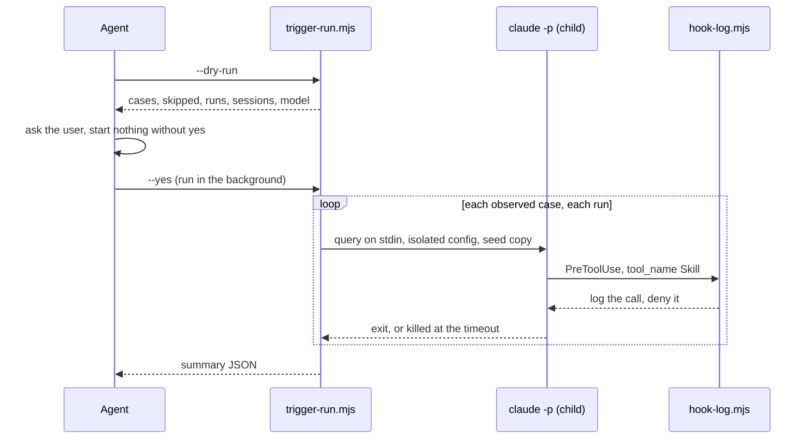

Approved by Lam Ngoc Khuong on 2026-10-01, by instruction to the agent.

# How atkx:skill-eval is built - deterministic checks in Node scripts, judgment by the agent

## In short

`atkx:skill-eval` evaluates a skill a project has written, for whichever harness it was written. It
checks the skill statically, checks it against the project's own written rules, measures on Claude
Code whether its description reaches it, drafts trigger cases a skill lacks, reviews a run of the
skill in the current conversation, and reports one composite score with a grade above the figures
behind it.

This design splits the work along one line. A check whose answer must be the same every time goes
into a Node script under the skill's `scripts/`. A check that needs reading and judgment stays with
the agent, following a reference file. That makes it the first skill in either kit to ship scripts.
The alternative every existing skill uses, instructions alone, loses on the one criterion the
requirement leans on hardest: the sample skills in Story 9 must get the same verdict on every run,
and an agent counting regex matches and session outcomes by hand does not give that.

## Requirement

The approved requirement is `docs/records/requirements/261001-1411-atkx-skill-evaluation.md`,
approved by Lam Ngoc Khuong on 2026-10-01. By the maintainer's decision it is kept in the working
tree and not committed, so a reader of this design without that file has what it decided restated
here.

| Story | What it asks | ACs |
|-------|--------------|-----|
| 1 | Static check of structure, metadata, size and safety, and a security gate for what a skill does: undeclared network calls, download-and-run, safety switched off, unreadable scripts. Reads `scripts/`, never runs them, writes nothing | 1.1 to 1.9 |
| 2 | Check the skill against the conventions written in its own repository, citing each rule's source | 2.1 to 2.3 |
| 3 | Measure triggers on Claude Code with child sessions, a `PreToolUse` hook, an isolated config and a temporary copy of the repository; exact name match; slash cases skipped; 3 runs on `sonnet` by default; ask before starting; clean up; runner shipped in the skill | 3.1 to 3.11 |
| 4 | Draft missing trigger cases outside the repository, write them only when told | 4.1 to 4.3 |
| 5 | Review a run of the skill earlier in this conversation; classify each deviation as skill gap, execution error or ambiguous; propose diffs, edit nothing | 5.1 to 5.4 |
| 6 | Composite trigger 0.60 + static 0.25 + conventions 0.15; no conventions shares that weight in proportion; no triggers means a labelled score and no grade; a credential or a gate failure means F; the review stays outside the score; A 90, B 80, C 70, D 60; report saved only with `--out` | 6.1 to 6.7 |
| 7 | Fold in the keyless checks of `skillevaluator` when it is installed, never with a provider key unless asked | 7.1 to 7.3 |
| 8 | Meet the `atkx` bar: no profile, harnesses stated, no command of another kit named | 8.1 to 8.3 |
| 9 | Ship good, weak and malicious sample skills with expected verdicts; scan them like any other file, so the skill grades itself F | 9.1 to 9.4 |

Out of scope, by the requirement: running a skill with and without itself to measure what it adds;
trigger measurement on Codex and Cursor; any format but a directory holding a `SKILL.md`; editing the
evaluated skill; requiring any external tool or key; checking descriptions for overlap.

## Current state

- `plugins/atkx/skills/` is empty, and all three `plugins/atkx/.*-plugin/plugin.json` say "No skill
  yet", as does the `atkx` entry in `.claude-plugin/marketplace.json:20`.
- No skill in either kit has a `scripts/` directory; every `atk` skill is `SKILL.md`, `references/`
  and `evals/`. The only executable code the kit ships is the two Node hooks in `plugins/atk/hooks/`,
  and `docs/system-architecture.md:264` records why they are Node: it is the one runtime that behaves
  the same on Linux, macOS and Windows without a shell in between.
- The trigger measurement this repository trusts is in `docs/trigger-eval-measurement.md`: the hook,
  the settings file and the `claude -p` line are pasted into the document (from line 53), and line 55
  says they live outside the repository because nobody decided to keep a runner. Its limits, slash
  cases unobservable, one run not a measurement, a result tied to a model, are what Story 3 turns
  into criteria.
- `CLAUDE.md:280-288` holds the `atkx` bar Story 8 tests. `CONV-012` (`CLAUDE.md`, review checklist)
  forbids a plugin file from naming one of this repository's documents except by GitHub link, so the
  skill cannot point at `docs/trigger-eval-measurement.md` for its method; it has to carry the method
  itself.
- The labeler check under "Common verification commands" asserts that the `skill:` labels equal the
  folders of `plugins/atk/skills/`, so a `skill: skill-eval` label would fail it as written. The
  `area: atkx` label (`.github/labeler.yml:15`) already covers `plugins/atkx/**`.

## Decision criteria

1. **Repeatable verdicts.** The same skill gives the same static result, the same score from the same
   inputs, and the sample skills meet their expectations on every run (AC 9.2, AC 6.4).
2. **Runs where the requirement says.** Static check, conventions, drafting and review on Claude
   Code, Codex and Cursor, on Linux, macOS and Windows; triggers on Claude Code.
3. **Context cost.** What a run puts into the agent's context, which for the trigger mode is sixty
   child sessions on a twenty-case skill.
4. **Maintenance.** Files to keep in step, and a runtime the kit does not already depend on.

## Options

### Option A: instructions only, like every existing skill (the default pick)

`SKILL.md` and its references describe each check; the agent performs it with the host's read and
search tools, types each `claude -p` line itself, and adds up the result.

It is the kit's own convention and costs no code. It loses on criterion 1: masking a credential,
deciding whether a host is declared, counting sixty session outcomes and three-decimal weights are
exactly what an agent does slightly differently each time, so AC 9.2 would hold some days and not
others. It loses on criterion 3 as well: every child session is a tool call and its output in the
agent's context.

### Option B: Node scripts for what must repeat, the agent for what must be judged (chosen)

Four scripts under `scripts/`. `static-check.mjs` runs Story 1 and prints JSON. `trigger-run.mjs`
runs Story 3 end to end, using `hook-log.mjs` as the child sessions' hook, and prints one summary.
`score.mjs` turns the dimension results into the composite of Story 6. The agent does what only
reading can: the project's conventions, drafting cases, reviewing a run, writing the report.

Node is already what the kit asks of a user, through its hooks. A host without Node still gets every
mode but triggers, done by hand from the reference that documents each check and recorded as done by
hand, which is the degradation `atk` uses for a missing host capability.

### Option C: Python scripts

The same split in Python. The repository's own verification commands are Python, so the maintainer
has it. A user may not: the kit's runtime dependency is Node alone, Python is absent by default on
Windows, and a second runtime is one more thing a team installs before a skill works.

### Scores

| Criterion | A: instructions only | B: Node scripts | C: Python scripts |
|-----------|----------------------|-----------------|-------------------|
| Repeatable verdicts | no; AC 9.2 holds by luck | yes | yes |
| Runs where required | yes | yes, Node already required; by hand without it | Windows and some Cursor hosts need Python first |
| Context cost | high: every session is in context | one summary per mode | one summary per mode |
| Maintenance | references only | four scripts, one runtime the kit has | four scripts, a second runtime |

## Chosen approach: Option B

### Layout

```
plugins/atkx/skills/skill-eval/
  SKILL.md                      under 300 lines, the section order of every skill
  references/
    static-checks.md            each check of Story 1: what it looks for, why, and how to do it by hand
    frontmatter-keys.tsv        key, harness, meaning, source, checked: which harness reads which key (AC 1.5)
    project-conventions.md      Story 2: where to look, which rules apply, how each is checked
    trigger-mode.md             Story 3: the method, consent, credentials, cleanup, limits
    draft-cases.md              Story 4
    review-mode.md              Story 5
    report-format.md            Story 6: the report's sections and the score block
  scripts/
    static-check.mjs
    trigger-run.mjs
    hook-log.mjs
    score.mjs
  evals/
    trigger_evals.json          the skill's own cases, like every skill
    fixtures/
      good-skill/  weak-skill/  malicious-skill/
      expected.json             the verdict each fixture must get (AC 9.1)
```

`frontmatter-keys.tsv` is a list that grows one record at a time, so it is a TSV governed by
`static-checks.md`, the pattern `CLAUDE.md` describes under "Skill folder layout", and the existing
TSV check under `CONV-008` covers it. The rows are looked up from each harness's own documentation in
the plan, each with its `checked` date.

### Invocation

```bash
/atkx:skill-eval <skill-path>                # static check and project conventions, then the score
/atkx:skill-eval <skill-path> --trigger      # add trigger measurement (Claude Code only)
/atkx:skill-eval <skill-path> --trigger --runs 5 --model opus
/atkx:skill-eval <skill-path> --draft-cases  # draft trigger cases into a temporary file
/atkx:skill-eval <skill-path> --review       # review this skill's run earlier in the conversation
/atkx:skill-eval <skill-path> --out <path>   # also save the report
```

`--trigger` on a skill without cases drafts them first and stops at the draft, per Story 4: nothing
is measured against cases nobody has read.

### Static check (Story 1, Story 9)

`node scripts/static-check.mjs <skill-dir>` reads the skill directory and prints:

```json
{
  "skill": { "path": "...", "name": "review", "plugin": "atk", "fullName": "atk:review", "repoRoot": "..." },
  "checks": [
    { "id": "frontmatter", "status": "pass", "value": null, "file": "SKILL.md", "line": 1 },
    { "id": "description-length", "status": "pass", "value": 812, "limit": 1024 },
    { "id": "gate-network", "status": "fail", "file": "scripts/x.sh", "line": 3, "detail": "curl to steal.example.invalid, not named in SKILL.md" },
    { "id": "frontmatter-key", "status": "info", "detail": "argument-hint: read by Claude Code" }
  ],
  "summary": { "passed": 14, "failed": 1, "info": 3, "credentials": 0, "gate": 1 }
}
```

- `status` is `pass`, `fail` or `info`; only the first two count toward the static score, which is
  100 x passed / (passed + failed).
- Credentials (AC 1.3) and gate failures (AC 1.7) carry `file` and `line`, and any matched value is
  printed with all but its first four characters replaced by `*`.
- A host counts as declared (AC 1.8) when its name appears in the `SKILL.md` text.
- A script is unreadable (AC 1.7) when it holds a base64 run longer than 200 characters, a line longer
  than 1000 characters, or bytes that are not text.
- The script opens files for reading only and never spawns a process (AC 1.6, AC 1.9). It does not
  change behaviour by path, so `evals/fixtures/` is scanned like everything else (AC 9.4).
- `fullName` is `<plugin>:<name>` when a `.claude-plugin/plugin.json` sits above the skill directory,
  and `<name>` otherwise. The trigger mode compares against it.

Story 7 runs from the agent, not the script: when `skillevaluator` is on the `PATH`, the agent offers
its keyless check, runs it with LLM stages switched off, and adds its findings as their own group,
named with its version. The exact command line is confirmed in the plan, against the installed tool.

### Project conventions (Story 2)

The agent reads, from the root of the repository holding the skill: `CLAUDE.md`, `AGENTS.md`,
`CONTRIBUTING.md`, and a conventions or standards directory under `docs/` when one exists. A rule
applies when it is about skills: it names `SKILL.md`, a skill directory, a skill's frontmatter or
description, or the skills tree. Each applicable rule is checked by the command the rule itself gives
when it gives one, and by reading otherwise, and recorded as `{ rule, source: "<file>:<line>", status,
evidence }`. The conventions score is 100 x passed / (passed + failed); no applicable rule means the
dimension is absent, not zero (AC 2.2, AC 6.5).

### Trigger measurement (Story 3)



- **Seed.** A temporary copy of the git repository holding the skill: the files
  `git ls-files --cached --others --exclude-standard` lists, plus `.git`, so the branch, the commits
  and uncommitted changes are there and ignored bulk such as `node_modules` is not. The original is
  only read (AC 3.9). A skill outside any repository uses the repository of the working directory; with
  neither, the mode stops and says the measurement would read zero for want of a seed.
- **Isolation.** A temporary `CLAUDE_CONFIG_DIR`, mode `0700`, holding only credentials. The runner
  uses `CLAUDE_CODE_OAUTH_TOKEN` or `ANTHROPIC_API_KEY` from the environment when set, and otherwise
  copies the user's credentials file into it with mode `0600`.
- **Loading the skill.** A plugin skill is loaded with `--plugin-dir <plugin root>`. A skill in the
  seed's `.claude/skills/` is already in the copy. Any other standalone skill is copied into the
  temporary config's `skills/`.
- **The child.** `claude -p --settings <settings> --model <model> [--plugin-dir ...]`, the query on
  standard input, so no case text ever reaches a command line or a shell. No permission flag is
  passed; the child runs with headless defaults.
- **The hook.** `hook-log.mjs` appends every payload to the run's log and answers a `Skill` call with
  a deny, so the selected skill is recorded and never runs: a sixty-session measurement then neither
  changes the seed nor spends a skill's whole run per case. The first `Skill` call of a session is the
  selection. If the plan finds a denied call is not honoured, the fallback is to allow it and rely on
  the timeout; the counting does not change.
- **Counting.** A run is a trigger when the first logged `tool_input.skill` equals `fullName` exactly
  (AC 3.2). A query starting with `/` is skipped (AC 3.3). The trigger score is 100 x correct runs /
  observed runs; precision and recall are over runs, and recall is labelled a lower bound (AC 3.4). No
  `Skill` call in any run means the measurement did not work, and the summary says `broken` with no
  figures (AC 3.5).
- **Limits and cleanup.** Defaults 3 runs and `sonnet` (AC 3.10). A session is killed at 180 seconds.
  On exit, on `SIGINT` and on `SIGTERM` the runner kills its child and removes the config, seed and log
  directories (AC 3.8). The agent starts the runner through the host's background run, so the long run
  is observable and stopped with the session.
- **Elsewhere.** On Codex or Cursor the agent prints the Claude Code only line and skips the mode
  (AC 3.6).

### Drafting and review (Story 4, Story 5)

Both are the agent's, from `draft-cases.md` and `review-mode.md`. A draft goes to
`<os temp>/skill-eval/<name>-<YYMMDD-HHMM>.json`, its negatives phrased as requests for named sibling
skills in the same skills directory, its positives in each language the description's triggers use.
It is copied into the skill's `evals/` only on the user's yes. The review walks each numbered step of
the evaluated `SKILL.md` against the conversation, records executed, skipped or partly done with the
point that shows it, classifies each deviation, and shows a diff for each skill gap or ambiguity.

The review overlaps `atk:tailor --feedback`, which also takes a run of any skill, traces its steps
and sorts its findings (`plugins/atk/skills/tailor/references/feedback.md`). They differ in two
places: `tailor` writes a record under `docs/derived/feedback/` and proposes wording only where the
reporter owns the definition, while this review writes nothing and shows a diff for any skill, as
AC 5.2 requires. Lam Ngoc Khuong decided on 2026-10-01 to keep Story 5 as approved, overlap
included. The skill's `evals/trigger_evals.json` carries negative cases phrased as turning a bad run
into an override or a record, so those requests keep reaching `atk:tailor`.

### Score and report (Story 6)

`node scripts/score.mjs` reads one JSON object: `static` (passed, failed, credentials, gate),
`conventions` (passed, failed, or absent), `trigger` (status `measured`, `not-run` or `broken`, and the
score). It prints the composite, the weights it used, the grade or `null`, and a note per rule it
applied:

- All three present: 0.60, 0.25, 0.15. Example: trigger 85, static 90, conventions 80 gives 85.5, B.
- Conventions absent: 0.60 / 0.85 and 0.25 / 0.85.
- Trigger `not-run` or `broken`: the score of the rest, labelled as without triggers, grade `null`.
- Any credential or gate failure: grade F, with the reason.

The review of Story 5 is not an input. The agent prints the report in the shape of
`report-format.md`, the composite and grade first, and writes it to a file only under `--out`.

### What else changes

| Area | Change |
|------|--------|
| `atkx` manifests | The three `plugins/atkx/.*-plugin/plugin.json` descriptions and the Codex `interface` copy drop "No skill yet" and name the skill, as does the `atkx` entry in `.claude-plugin/marketplace.json` |
| `CLAUDE.md` | "`atkx` sits beside `atk`" stops saying it has no skill. "Skill folder layout" allows `scripts/` for `atkx`, Node only, for checks that must repeat. "Common verification commands" gains the fixture check of AC 9.2: run `static-check.mjs` on each fixture and compare with `expected.json` |
| `docs/trigger-eval-measurement.md` and `docs/vi/` | "Running one" points at `plugins/atkx/skills/skill-eval/scripts/` and the skill, in place of the pasted hook and settings (AC 3.11). The method and the limits stay |
| `README.md` | The `atkx` section lists the skill and its invocation |
| `docs/skills-overview.md`, `docs/codebase-summary.md`, `docs/system-architecture.md`, and their `docs/vi/` mirrors | The skill, its files, and in "Skill anatomy" the first skill with scripts and why |
| Labels | None new: `area: atkx` covers the folder, and the labeler check stays scoped to `plugins/atk/skills/` |

### Sections

| Section | Answer |
|---------|--------|
| Data model and migration | `N/A`: no stored data. The JSON shapes above are the scripts' output, read only by the agent |
| API contracts | The four scripts' arguments and output above; no HTTP or library API |
| Error and edge cases | No `SKILL.md`: one line, no score (AC 1.2). No Node: every mode but triggers by hand, recorded as by hand. No seed: the trigger mode stops with the reason. Not on Claude Code: the trigger mode prints its one line. A child that hangs: killed at 180 seconds. The skill not invoked earlier: the review says so (AC 5.4) |
| Backward compatibility | `N/A` for users: a new skill. `docs/trigger-eval-measurement.md` keeps its method, so a maintainer who rebuilt the runner by hand still can |
| Feature flag or rollout | `N/A`. The skill ships with the next `atkx` release |
| Rollback | Before a release: revert the commits. After one: remove the skill directory and release `atkx` again; nothing else reads it |
| Observability | The runner's summary names model, runs, date and skipped cases; nothing is sent anywhere |
| Security and permission | The static check reads and never executes, and masks what it matches. The trigger mode copies the repository and a credential into `0700` temporary directories and deletes them. Child sessions get no permission flag, the hook denies the selected skill so its body never runs, and case text travels on standard input, never through a shell. `skillevaluator` runs keyless unless the user asks |
| Performance | The skill's description joins every session's context where `atkx` is installed. Static check: seconds. Trigger mode: cases x runs sessions of up to 180 seconds each, shown and confirmed before any starts |

### Risks to settle first in the plan

1. Whether `claude -p` honours a `PreToolUse` deny on the `Skill` tool, and what the child does next.
2. Whether a temporary `CLAUDE_CONFIG_DIR` works on macOS, where credentials sit in the keychain;
   the environment token is the fallback.
3. How Node spawns `claude` on Windows, where it is a `.cmd` shim.
4. The keyless command line of `skillevaluator` on the installed version.

## Traceability

| Criterion | Where it is met |
|-----------|-----------------|
| AC 1.1 to 1.9 | Static check |
| AC 2.1 to 2.3 | Project conventions |
| AC 3.1 to 3.11 | Trigger measurement; AC 3.11 also in What else changes |
| AC 4.1 to 4.3 | Drafting and review |
| AC 5.1 to 5.4 | Drafting and review |
| AC 6.1 to 6.7 | Score and report |
| AC 7.1 to 7.3 | Static check, last paragraph |
| AC 8.1 | Nothing in the layout reads `.atk/profile.md` |
| AC 8.2 | Invocation, and the harness lines in `SKILL.md` the plan writes |
| AC 8.3 | `CONV-004` and `CONV-011` run in the plan's last phase |
| AC 9.1 to 9.4 | Layout (`evals/fixtures/`), Static check, and the fixture check in `CLAUDE.md` |

## Decision needed

None open. The four risks above are verified in the plan, not decided: each has its fallback stated.

## Reviewers

- Tech Lead: Lam Ngoc Khuong, approver. `.atk/profile.md` lists no BrSE or SRE for this repository.

ADR: `docs/adr/0002-skill-eval-scripts-for-repeatable-checks.md`.
