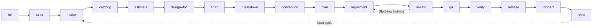

# Skills Overview

Twenty skills covering a team's delivery lifecycle. Each entry says what the skill produces, when
to reach for it, and when not to.

Read this before adopting the kit: every skill works alone, and a team can start with one.

## Where they sit

Three skills answer an event rather than a phase: `fix` when a defect is reported, at any point;
`onboard` when someone joins; `handover` when someone leaves or a phase ends.

`atk:init` runs once per project. It writes `.atk/profile.md`, which tells the skills that touch
code how this project is tested, built, and laid out. `atk:implement`, `atk:fix` and `atk:verify`
stop without it. `atk:plan` continues and says in the artifact which parts it inferred. Every other
skill runs without it.

---

## `atk:init`

**Produces.** `.atk/profile.md` in the project: the test, build, and lint command per app, the layer
layout with a standards document and a reference module for each, the docs roots, the tracker and
where the spec lives, who approves what, and how to start the application and confirm a side effect
in its data.

**Use when.** A team first installs `atk` in a project, and again when the project has moved on from
what the profile says. `--audit` compares an existing profile against the repository and changes
nothing.

**Do not use when.** You want the kit configured once for every project. A profile is true of one
project and is committed with it; the kit itself holds no project facts.

**The habit that matters.** It reads the repository before it asks. A question the package manifest,
the CI workflow, or the test directory could have answered is a question it does not put to a
person. What no file can answer becomes `TBD` with the name of whoever owes it, never a guess.

---

## `atk:tailor`

**Produces.** `.atk/overrides/<skill>.md` in the project: what this team wants one skill to do
differently, as a `## Before` section, an `## After` section, or both, with the role that owns the
skill's output named as approver.

**Use when.** The team keeps making the same correction to what a skill produces, a client or an
internal standard adds a step the kit does not know about, or an override written earlier no longer
matches the skill it belongs to. `--audit` checks every override file in the project and changes
nothing. `--feedback` takes a run that went wrong and sorts each finding into an override for this
team, a record for the kit author, or neither, and the record leaves the project only when asked.

**Do not use when.** The rule is about the code rather than about the skill. "Every pull request
needs a test" is checkable by a person with no kit installed, so it is a `CONV-NNN` row that
`atk:convention` writes and `atk:review` enforces. "`atk:review` should also check our i18n helper"
is about the skill and belongs here. When both readings fit, the rule about the code wins.

**The habit that matters.** It refuses. Seven things an override may never remove are listed in
`shared/project-overrides.md`, and the approver line, the rule that a skill does not decide what a
role owns, and the consent line before anything leaves the local repository are three of them. A
refused instruction is not dropped in silence: the skill says which of the seven it breaks and
offers the nearest thing that does not, which is usually an instruction that surfaces the decision
earlier rather than one that takes it.

---

## `atk:intake`

**Produces.** A requirement artifact: the request quoted verbatim, the current behavior cited to
file paths, user stories, `Given / When / Then` acceptance criteria, an out-of-scope list,
assumptions labelled as assumptions, and open questions each naming the person who must answer.

**Use when.** A request arrives as a chat message, a meeting note, a mail, or a one-line ticket, and
the team cannot start from it. Also when two people read the same ticket differently.

**Do not use when.** The requirement is already agreed and written; you want effort numbers
(`atk:estimate`) or a technical approach (`atk:design-doc`).

**The habit that matters.** Criteria such as "works correctly" or "is fast" are rejected rather than
accepted quietly. They become a number, a state, a visible result, or an open question.

---

## `atk:catchup`

**Produces.** For an epic: what the work is and for whom, why now, scope in and out, who decides
what, the terms a newcomer will not know, the places it is easy to go wrong, and an understanding
check the developer answers before writing any code. For a pull request: the same brief scoped to
the diff, without the check.

**Use when.** Someone picks up an epic they did not help write, joins work already in flight, or has
to review a pull request in an area they do not know.

**Do not use when.** The person is new to the project rather than to this piece of work
(`atk:onboard`), or the requirement itself is unclear rather than unfamiliar (`atk:intake`).

**The habit that matters.** The understanding check is answered by the developer, not filled in by
the skill. A brief nobody has to respond to is a brief nobody has read.

---

## `atk:estimate`

**Produces.** A per-item estimate with its basis and confidence, a visible risk buffer, a capacity
calculation showing leave and ceremonies as explicit subtractions, a sprint commitment, and the
overflow list.

**Use when.** Sprint planning, a client asks how long, or scope changed and the numbers need redoing.

**Do not use when.** The items have no acceptance criteria. The skill will mark them `NEEDS INTAKE`
rather than guess, which is the correct answer but not the one you wanted.

**The habit that matters.** Every number carries the basis it came from, usually a comparable past
item found in git history. A number without a basis cannot be argued with or learned from.

---

## `atk:design-doc`

**Produces.** A technical design document: current state cited to `path:line`, decision criteria,
two or more compared options, the chosen data model and API contracts, migration and rollback,
risks, required reviewers, and the matching ADR.

**Use when.** Before implementing anything touching a schema, a public contract, a shared module, or
more than one service.

**Do not use when.** The change is local and reversible. A design document for a two-file fix costs
more than it returns.

**The habit that matters.** One option is a plan, not a design. The document includes the option the
team would have picked by default, and says why it loses.

---

## `atk:spec`

**Produces.** The reference documents a team reads long after the work that produced them merged: the
API contract per resource in `docs/api/`, the schema per table in `docs/database/`, and what a feature
does in `docs/features/`. One file per subject, named after the subject, updated in place. `--check`
reports where a document and the code disagree and changes nothing.

**Use when.** A project has no written contract, a merged change left one behind, or nobody trusts
the documents any more. `--sync` folds the change on the current branch into the documents it
touched.

**Do not use when.** The question is still which approach to take. That is `atk:design-doc`, which
compares options and stops; this skill describes what was actually done.

**The habit that matters.** The shape comes from the documents the project already keeps, not from
the kit. A team holding 29 API documents in one shape has a convention, and a thirtieth in another
shape costs them more than the time it saved.

---

## `atk:breakdown`

**Produces.** Tasks with one deliverable each, an owner, a dependency graph with the critical path
marked, parallel lanes that declare the files they own, and a definition of done per task.

**Use when.** Before a sprint, or whenever work must be split across several people.

**Do not use when.** One person will do the whole thing in a day.

**The habit that matters.** Two parallel lanes may not own the same file, migration sequence, or
shared config. Where they must, the skill serializes them and says so, which is what prevents the
merge conflict nobody planned for.

---

## `atk:convention`

**Produces.** The team's conventions derived from its own code and git history, each rule classified
as `ENFORCED` by tooling, `REVIEWED` by a human, or `ASPIRATIONAL`, plus the tooling that could
enforce the ones currently checked by hand. A team that already keeps standards documents gets that
classification written into the set it has, in the shape it already uses: `docs/conventions.md` is
the kit's default, not an address every project has to move to.

**Use when.** There is no written convention, the written one no longer matches the code, or reviews
keep repeating the same comment.

**Do not use when.** You want a style guide imported from elsewhere. This skill documents what the
team does, not what an external guide recommends.

**The habit that matters.** The `ASPIRATIONAL` bucket. A rule nobody enforces is named as such
rather than left to look like policy. The `REVIEWED` rules are written in the record format from
`shared/review-checklist.md`, which is what lets `atk:review` cite them by ID.

---

## `atk:plan`

**Produces.** What the code does today with file paths, phases that each end in something a reviewer
can look at, steps inside a phase that each leave the tree working, what every step touches and how
it is checked, what is deliberately out of scope, and what is still unclear with the name of whoever
must answer.

**Use when.** Before starting work large enough to need stages, or when picking up something
somebody else designed and the steps are not obvious.

**Do not use when.** The work has to be shared across several people, which is `atk:breakdown`; or
it is one change in one file, where the plan costs more than the work.

**The habit that matters.** A phase that cannot end in something reviewable is not a phase, it is a
pause. Steps are ordered so the tree still works at every boundary, which is what makes it safe to
stop halfway.

---

## `atk:implement`

**Produces.** The code, plus an implementation record that becomes the pull request body: what
changed and why, which plan steps it covers, the command run for each layer with its output, what
the clean-up step changed, and what was deliberately left undone.

**Use when.** A ticket, a plan, or a described requirement is ready to be built, and the question
left is how to build it rather than what to build.

**Do not use when.** The requirement is still unclear (`atk:intake`), or the work is diagnosing a
defect (`atk:fix`).

**The habit that matters.** The plan gate has three settings rather than two. A small change goes
straight to code. A medium one calls `atk:plan`, confirms in a sentence, and carries on. Only a
change that touches a schema, a public contract, several services, or an open architecture decision
stops for a person to approve. Drafting a list of steps needs no approver; deciding the architecture
does.

Once the verification is green, the change goes through the host's code clean-up capability,
`/simplify` in Claude Code, before the review is called: a reviewer should spend their round on
behavior, not on duplication the author could have removed. On a harness without that capability the
record says so rather than leaving the step invisible.

---

## `atk:fix`

**Produces.** The failure captured verbatim, the cause proven rather than guessed, a check that the
current behavior is not a decision somebody made on purpose, the smallest change that removes the
cause, verification by layer, and a report saying what was checked and what was not.

**Use when.** A bug report, a failing test, a broken endpoint or screen, or an investigation that has
to end in an explanation rather than a guess.

**Do not use when.** Production is down right now: `atk:incident` runs the response, and this skill
fits inside it. Or nothing is broken and the code is merely unpleasant, which is not a defect.

**The habit that matters.** No file changes before the cause is proven, and the proving itself has a
ceiling: three ruled-out hypotheses, then the skill stops and hands the investigation to a person by
name, because what is left after three is usually somebody's knowledge rather than another search.
`--investigate-only` exists
because the explanation is often the whole deliverable, and stopping there is a valid result rather
than an unfinished one. The clean-up step that follows verification is narrower here than anywhere
else in the kit: it covers the lines the fix touched and nothing beside them, because a fix carrying
a tidy-up of the surrounding file cannot be reverted cleanly.

---

## `atk:review`

**Produces.** Review findings ranked `BLOCKING`, `SHOULD FIX`, and `NIT`, each citing a line, stating
the failure it causes, and suggesting a concrete change. At most ten of them, or twenty under
`--strict`, with the blocking ones never cut. Optionally posted as inline PR comments.

**Use when.** Before approving a pull request, or when a review needs a second opinion.

**Do not use when.** You want the code fixed rather than reviewed, or you want the requirement itself
questioned (`atk:intake`).

**The habit that matters.** It starts from what the change was supposed to do, not from the diff,
and it separates blocking defects from preferences, which is what makes a review feel fair. A
convention finding quotes the rule and cites its ID, so the author can dispute the rule rather than
the reviewer.

Nothing reaches the list unverified. A finding is confirmed when the input that triggers it can be
named, and plausible when the mechanism is real but the trigger depends on timing, environment, or
configuration; a plausible one carries the single check that would settle it, which is what lets the
author close it in a minute. A candidate is dropped only on something the code shows, never for
being unlikely, because the second habit is what keeps races and rare-path failures in a review
instead of in production. Once that list exists, one more pass reads the diff looking only for what
is not on it, and comes back empty rather than padded when there is nothing new. Where the cap cuts
the list, correctness outranks convention and readability, and the review says how many findings went
and at what severity.

The review runs as nine rounds, one job each, so no pass has to hold every concern at once and none
of them skips the same ground for the same reason. A round that has to go looking runs several
copies where the harness can run agents in parallel, because one pass over a diff is not reliable on
its own, and each of its findings carries how many copies raised it; a round that only checks the
diff against a list that already exists runs once and reports under its own name. `--parallel <N>`
forces the copy count, and a finding only one copy raised is checked against the code before it is
reported. Several copies agreeing is still one model's work, never a stand-in for the colleague who
approves.

---

## `atk:qa`

**Produces.** A test plan with entry and exit criteria, test cases traced to acceptance criteria,
negative and boundary coverage, and a regression matrix that justifies each entry with a shared
module, table, or endpoint.

**Use when.** A feature reaches QA, a release needs a regression pass, or there are no written cases.

**Do not use when.** You want automated test code written. This produces the plan a person executes
and a developer can automate from.

**The habit that matters.** Traceability runs both ways, so an untested criterion and an untraced
case are both visible.

---

## `atk:verify`

**Produces.** The application started the way this project starts it, exercised with real requests,
side effects asserted in the data rather than in a status code, screens compared against the design
when `--ui` is passed, and a report naming what was proven and what was not.

**Use when.** The suite is green and nobody has yet seen the feature work, before handing a ticket to
QA, or before a release goes out.

**Do not use when.** The profile has no `Verify` section saying how to start the application and how
to confirm a side effect. The skill stops rather than guess a start command, because a guessed
command that exits zero reads as proof.

**The habit that matters.** A 200 is not a result. The skill asserts the row, the file, or the
message the request was supposed to produce. It also stops after three rounds and escalates to a
named person, rather than patching until something passes. Code its rounds changed is tidied and the
failing case re-run before the change is closed, because a fix made at the end of a long run is
still a change somebody has to review.

---

## `atk:release`

**Produces.** A change list from the commit range, internal and client-facing notes kept separate,
migrations with reversibility and downtime stated, a three-phase checklist with an owner per step,
a rollback plan, and recorded sign-offs.

**Use when.** Cutting a version, deploying to staging or production, or writing notes for a client.

**Do not use when.** You want the deployment executed. The pipeline and SRE do that.

**The habit that matters.** The rollback trigger, steps, and the person who may call it are written
before the deploy, not improvised during it.

---

## `atk:incident`

**Produces.** During an incident: a named commander, a severity, and a timestamped timeline.
Afterwards: a root cause supported by evidence with rejected hypotheses listed, the detection gap,
a blameless postmortem, follow-up actions with owners and dates, and the runbook.

**Use when.** An outage is happening, has just ended, or a failure mode keeps recurring.

**Do not use when.** You want the bug found and fixed. That is debugging work; this skill structures
the response around it.

**The habit that matters.** Blameless is enforced mechanically: no sentence may name a person as the
cause, and every follow-up action needs an owner and a date or it does not go in the document.

---

## `atk:retro`

**Produces.** Last retro's actions verified with evidence, sprint data from the tracker, git, and CI,
team statements kept separate from that data, at most three new actions with owners and dates, and
the status report for an internal or client audience.

**Use when.** End of a sprint, milestone, or phase, and when a status report is due.

**Do not use when.** You want an individual assessed. The skill will not produce it.

**The habit that matters.** It opens with whether the last retro's actions happened. A team that
never closes its actions does not need another list of them.

---

## `atk:onboard`

**Produces.** Setup steps derived from the repository and marked `UNVERIFIED` where they could not be
checked, an access list naming who grants what and whether it blocks day one, a code map by owner,
the team's working agreements, and a first week ending in a real merged change.

**Use when.** Someone joins, moves between teams, or returns after a long absence.

**Do not use when.** You want business domain training. That belongs in the project's domain docs.

**The habit that matters.** No credential ever enters the document, only its location and who grants
it; and a setup step that cannot be verified says so instead of pretending.

---

## `atk:handover`

**Produces.** An inventory of in-flight work with its true state rather than its ticket state, the
decisions whose reasons are not in the code, the traps, an access and duty transfer plan, contacts,
open questions, and a validation checklist the receiver signs.

**Use when.** A member leaves or rotates, a phase ends, a vendor hands to a client, or someone is
about to be away for a long time.

**Do not use when.** The receiver is new to the project entirely; run `atk:onboard` first, then this.

**The habit that matters.** The receiver is the approver. A handover is accepted by the person taking
it, never declared complete by the person leaving.

---

## Adopting the kit

Start with the stage that hurts. Five common entry points:

- Requests arrive unclear: `atk:intake`, then `atk:qa` once criteria exist.
- Reviews are inconsistent: `atk:convention`, then `atk:review` against it.
- Knowledge keeps walking out the door: `atk:handover` and `atk:onboard`.
- Bugs come back because the cause was never found: `atk:fix`.
- Features reach QA having only ever been seen green in CI: `atk:init`, then `atk:verify`.

`atk:implement`, `atk:fix` and `atk:verify` want `.atk/profile.md` before they will do anything, and
`atk:plan` produces a better plan with it. Every other skill runs on a fresh clone with nothing set
up.

The artifacts compose, because each skill reads the previous artifact when one exists, but none of
them requires it.
