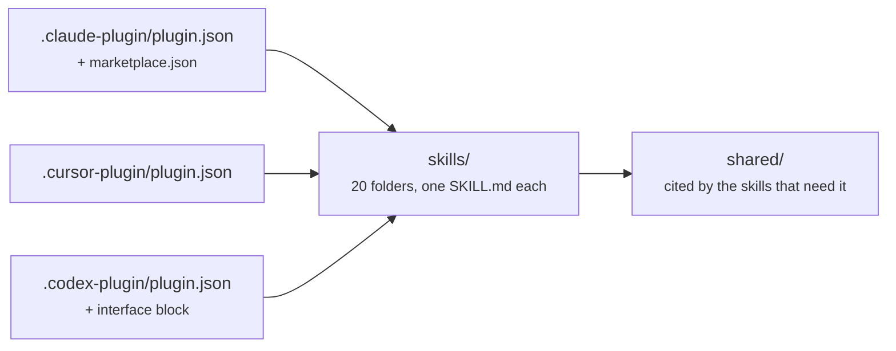
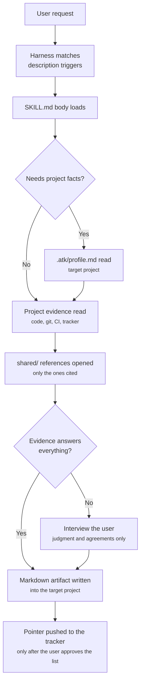

# System Architecture

## Shape

`atk` is content plus manifests. There is no build step, no bundler, and no runtime: the harness
reads Markdown and JSON directly from the repository tree.

```
aiteamkit/
  .claude-plugin/     plugin.json + marketplace.json     Claude Code
  .cursor-plugin/     plugin.json                        Cursor
  .codex-plugin/      plugin.json (+ interface block)    OpenAI Codex CLI
  skills/<name>/SKILL.md        21 skills, one folder each
  skills/<name>/references/*.md lazily loaded detail: templates, checklists, playbooks
  skills/<name>/evals/*.json    trigger cases for the description
  shared/*.md                   DRY layer shared by the skills that cite it
  hooks/                        profile reminder and override loader, Claude Code and Codex
  assets/*.svg                  icon and logo for marketplace listings
  docs/, docs/vi/               bilingual project documentation
  .atk/                         the kit's own profile and overrides, for running its skills on itself
```

Nothing in this tree describes the project the kit is installed into. That lives in one file in the
**target project**, `.atk/profile.md`, written by `atk:init` and, in the ordinary case, committed
with the project; `shared/project-profile.md` holds the two shapes where nothing tracks it. The
plugin directory is read-only and shared by every project on the machine, so it is the wrong place
for a fact that is true of one of them.

The `.atk/` in the tree above is the kit's own, true of `aiteamkit` alone, and it is there because
the kit runs its own skills on itself. An install copies the repository whole, and no manifest field
filters files out, so it reaches everyone who installs the plugin. No skill reads it for their
project: every citation of `.atk/` resolves from the root of the target project.

## One content tree, three manifests

The three manifest folders describe the same `skills/` directory to three harnesses. Skill content
is never duplicated per harness. The manifests differ only in how they declare content:

| Manifest | How skills are declared | Harness-specific extra |
|----------|-------------------------|------------------------|
| `.claude-plugin/plugin.json` | omitted; Claude Code auto-discovers `skills/` | `marketplace.json` beside it |
| `.cursor-plugin/plugin.json` | `"skills": "./skills/"` | `displayName` |
| `.codex-plugin/plugin.json` | `"skills": "./skills/"` | `interface{}` with `defaultPrompt`, icons, `brandColor` |



There is no `commands/` layer. A skill is its own slash command, named from its folder, namespaced
`atk:` by the harness at load time from `plugin.json`.

## Load model

A harness loads only the frontmatter of every `SKILL.md` at startup. That frontmatter, mainly the
`description` field with its trigger phrases, is what the router matches a user request against. The
body of a `SKILL.md` is read only after the skill is selected.

This produces the size discipline in the kit:

| Layer | When it loads | Budget |
|-------|---------------|--------|
| `description` frontmatter | Always, for all 21 skills | A few lines; triggers belong here and nowhere else |
| `SKILL.md` body | On invocation | Under 300 lines |
| `references/*.md` | Only when a workflow step opens it | Unbounded, kept out of the default path |
| `shared/*.md` | Only when a skill cites it | Small, since several skills may open it |
| `.atk/profile.md` | Once per run, in the skills that need project facts | A page of pointers and commands, never prose |

## The `shared/` layer

Thirteen files hold what skills would otherwise repeat. The first three are cited by all 21:

- `shared/team-roles.md`: the role table and the eight rules every skill follows.
- `shared/artifact-paths.md`: the default output path per skill, how a language-partitioned docs
  root moves it, which repository an artifact lands in where the project spans several, naming
  rules, and front matter.
- `shared/ticket-adapters.md`: tracker detection and its three outcomes, including the one where a
  tracker is configured and answers nothing, the vocabulary map, which trackers store a sprint's
  dates, and what to report where field history is missing.

Eight are contracts between a named handful of skills rather than kit-wide rules:

- `shared/review-checklist.md`: where a project keeps its conventions and the order that resolves
  it, the rule record format that `atk:convention` writes and `atk:review` cites by ID, the rule
  that a project which already writes conventions keeps its own shape, the route that carries a
  convention gap out of a review report and back to `atk:convention`, and the baseline items that
  hold in any project. It exists so a convention is written once and checked in the same words,
  instead of being restated in both skills and drifting. The resolution is here for the same reason:
  `docs/conventions.md` is a default and not an address, so a reader that went straight to it would
  report a team with a directory of standards documents as having recorded nothing.
  `atk:implement` reads the file for that resolution and for the baseline items, which it falls back
  to when a project really has recorded no conventions of its own.
- `shared/finalize-steps.md`: the closing sequence for a finished piece of work, the consent
  line that every action past the commit has to cross, and the order a change spanning several
  repositories is carried in. `atk:git` is what carries it out; this file
  stays the contract, which is what lets the code-changing skills and the artifact-writing ones
  close the same way. Cited by `atk:fix`, `atk:implement` and `atk:verify`, which hand off to
  `atk:git`, by `atk:plan` and `atk:tailor` for the consent line alone, and by every skill that
  writes an artifact for the section about a change that produced only a document. Nothing leaves
  the local repository without being asked for.
- `shared/layer-verification.md`: the five-layer table saying what to run for a layer, what a pass
  proves, and what it does not, and the gate rule: which CI job judges a layer, and what a local
  command weaker than that job leaves unverified. Cited by the same three. Each of them runs a check
  and then has to say what the result means, and the second half of that answer has to be identical
  in all three.
- `shared/diagram-conventions.md`: when a diagram earns its place in an artifact, the four shapes
  the kit draws, and the rules that keep them readable in a pull request on either theme. Cited by
  `atk:catchup`, `atk:design-doc`, `atk:plan`, `atk:breakdown`, and `atk:incident`, the five skills
  whose artifacts carry a diagram. Diagrams are Mermaid, so they render where the artifact is read
  and nothing has to be committed as an image.
- `shared/host-capabilities.md`: which capabilities of the host agent a skill may use, and what it
  does on a harness that has none. Cited by `atk:fix`, `atk:implement`, and `atk:verify` for the
  tidy step that follows a green verification, by `atk:review` for independent passes run in
  parallel, and by `atk:init` for what one turn of an interview counts as where the harness carries
  several questions in a single prompt. It draws the line the kit had drawn only one way before: a
  capability the harness itself ships may be named and used, a command belonging to another kit may
  not, because the first is there for everyone who installed atk on that harness and the second is
  not.
- `shared/tidy-pass.md`: what tidying a change looks for, in three lenses, with what may be changed
  and what is never touched. Cited by the same three code skills through `host-capabilities.md`. It
  exists so the step lands the same way on a harness that ships a clean-up capability and on one
  where the skill works through the list itself, and it is why the kit ships no `simplify` skill of
  its own: the content belongs to the skills that already run it, not to a slash command that would
  produce no artifact and answer to no approver.

- `shared/spec-docs.md`: what separates a reference document from a design document, whose shape
  wins when a project already keeps documents of its own, the five kinds of change that oblige a
  pull request to carry its reference document, what that obligation becomes when the document
  lives in a repository other than the code's, and the line between drift and a question nobody
  has answered. Cited by `atk:spec`, which writes those documents, and by `atk:design-doc`,
  `atk:fix`, `atk:implement`, `atk:review` and `atk:verify`, which have to leave them true. It is
  the widest of these contracts, because `shared/finalize-steps.md` now opens with its obligation,
  which makes every code-changing skill a party to it.
- `shared/host-file-locations.md`: how the code host is detected, every location each host reads
  `CONTRIBUTING.md`, a pull request template and `CODEOWNERS` from, and when one of them counts as
  present. Cited by `atk:convention`, which decides from it whether a file is missing and therefore
  worth offering to draft, by `atk:git`, which finds the template it has to fill, and by `atk:init`,
  which reads the team's host identifiers out of `CODEOWNERS` instead of spending an interview turn
  on them. The first two ask the same question from opposite ends, and a narrower answer in either
  one is how a repository ends up with a second template that outranks the team's own.

The last two describe files that do not ship with the kit at all:

- `shared/project-profile.md`: what `.atk/profile.md` holds in the **target project**, where the
  project root is and how a skill walks up to it, the four shapes a project can have with what a
  parent holding member repositories and a workspace holding none of its own each cost, and what each
  skill does when that file is missing. Skills that run commands stop; skills that only read a diff
  continue and say the profile was absent; skills that work from a chat message ignore it entirely.
  `atk:init` writes the profile, so it belongs to no group.

- `shared/project-overrides.md`: what `.atk/overrides/<skill>.md` holds in the **target project**,
  where the directory sits when a project spans several repositories, the two sections it may carry,
  and the seven things an override may never remove. The seven
  exclusions are what keeps the mechanism from turning a team kit into a personal assistant, and a
  skill that skips part of an override says so in its artifact rather than silently.

The override mechanism is the one that reaches every skill in two halves, and the split is
deliberate. Rule 7 of `shared/team-roles.md` holds the behaviour, stated once. Each `## Workflow`
carries one line naming its own override file and pointing at that rule, because a shared file is
only read when something makes a skill open it, and a citation under `## Roles` does not. The line
costs a few tokens per invocation and buys the guarantee that the mechanism runs at all; putting the
behaviour itself in 20 files instead would be 20 copies of one rule, drifting.

`shared/` sits at the repository root rather than under `skills/`, because a folder inside `skills/`
without a `SKILL.md` is ambiguous to skill discovery. Skills cite the files as `shared/<file>.md`,
which resolves to `../../shared/<file>.md` from a skill file; both spellings appear in each shared
file's header. `.atk/profile.md` is the exception: it is cited from the root of the target project,
because it is not part of the kit.

## The session-start hook

`hooks/hooks.json` registers one `SessionStart` hook that runs `hooks/check-profile.mjs`, and
`hooks/codex-hooks.json` registers the same script on Codex. It answers a single question, "does
this project have a profile yet", reading the project the way `shared/project-profile.md` does,
which is the nearest profile at or above the directory the session opened in, and it reminds without
blocking.

The boundary is the point. A hook that blocked would put the rule in two places, and the rule is not
uniform anyway: ten skills need no profile, and a hook that stopped everything would stop
`atk:intake` from turning a chat message into requirements, which needs nothing from the repository.
Which skill needs what, and what it does without it, stays in `shared/project-profile.md`.

The boundary also holds by construction on this harness. Claude Code's hook contract says
`SessionStart` cannot block: exit code 2 takes no blocking action there, and any exit code sends
stdout to the model as context. The script exits 0 on every path regardless, and prints nothing when
there is nothing to say: no git entry in the directory, a profile already present, or a reminder
already given for this project. The "already reminded" marker is written to `${CLAUDE_PLUGIN_DATA}`
when the harness provides it and to the user's state directory otherwise, never into the user's
repository and never into a world-writable directory.

### Why the hook is Node and not a shell script

This section is the reason of record. `CLAUDE.md` and the comment at the top of the script point
here rather than restating it.

In `hooks/hooks.json`, which is the registration Claude Code reads, the hook is registered in
**exec form**: `"command": "node"` plus an `args` array. Claude Code documents exec form as resolving
the executable on `PATH` and spawning it directly, substituting `${CLAUDE_PLUGIN_ROOT}` itself, with
no shell involved on any platform. Codex needs the opposite shape, for the reason the next section
gives under "Why Codex has a registration file of its own"; the script is the same either way.

That matters because shell form does not behave the same everywhere. Claude Code runs a shell-form
hook under bash, except on Windows without Git Bash, where it falls back to PowerShell. A POSIX
shell script would therefore fail to spawn there, and a hook that fails to spawn is not silent: the
session shows `Failed with non-blocking status code` with the interpreter's message. Hooks have no
operating-system condition, so a second PowerShell copy could not be registered without firing on
Linux and macOS too. One portable interpreter is what lets the three platforms behave alike.

### Why Codex has a registration file of its own

Codex reads `hooks/hooks.json` from a plugin root by default, so the exec-form entry above was not
ignored there: it was run with its path unresolved, and every Codex session opened on a failed
startup hook. The two harnesses resolve the plugin root at different moments. Claude Code substitutes
`${CLAUDE_PLUGIN_ROOT}` in `args` itself; Codex substitutes `${PLUGIN_ROOT}` and `${CLAUDE_PLUGIN_ROOT}`
in the `command` string and substitutes nothing in `args`, so Node received the literal
`${CLAUDE_PLUGIN_ROOT}/hooks/check-profile.mjs`, resolved it against the workspace, and exited with
`MODULE_NOT_FOUND`.

`hooks/codex-hooks.json` carries the same two hooks with the path inside `command`, and the `hooks`
key in `.codex-plugin/plugin.json` points Codex at it, which is also what stops Codex reading the
Claude Code file. Nothing about the scripts changes: they are the same two Node files, they read the
same environment, and neither registration file holds a rule. Measured against codex-cli 0.155.1: a
repository with no profile gets the reminder and the hook completes, a repository with one stays
silent, and the marker lands in the plugin data directory Codex provides as `CLAUDE_PLUGIN_DATA`.
Codex sets no `CLAUDE_PROJECT_DIR`, which costs nothing, because both scripts already fall back to
the working directory and Codex runs a hook from the workspace root.

Two limits, accepted:

- **No Cursor wrapper.** Cursor can package hooks too, but its event contract could not be tested
  here, and Cursor does not read either file. The reminder is a convenience; the gate that matters is
  in the skills, and it runs identically on all three harnesses. That wrapper waits until someone can
  verify it against a running harness.
- **The Codex `PreToolUse` entry is registered, not observed.** Codex's own tool name for a skill
  invocation was not confirmed against a running session, so the override loader may never match
  there. That is the degradation `load-overrides.mjs` is built for: every skill opens its own
  override file when nothing put it in front of it.

### Why a hook may only save work, never do it

The kit runs two hooks and will accept a third on one condition: the kit behaves the same when it is
missing.

`hooks/load-overrides.mjs` is the case that makes the rule concrete. It fires on `PreToolUse` with
matcher `Skill` and puts `.atk/overrides/<skill>.md` in front of the skill that owns it. Every skill
also names that file at the top of its own `## Workflow` and opens it when nothing put it there, so
a harness the hook does not reach produces the same result one file read slower. Cursor has no
matching event; Codex carries the entry in `hooks/codex-hooks.json` and has never been seen matching
a skill invocation, which the accepted limits above record.

The alternative was available and was rejected. Putting the override mechanism in the hook alone
would have cost no edits to any `SKILL.md`, and it would have given two of the three harnesses
nothing at all. `shared/project-profile.md` already refused the same move for the precondition rule,
for a reason that holds here and is worth repeating: three hook dialects mean three implementations
of one rule, and three implementations of one rule drift apart.

So the boundary is not "hooks are for reminders". It is that a hook may make something cheaper and
may never be the only road to it. The test is mechanical: run a skill against a project that has an
override for it, once with the `PreToolUse` entry registered and once with it removed, and compare.
The two results have to match.

## Skill anatomy

Every `SKILL.md` follows the same section order, which is also the reading order an agent needs:

```
frontmatter        name, description with triggers, argument-hint
title + intro      what this produces and the one habit that makes it work
## Scope           handles / does NOT handle, naming the skill that takes over
## Roles           who authors, who approves, who is consulted
## Invocation      the flags, one line of comment each
## Workflow        ASCII pipeline, then one numbered section per stage
## Output          artifact path and section list
## Ticket          how it reaches the team's tracker
## Definition of done   a checklist the skill must satisfy before reporting success
```

## Data flow at runtime



Artifacts are written into the **target project**, never into the atk kit itself.

## Versioning

One version spans six files, five of them driven by `release-please-config.json` `extra-files`, with
`.release-please-manifest.json` owned natively by release-please. The release workflow runs on push
to `main`. Details in `CLAUDE.md`.
