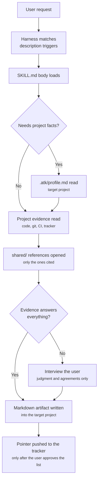

# System Architecture

## Shape

`atk` is content plus manifests. There is no build step, no bundler, and no runtime: the harness
reads Markdown and JSON directly from the repository tree.

```
aiteamkit/
  .claude-plugin/     plugin.json + marketplace.json     Claude Code
  .cursor-plugin/     plugin.json                        Cursor
  .codex-plugin/      plugin.json (+ interface block)    OpenAI Codex CLI
  skills/<name>/SKILL.md        19 skills, one folder each
  skills/<name>/references/*.md lazily loaded detail: templates, checklists, playbooks
  skills/<name>/evals/*.json    trigger cases for the description
  shared/*.md                   DRY layer shared by the skills that cite it
  hooks/                        session-start reminder, Claude Code only
  assets/*.svg                  icon and logo for marketplace listings
  docs/, docs/vi/               bilingual project documentation
```

Nothing in this tree describes the project the kit is installed into. That lives in one file in the
**target project**, `.atk/profile.md`, written by `atk:init` and committed with the project. The
plugin directory is read-only and shared by every project on the machine, so it is the wrong place
for a fact that is true of one of them.

## One content tree, three manifests

The three manifest folders describe the same `skills/` directory to three harnesses. Skill content
is never duplicated per harness. The manifests differ only in how they declare content:

| Manifest | How skills are declared | Harness-specific extra |
|----------|-------------------------|------------------------|
| `.claude-plugin/plugin.json` | omitted; Claude Code auto-discovers `skills/` | `marketplace.json` beside it |
| `.cursor-plugin/plugin.json` | `"skills": "./skills/"` | `displayName` |
| `.codex-plugin/plugin.json` | `"skills": "./skills/"` | `interface{}` with `defaultPrompt`, icons, `brandColor` |


There is no `commands/` layer. A skill is its own slash command, named from its folder, namespaced
`atk:` by the harness at load time from `plugin.json`.

## Load model

A harness loads only the frontmatter of every `SKILL.md` at startup. That frontmatter, mainly the
`description` field with its trigger phrases, is what the router matches a user request against. The
body of a `SKILL.md` is read only after the skill is selected.

This produces the size discipline in the kit:

| Layer | When it loads | Budget |
|-------|---------------|--------|
| `description` frontmatter | Always, for all 19 skills | A few lines; triggers belong here and nowhere else |
| `SKILL.md` body | On invocation | Under 300 lines |
| `references/*.md` | Only when a workflow step opens it | Unbounded, kept out of the default path |
| `shared/*.md` | Only when a skill cites it | Small, since several skills may open it |
| `.atk/profile.md` | Once per run, in the skills that need project facts | A page of pointers and commands, never prose |

## The `shared/` layer

Eleven files hold what skills would otherwise repeat. The first three are cited by all 19:

- `shared/team-roles.md`: the role table and the six rules every skill follows.
- `shared/artifact-paths.md`: the default output path per skill, naming rules, and front matter.
- `shared/ticket-adapters.md`: tracker detection and the vocabulary map.

Seven are contracts between a named handful of skills rather than kit-wide rules:

- `shared/review-checklist.md`: the rule record format that `atk:convention` writes and `atk:review`
  cites by ID, plus the baseline items that hold in any project. It exists so a convention is
  written once and checked in the same words, instead of being restated in both skills and drifting.
  `atk:implement` reads it for the baseline items alone, as a fallback when a project has recorded
  no conventions of its own.
- `shared/finalize-steps.md`: the closing sequence for a code change, and the consent line that
  every action past the commit has to cross. Cited by `atk:fix`, `atk:implement`, and `atk:verify`,
  the three skills that change code. Nothing leaves the local repository without being asked for.
- `shared/layer-verification.md`: the five-layer table saying what to run for a layer, what a pass
  proves, and what it does not. Cited by the same three. Each of them runs a check and then has to
  say what the result means, and the second half of that answer has to be identical in all three.
- `shared/diagram-conventions.md`: when a diagram earns its place in an artifact, the four shapes
  the kit draws, and the rules that keep them readable in a pull request on either theme. Cited by
  `atk:catchup`, `atk:design-doc`, `atk:plan`, `atk:breakdown`, and `atk:incident`, the five skills
  whose artifacts carry a diagram. Diagrams are Mermaid, so they render where the artifact is read
  and nothing has to be committed as an image.
- `shared/host-capabilities.md`: which capabilities of the host agent a skill may use, and what it
  does on a harness that has none. Cited by `atk:fix`, `atk:implement`, and `atk:verify` for the
  tidy step that follows a green verification, and by `atk:review` for independent passes run in
  parallel. It draws the line the kit had drawn only one way before: a capability the harness itself
  ships may be named and used, a command belonging to another kit may not, because the first is
  there for everyone who installed atk on that harness and the second is not.
- `shared/tidy-pass.md`: what tidying a change looks for, in three lenses, with what may be changed
  and what is never touched. Cited by the same three code skills through `host-capabilities.md`. It
  exists so the step lands the same way on a harness that ships a clean-up capability and on one
  where the skill works through the list itself, and it is why the kit ships no `simplify` skill of
  its own: the content belongs to the skills that already run it, not to a slash command that would
  produce no artifact and answer to no approver.

- `shared/spec-docs.md`: what separates a reference document from a design document, whose shape
  wins when a project already keeps documents of its own, the five kinds of change that oblige a
  pull request to carry its reference document, and the line between drift and a question nobody
  has answered. Cited by `atk:spec`, which writes those documents, and by `atk:design-doc`,
  `atk:fix`, `atk:implement`, `atk:review` and `atk:verify`, which have to leave them true. It is
  the widest of these contracts, because `shared/finalize-steps.md` now opens with its obligation,
  which makes every code-changing skill a party to it.

The eleventh describes a file that does not ship with the kit at all:

- `shared/project-profile.md`: what `.atk/profile.md` holds in the **target project**, and what each
  skill does when that file is missing. Skills that run commands stop; skills that only read a diff
  continue and say the profile was absent; skills that work from a chat message ignore it entirely.
  `atk:init` writes the profile, so it belongs to no group.

`shared/` sits at the repository root rather than under `skills/`, because a folder inside `skills/`
without a `SKILL.md` is ambiguous to skill discovery. Skills cite the files as `shared/<file>.md`,
which resolves to `../../shared/<file>.md` from a skill file; both spellings appear in each shared
file's header. `.atk/profile.md` is the exception: it is cited from the root of the target project,
because it is not part of the kit.

## The session-start hook

`hooks/hooks.json` registers one `SessionStart` hook that runs `hooks/check-profile.mjs`. It answers
a single question, "does this project have a profile yet", and it reminds without blocking.

The boundary is the point. A hook that blocked would put the rule in two places, and the rule is not
uniform anyway: nine skills need no profile, and a hook that stopped everything would stop
`atk:intake` from turning a chat message into requirements, which needs nothing from the repository.
Which skill needs what, and what it does without it, stays in `shared/project-profile.md`.

The boundary also holds by construction on this harness. Claude Code's hook contract says
`SessionStart` cannot block: exit code 2 takes no blocking action there, and any exit code sends
stdout to the model as context. The script exits 0 on every path regardless, and prints nothing when
there is nothing to say: no git entry in the directory, a profile already present, or a reminder
already given for this project. The "already reminded" marker is written to `${CLAUDE_PLUGIN_DATA}`
when the harness provides it and to the user's state directory otherwise, never into the user's
repository and never into a world-writable directory.

### Why the hook is Node and not a shell script

This section is the reason of record. `CLAUDE.md` and the comment at the top of the script point
here rather than restating it.

The hook is registered in **exec form**: `"command": "node"` plus an `args` array. Claude Code
documents exec form as resolving the executable on `PATH` and spawning it directly, substituting
`${CLAUDE_PLUGIN_ROOT}` itself, with no shell involved on any platform.

That matters because shell form does not behave the same everywhere. Claude Code runs a shell-form
hook under bash, except on Windows without Git Bash, where it falls back to PowerShell. A POSIX
shell script would therefore fail to spawn there, and a hook that fails to spawn is not silent: the
session shows `Failed with non-blocking status code` with the interpreter's message. Hooks have no
operating-system condition, so a second PowerShell copy could not be registered without firing on
Linux and macOS too. One portable interpreter is what lets the three platforms behave alike.

One limit, accepted:

- **Claude Code only.** Codex and Cursor can package hooks too, but each uses its own event names
  and output contract, and neither could be tested here. The reminder is a convenience; the gate
  that matters is in the skills, and it runs identically on all three harnesses. The other two
  wrappers wait until someone can verify them against a running harness.

## Skill anatomy

Every `SKILL.md` follows the same section order, which is also the reading order an agent needs:

```
frontmatter        name, description with triggers, argument-hint
title + intro      what this produces and the one habit that makes it work
## Scope           handles / does NOT handle, naming the skill that takes over
## Roles           who authors, who approves, who is consulted
## Invocation      the flags, one line of comment each
## Workflow        ASCII pipeline, then one numbered section per stage
## Output          artifact path and section list
## Ticket          how it reaches the team's tracker
## Definition of done   a checklist the skill must satisfy before reporting success
```

## Data flow at runtime



Artifacts are written into the **target project**, never into the atk kit itself.

## Versioning

One version spans six files, five of them driven by `release-please-config.json` `extra-files`, with
`.release-please-manifest.json` owned natively by release-please. The release workflow runs on push
to `main`. Details in `CLAUDE.md`.
