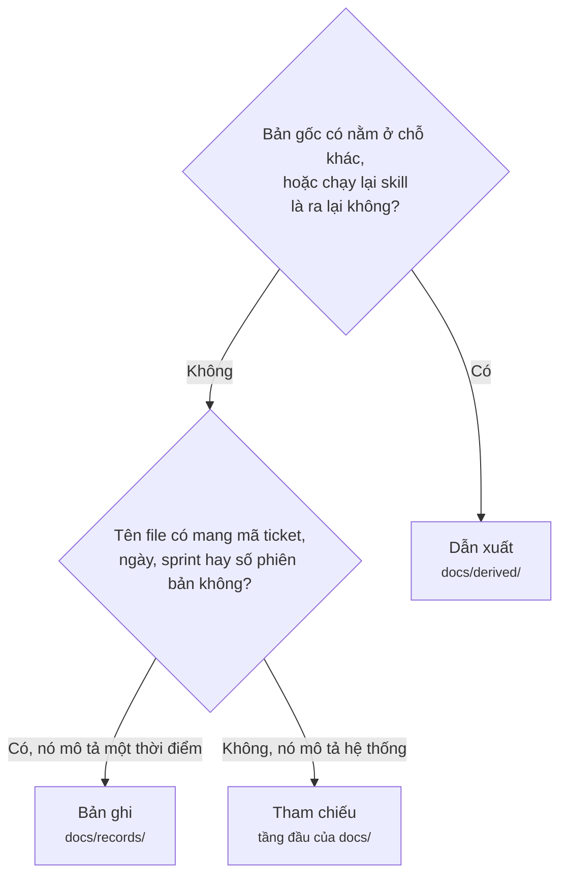

# Vòng đời artifact

Mọi skill trong kit có ghi file đều ghi Markdown vào repo của bạn, trừ một ngoại lệ nói bên dưới;
`atk:help` không ghi gì, vì nó trả lời ngay trong phiên. Tuần đầu tiên dùng `atk`, đội nào cũng hỏi
hai câu: có phải commit hết không, và sau này có được xóa bớt không. Tài liệu này trả lời cả hai và
nói rõ mỗi lựa chọn mất gì, để đội tự quyết thay vì đoán.

Đường dẫn của từng artifact nằm ở [shared/artifact-paths.md](../../shared/artifact-paths.md), và khi
hai bên nói khác nhau thì file đó đúng. Ở đây chỉ bàn chuyện gì xảy ra với một file sau khi công
việc sinh ra nó đã merge.

## Ba câu hỏi xếp chỗ cho mọi artifact

Điều quyết định không phải tài liệu nói về cái gì, mà là nó có phải bản duy nhất hay không, và nó có
tự nhận là đang mô tả hiện tại hay không.

## Ba nhóm

| Nhóm | Gồm những gì | Commit | Sửa về sau | Xóa về sau |
|------|--------------|--------|------------|------------|
| Tham chiếu | `docs/api/`, `docs/database/`, `docs/features/`, `docs/qa/`, `docs/standards/` và `docs/conventions.md`, các tài liệu onboarding, `docs/runbooks/`, `.atk/profile.md`, `.atk/overrides/` | Có, trừ hình dạng `workspace`, nơi gốc dự án không thuộc repository nào nên không gì theo dõi chúng | Luôn luôn, sửa tại chỗ | Không. Đây là lời khẳng định duy nhất về việc hệ thống hôm nay làm gì |
| Bản ghi | mọi thứ dưới `docs/records/`, cộng `docs/adr/` | Có | Không. Cho nó nghỉ thay vì sửa | Chỉ khi có người quyết cho từng file, không bao giờ bằng một luật quét |
| Dẫn xuất | mọi thứ dưới `docs/derived/` | Tùy đội | Chạy lại skill | Được, thoải mái |

## Ba file không thuộc nhóm nào

`atk:convention` có thể soạn `CONTRIBUTING.md`, template pull request và `CODEOWNERS`, và chỉ soạn
khi bạn chọn. Chúng không phải artifact của kit và không nhóm nào ở trên xếp chỗ cho chúng. Chúng là
file cộng tác của chính dự án bạn, giống như file cấu hình linter: code host đọc chúng, người chưa
từng cài `atk` vẫn bị chúng ràng buộc, và một trong ba file không phải Markdown.

Nói gọn thì thế này. **Luôn commit chúng.** Sửa bất cứ lúc nào đội quyết sửa, sửa tại chỗ, bằng tay
hoặc bằng một lượt chạy khác của skill đã soạn ra chúng. Xóa một file thì mất đúng phần việc host
thôi làm giúp: không có template thì reviewer chỉ còn nhìn diff, không có `CODEOWNERS` thì review
thôi tự động định tuyến.

## Xóa mỗi nhóm thì mất gì

**Tham chiếu.** Mất câu trả lời cho "endpoint này hôm nay làm gì", và cả đội quay lại đọc mã nguồn
để biết. Đó đúng là chi phí mà tài liệu tham chiếu sinh ra để bỏ đi. Không có gì khác trong repo đưa
ra cùng lời khẳng định ấy, và cũng vì vậy một dòng cũ nằm trong nhóm này là sai chứ không chỉ là lỗi
thời.

**Bản ghi.** Mất câu trả lời cho "vì sao lại làm như thế này". Mã nguồn không mang theo điều đó, còn
tài liệu tham chiếu thì không có chỗ cho phương án đã thua. Câu hỏi quay lại dưới những hình thức
rất cụ thể: người mới đề xuất đúng cách làm mà một thiết kế cũ đã loại vì một lý do giờ không ai gọi
tên được; khách hàng hỏi bản 1.4.2 có những gì; bên kiểm toán hỏi biên bản sự cố và các hành động
khắc phục; người bàn giao đã đi sáu tháng trước và file bàn giao là thứ duy nhất còn lại.

**Dẫn xuất.** Không mất gì. Bản ghi triển khai và bản ghi chuyển giao đều là bản sao của thứ nằm
trên pull request, bản ghi phản hồi là bản sao của thứ đã gửi lên repo của kit, bản tóm tắt của
`atk:catchup` chạy lại là có, báo cáo review cũng vậy: chạy lại `atk:review`, hoặc
`atk:plan --review` nếu thứ được soát là một bản kế hoạch; còn báo cáo lỗi thiết lập thì chạy lại
`atk:onboard` trên kho mã ở trạng thái lúc đó. Hai lượt review ấy, khi chạy mà không kèm
`--comment` của chúng, đều không đăng gì lên pull request, nên tới khi chạy lại, báo cáo của nó là
bản viết duy nhất: đó là lý do nên giữ thư mục, không phải lý do để sợ xóa. Có ba skill đọc một
trong sáu loại, và cả ba đều đọc báo cáo review: lượt `atk:review` thứ hai trên cùng một đối tượng
đọc báo cáo đang nằm sẵn ở đó để giữ lại mã định danh của các phát hiện, và khi không có báo cáo nào
thì đánh số lại từ 1 và nói rõ điều đó; `atk:plan --review` đọc báo cáo đang có của cùng bản kế
hoạch, cũng để giữ mã định danh, và để phân biệt một kết quả tác giả đã thấy mà không sửa với một
kết quả vừa mới sinh ra sau một tuần commit; còn `atk:convention` đọc mục `Convention gaps` của báo
cáo, đó là đường đi để một luật mà lượt review muốn có tới được tài liệu ghi luật. Xóa báo cáo ấy làm lượt
review sau mất một bộ mã định danh và mất những khoảng trống quy ước đáng lẽ được mang sang, chứ
không đứt mắt xích nào.

## Lịch sử git không phải đường lùi

Xóa một file khỏi cây làm việc rồi trông vào `git log` để lấy lại nghe thì an toàn nhưng không phải.
Muốn tìm lại, người ta phải biết là từng có một file như vậy và đoán đúng tên nó. Người mới vào
tháng trước tìm khắp cây thư mục, không thấy gì, và kết luận rằng chưa ai từng nghĩ tới câu hỏi đó.

ADR là chỗ dễ thấy nhất. Số ADR không bao giờ dùng lại, nên một khoảng trống trong dãy số là một
quyết định đã biến mất mà không để lại dòng nào nói nó từng quyết điều gì.

## Thư mục duy nhất được phép để ngoài git

`docs/derived/` là phần duy nhất của cây thư mục mà kit nói dự án có thể không đưa vào git. Một dòng
trong `.gitignore` là các bản sao thôi dồn lại. Không mắt xích nào trong chuỗi skill đứt, vì mọi bản
gốc vẫn nằm trên pull request hoặc chỉ cách một câu lệnh.

Đừng nối dòng đó sang `docs/records/`, vì hai lý do không liên quan gì tới dung lượng đĩa:

- **Một artifact không được commit thì không ai duyệt được.** Mỗi artifact mang một `status` và một
  người duyệt không phải tác giả. Một tài liệu yêu cầu đang ở `IN REVIEW` trên máy một người thì
  không phải đang được duyệt; không ai khác nhìn thấy nó.
- **Skill đọc bản ghi trong lúc công việc còn đang chạy.** `atk:qa` truy vết từng test case về tiêu
  chí nghiệm thu trong tài liệu yêu cầu, `atk:breakdown` đọc thiết kế, còn `atk:review` đối chiếu
  thay đổi với cả hai. Một luật giấu cả thư mục thì không phân biệt được tài liệu của sprint này với
  tài liệu ba năm trước.

## Cho một bản ghi nghỉ mà không xóa nó

Một bản ghi đã có bản thay thế thì giữ nguyên nội dung và nhận `status: SUPERSEDED`, kèm liên kết
tới bản mới và liên kết ngược lại. Nội dung vẫn đúng về thời điểm mà nó mô tả; chỉ có lời tự nhận là
hiện hành bị rút lại. Hai file cùng đọc như đang hiện hành là thất bại mà cách này ngăn, và nó tốn
đúng hai liên kết.

Dùng cách này mỗi khi một thiết kế thứ hai phủ lên phần mà thiết kế đầu đã phủ, hoặc một tài liệu
yêu cầu được viết lại sau khi phạm vi được thương lượng lại. Đây là câu trả lời cho "file này cũ
rồi", và nó tốt hơn xóa vì nó còn sống sót được câu hỏi "chuyện này từng được cân nhắc chưa".

## Ba chính sách một đội có thể chọn

| Chính sách | Dành cho | Đánh đổi gì |
|------------|----------|-------------|
| Commit hết | Mặc định. Đội có khách hàng, có kiểm toán, có người ra vào, hoặc bất kỳ ai sẽ đọc repo mà không có mặt trong cuộc trò chuyện sinh ra nó | Không mất gì, đổi lại cây docs lớn hơn |
| Commit hết trừ `docs/derived/` | Đội có lịch sử review và triển khai vốn đã nằm trên pull request và không muốn thêm một bản sao trong repo | Các bản sao tại chỗ. Muốn đọc thì mở pull request |
| Dọn bản ghi theo từng trường hợp | Repo đủ già để có những bản ghi chết thật, ví dụ thiết kế cho một module không còn tồn tại | Cần người quyết cho từng file. Đây không phải việc chạy theo lịch |

Cái thứ ba là một quyết định chứ không phải chính sách tự động hóa được. Một luật xóa mọi bản ghi
quá một năm tuổi thì không phân biệt được một thiết kế đã chết với biên bản sự cố giải thích vì sao
có một cảnh báo. Nếu một thư mục đã phình tới mức khó chịu, hãy sắp nó theo năm trước khi sắp nó
vào sọt rác.

## Điều này không thay đổi cái gì

Dự án nào đang giữ các tài liệu này ở chỗ khác thì cứ giữ nguyên ở đó. Bố cục trên là mặc định của
kit cho một cây thư mục trống, không phải một cuộc di chuyển phải làm với dự án đã ghi vào
`docs/design/` suốt một năm. Chẻ đôi một thư mục còn tệ hơn cả hai bố cục, và `atk` đọc bố cục của
chính dự án trước.
