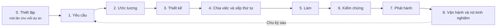
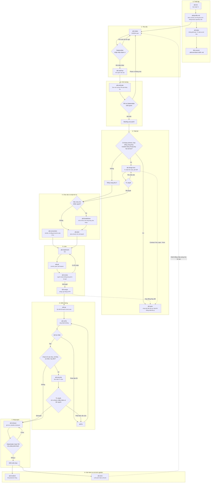
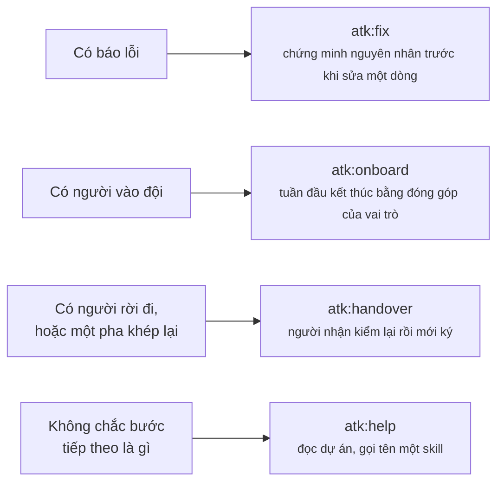

# Luồng dự án

23 skill rơi vào chu trình bàn giao của một đội như thế nào: skill nào thuộc pha nào, ai viết ra
artifact của nó, và ai phải chấp nhận artifact đó trước khi pha sau bắt đầu.

Tài liệu đi kèm: [skill-chain.md](./skill-chain.md) cho biết mỗi skill ăn vào gì và đẻ ra gì,
[skill-lifecycle.md](./skill-lifecycle.md) cho biết một skill chạy ra sao và khi nào nó với sang
skill khác, [../skills-overview.md](../skills-overview.md) cho biết khi nào nên dùng một skill và
khi nào không.

Các vai trò lấy từ `shared/team-roles.md`: PM, BrSE/BA, TL, Dev, QA, SRE và Stakeholder. Đội nhỏ thì
một người gánh vài vai; lý do vẫn tách tên ra là vì người viết artifact và người duyệt nó là hai
dòng riêng, kể cả khi hai dòng đó trỏ về cùng một khuôn mặt.

## Toàn cảnh các pha

## Chi tiết chu trình

Mỗi hình thoi là một người chấp nhận hoặc trả lại artifact, không bao giờ là một skill tự quyết.
Artifact bị trả về tay người viết, và đó là vòng lặp được vẽ ở mỗi pha.

## Tra cứu theo pha

| Pha | Skill | Người viết | Người chấp nhận | Trạng thái artifact tại cửa duyệt |
|-----|-------|------------|-----------------|------------------------------------|
| 0. Thiết lập | `atk:init` | Dev hoặc TL | Commit cùng repo, không cần duyệt riêng; với hình dạng `workspace` thì không có repository nào để commit vào | không có |
| 0. Thiết lập | `atk:tailor` | TL, hoặc ai sở hữu thứ skill đó sinh ra | Vai sở hữu kết quả của skill được tùy biến | `IN REVIEW` sang `APPROVED` |
| 1. Yêu cầu | `atk:intake` | BrSE/BA | Stakeholder, về phạm vi và tiêu chí | `IN REVIEW` sang `APPROVED` |
| 1. Yêu cầu | `atk:catchup` | Người mới vào việc | Không ai; phần kiểm tra hiểu bài là tự chấm | `DRAFT` |
| 2. Ước lượng | `atk:estimate` | Dev, PM soát năng lực | PM và Stakeholder cùng chốt | `IN REVIEW` sang `APPROVED` |
| 3. Thiết kế | `atk:design-doc` | TL hoặc Dev | TL, người nắm quyết định kỹ thuật cuối | `IN REVIEW` sang `APPROVED` |
| 3. Thiết kế | `atk:spec` | Dev, và BrSE/BA với loại `screen` | TL với loại `api` và `db`, BrSE/BA với loại `feature` và `screen` | `IN REVIEW` sang `APPROVED`, sau đó ghi đè tại chỗ mãi mãi |
| 4. Chia việc | `atk:breakdown` | TL hoặc PM | Từng Dev nhận phần việc của mình | `IN REVIEW` sang `APPROVED` |
| 4. Xếp thứ tự | `atk:plan` | Dev | Chính tác giả, trừ khi cửa kiểm tra đẩy lên TL | `DRAFT` |
| 4. Quy ước | `atk:convention` | TL | Cả đội đồng thuận, ghi theo từng quy tắc | `IN REVIEW` sang `APPROVED` |
| 5. Làm | `atk:implement` | Dev | Người review ở dòng dưới | không có |
| 5. Làm | `atk:review` | Người review, không bao giờ là tác giả | TL, khi vòng lặp chạm trần | không có |
| 5. Làm | `atk:git` | Dev | Người review, người duyệt pull request mà nó mở | không có |
| 6. Kiểm chứng | `atk:qa` | QA | QA Leader hoặc TL | `IN REVIEW` sang `APPROVED` |
| 6. Kiểm chứng | `atk:verify` | Dev hoặc QA | QA ký nhận trước khi ticket chuyển trạng thái | `DRAFT` |
| 6. Kiểm chứng | `atk:security` | Dev hoặc TL | TL, hoặc người phụ trách bảo mật nếu đội có; mỗi phát hiện chưa sửa được PM hoặc Stakeholder chấp nhận | `IN REVIEW` sang `APPROVED` |
| 7. Phát hành | `atk:release` | PM cùng SRE | Stakeholder hoặc PM ra quyết định phát hành | `IN REVIEW` sang `APPROVED` |
| 8. Vận hành | `atk:incident` | Incident Commander | TL và PM, về các hành động tiếp theo | `IN REVIEW` sang `APPROVED` |
| 8. Rút kinh nghiệm | `atk:retro` | PM hoặc cả đội | Cả đội, về ba hành động chọn ra | `IN REVIEW` sang `APPROVED` |

## Nằm ngoài chu trình

Ba skill đáp lại một sự kiện chứ không thuộc pha nào, và một skill đáp lại một câu hỏi. Cả bốn đều có
thể chạy ở bất kỳ điểm nào bên trên.

`atk:help` không có cửa kiểm soát và không có người duyệt, vì nó không viết artifact nào. Thay vào
đó nó đọc các cửa kiểm soát bên trên: một artifact còn ở `IN REVIEW` được báo là đang chờ người duyệt
của nó, không bao giờ được báo là đã sẵn sàng cho pha kế tiếp.

`atk:fix` là skill duy nhất thò tay ngược vào chu trình: lỗi bắt ở pha 6 thì sửa xong quay lại pha 6,
còn lỗi lộ ra sau khi phát hành thì mở thẳng pha 8.

`atk:git` vẽ ở pha 5 vì đó là nơi phần lớn công việc đi tới một pull request, nhưng nó không gắn với
pha nào. Mọi skill làm xong việc đều giao lại cho nó, nên một artifact viết ở pha 1 và một bản vá làm
ở pha 8 đều đóng lại theo cùng một đường.

`atk:spec` vẽ ở pha 3 vì đó là lúc một đội lần đầu viết ra vùng này làm gì, nhưng cạnh nét đứt đi từ
chỗ merge mới là cạnh chạy thường xuyên nhất. Thay đổi nào đụng tới hợp đồng thì mang theo tài liệu
tham chiếu trong cùng pull request, theo `shared/spec-docs.md`, và đó là lý do tài liệu sống lâu hơn
cái pha sinh ra nó. Khi `Contract: first`, pha 3 cũng là lúc tài liệu được viết từ thiết kế ngay khi
thiết kế đang được review, nên contract và quyết định được review cùng nhau, và các pha sau làm theo
cùng một trang.

## Những gì luồng này không quy định

Nó không định độ dài sprint, chiến lược nhánh, hay tên cụ thể của người duyệt. Đó là quyết định của
đội, và kit chỉ ghi lại chứ không chọn thay: người duyệt theo từng loại artifact nằm trong
`.atk/profile.md` (xem `shared/project-profile.md`), còn quy tắc nhánh và commit là bất cứ thứ gì
`atk:convention` tìm thấy trong repo.
