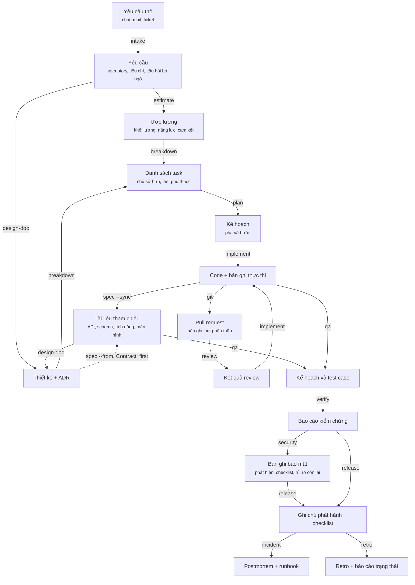

# Chuỗi skill

Mỗi skill đọc gì, để lại gì, và skill nào nhặt thứ đó lên tiếp. Các pha và cửa duyệt giữa chúng nằm
ở [project-flow.md](./project-flow.md), còn chuyện một skill chạy ra sao và gọi sang skill khác thế
nào thì ở [skill-lifecycle.md](./skill-lifecycle.md); tài liệu này nói về artifact.

Đường dẫn output chính xác không chép lại ở đây. Chúng nằm một chỗ duy nhất là
`shared/artifact-paths.md`, và khi hai bên lệch nhau thì file đó đúng.

## Chuỗi

Các nút là artifact. Nhãn trên mũi tên là skill biến artifact này thành artifact kia.

Bốn skill đứng bên cạnh chuỗi chứ không nằm trong nó, vì chúng đọc cả chuỗi thay vì một mắt xích:
`help` đọc trạng thái của mọi mắt xích để nói mắt xích nào tới lượt, `catchup` tóm tắt bất kỳ artifact nào cho người mới, `onboard` dẫn thành viên mới đi qua repo, và
`handover` ghi lại trạng thái thật của mọi việc còn dở.

Ba skill nữa nuôi chuỗi mà không do chuỗi sinh ra: `init` viết profile mà mọi skill đụng code đều
đọc, `convention` viết ra bộ quy tắc `implement` tuân theo và `review` soi, còn `tailor` viết file
ghi đè mà mỗi skill đọc trước bước đầu tiên của mình.

`spec` là nút duy nhất mà chuỗi quay về chứ không đi ngang qua. Tài liệu của nó vừa là đầu vào cho
thiết kế kế tiếp và test plan kế tiếp, vừa là đầu ra của mọi thay đổi đụng tới hợp đồng. Đó là lý do
mũi tên đi vào nó xuất phát từ code, không phải từ bản thiết kế đề xuất ra nó. Dự án có profile ghi
`Contract: first` thêm một mũi tên thứ hai, từ thiết kế vào `spec`: contract được viết từ thiết kế
ngay khi nó đang được review, để frontend, backend và QA làm theo nó trước khi có code, rồi mũi tên
từ code chuyển từng mục sang code khi mục đó được làm xong, theo `shared/spec-docs.md`.

## Mỗi skill ăn vào gì

| Skill | Đọc | Sinh ra | Skill dùng tiếp |
|-------|-----|---------|-----------------|
| `help` | Các skill của chính kit, cùng profile, front matter của artifact, kế hoạch và branch của dự án | Một câu trả lời trong phiên, không có file | Skill nó gọi tên, do người hỏi chạy |
| `init` | Repo | Profile của dự án | Mọi skill có chạy lệnh |
| `tailor` | Một `SKILL.md` của kit, và điều đội nói là muốn khác đi | File ghi đè cho skill đó | Chính skill mang tên file đó |
| `intake` | Một yêu cầu thô, hoặc một design Figma | Yêu cầu kèm câu hỏi bỏ ngỏ | `estimate`, `design-doc`, `qa`; từ design thì `spec --kind screen`, bỏ qua `design-doc` trừ khi thay đổi của màn hình chạm tới schema, public contract, shared module, hoặc hơn một service |
| `catchup` | Một epic hoặc một pull request | Bản tóm tắt kèm phần kiểm tra hiểu bài | Con người, không phải skill |
| `estimate` | Yêu cầu hoặc epic | Khối lượng, năng lực, cam kết sprint | `breakdown` |
| `design-doc` | Yêu cầu, và tài liệu tham chiếu của vùng sắp đổi | Thiết kế kèm ADR; khi `Contract: first` thì contract ở dạng tóm tắt, kèm tên các tài liệu tham chiếu | `breakdown`, `plan`, `implement`, và `spec` khi `Contract: first` |
| `spec` | Code, và những tài liệu đã có trong `docs/api/`, `docs/database/`, `docs/features/`, `docs/screens/`; khi `Contract: first` thì cả thiết kế; với màn hình thì design Figma của nó hoặc ảnh export từ đó | Tài liệu tham chiếu được giữ đúng, hoặc một báo cáo lệch | `design-doc`, `qa`, `plan`, `implement`, `review` |
| `breakdown` | Thiết kế hoặc epic | Task có chủ, làn song song, đồ thị phụ thuộc | `plan`, `implement` |
| `convention` | Code và lịch sử của nó, cùng những khoảng trống quy ước trong các báo cáo review đã viết | Quy ước, phân loại theo cách được ép tuân thủ | `implement`, `review` |
| `plan` | Ticket, thiết kế, hoặc mô tả; với `--review` thì là một bản kế hoạch đã viết | Pha và bước, hoặc danh sách phát hiện về một bản kế hoạch | `implement`; với `--review` là người viết bản kế hoạch đó |
| `implement` | Kế hoạch, ticket, hoặc mô tả | Code kèm bản ghi dùng làm nội dung PR | `review`, `qa` |
| `fix` | Báo cáo lỗi | Nguyên nhân đã chứng minh và thay đổi nhỏ nhất | `verify`, `review` |
| `review` | Pull request hoặc nhánh | Phát hiện xếp theo chặn, nên sửa, vụn vặt, cùng những khoảng trống quy ước đứng sau chúng | `implement`, `fix`, `convention` |
| `qa` | Tiêu chí nghiệm thu, thay đổi, tài liệu tham chiếu cho giá trị mong đợi, spec màn hình cho text của case `GUI` hoặc design Figma khi màn hình chưa có spec, và thiết kế cho migration, rollback và rollout | Kế hoạch test, test case, ma trận hồi quy | `verify` |
| `verify` | Hệ thống đang chạy | Điều gì đã chứng minh, điều gì chưa | `security`, `release` |
| `security` | Mã trong phạm vi, các scanner của dự án, bản thiết kế và mô hình mối đe dọa; với `--checklist`, checklist do khách hàng hoặc công ty cung cấp | Một bản ghi bảo mật với các phát hiện đã kiểm chứng, một checklist đã trả lời và rủi ro còn lại; với `--threat-model`, mô hình mối đe dọa của một tính năng | `release`, `fix`, `implement`, và người duyệt chấp nhận từng rủi ro |
| `git` | Một thay đổi hoặc artifact đã xong, cùng bản ghi mà skill gọi nó đã viết | Các commit, một nhánh, và pull request mang bản ghi đó | `review`, rồi tới người duyệt |
| `release` | Diff kể từ phiên bản trước | Ghi chú, checklist, đường lui | `incident`, `retro` |
| `incident` | Log, số đo, dòng thời gian | Postmortem kèm runbook | `retro`, `fix` |
| `retro` | Git, tracker, cả đội | Hành động đã kiểm, bằng chứng, báo cáo trạng thái | Chu kỳ sau |
| `onboard` | Repo và danh sách quyền truy cập | Thiết lập, bản đồ code, tuần đầu, và báo cáo mọi lỗi thiết lập tìm được | Thành viên mới, và người sở hữu lỗi được báo |
| `handover` | Mọi việc còn dở | Trạng thái, quyết định, cạm bẫy, chuyển quyền | Người nhận |

## Chỗ chuỗi đứt

Một mắt xích chỉ tốt bằng artifact nằm sau nó, và có bốn chỗ đứt đủ phổ biến để gọi tên.

**Không có profile.** Skill nào chạy lệnh của chính dự án thì dừng lại và đòi `atk:init`, thay vì
đoán bừa lệnh test. Skill nào chỉ đọc diff thì chạy tiếp và ghi rằng lúc đó không có profile.
`shared/project-profile.md` nói skill nào rơi vào nhóm nào.

**Artifact chưa từng được duyệt.** Một thiết kế ở trạng thái `DRAFT` mới là đề xuất, và xây từ đó có
nghĩa là bình luận review đầu tiên sẽ nhắm vào chính thiết kế. Hãy xem trường `status` trong front
matter trước khi dùng một artifact, đừng chỉ xem file có tồn tại hay không.

**Tài liệu tham chiếu không ai mang theo.** Hợp đồng đổi mà tài liệu đứng yên, nên người thiết kế
tiếp theo thiết kế dựa trên thứ đã hết đúng. `atk:review` nêu đây là phát hiện mức chặn, còn
`atk:spec --check` tìm ra những chỗ đã lọt. Nghĩa vụ này và sáu loại thay đổi kích hoạt nó nằm trong
`shared/spec-docs.md`.

**Artifact đã bị thay thế nhưng trông vẫn như bản hiện hành.** Lập kế hoạch lại cho cùng một việc sẽ
tạo thư mục thứ hai, và không có gì tự đánh dấu thư mục đầu là đã chết. Quy tắc khai tử nó nằm ở
cuối `shared/artifact-paths.md`.
