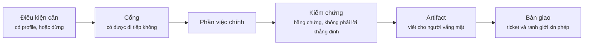
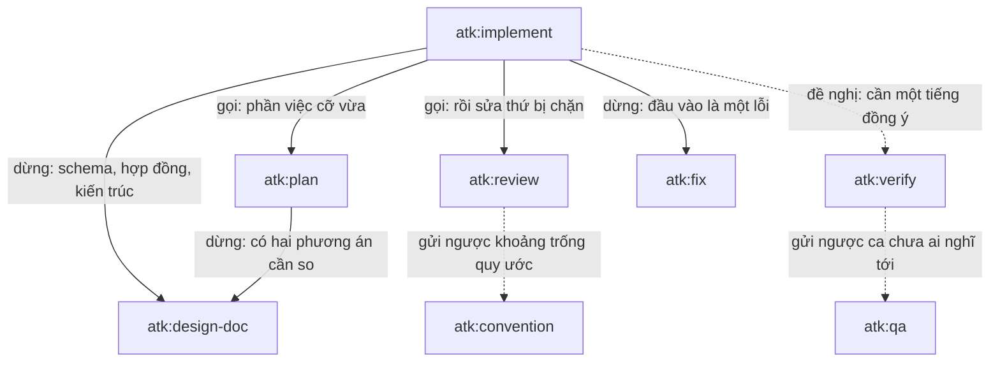

# Vòng đời một skill

Một skill chạy ra sao, từ lúc được gọi cho tới lúc bàn giao công việc, và khi nào nó với sang một
skill khác thay vì tự đi tiếp.

Tài liệu đi kèm: [project-flow.md](./project-flow.md) cho biết skill thuộc pha nào và ai nhận
artifact của nó, [skill-chain.md](./skill-chain.md) cho biết từng skill đọc gì và sinh ra gì,
[../skills-overview.md](../skills-overview.md) cho biết khi nào nên dùng và khi nào không.

## Một skill gồm những gì

Một file `SKILL.md`, luôn theo cùng một thứ tự mục, để người đã đọc một skill biết ngay chỗ cần tìm
trong skill kế tiếp.

| Mục | Trả lời |
|-----|---------|
| Front matter | Tên, phần mô tả mà harness dùng để khớp, và danh sách cờ |
| Đoạn mở | Skill này để làm gì, gói trong một đoạn |
| Scope | Nhận việc gì, và cố ý không nhận việc gì |
| Roles | Ai viết, ai duyệt, báo lên ai khi bế tắc |
| Invocation | Mọi cách gọi, và thứ phải có sẵn thì skill mới chạy |
| Workflow | Đường ống, rồi tới các bước đánh số |
| Output | Artifact, đường dẫn của nó, và những gì bắt buộc phải có trong đó |
| Ticket | Thứ được đề nghị đẩy lên tracker, và thứ không bao giờ được làm với ticket |
| Definition of done | Danh sách kiểm mà người review có thể đối chiếu lại sau khi chạy |

Phần chi tiết dài nằm ở `skills/<name>/references/*.md` và chỉ được mở bởi đúng bước cần tới nó. Quy
tắc dùng chung với skill khác nằm ở `shared/*.md` và chỉ mở khi được trích dẫn. Ngoài ra không có gì
nạp thêm: thân `SKILL.md` khi được gọi, một file reference khi có bước với tới, và `.atk/profile.md`
một lần mỗi lượt chạy, ở những skill cần dữ kiện của dự án.

## Hình dạng một lượt chạy

Không phải skill nào cũng có đủ năm chặng, và chặng bị bỏ qua cũng nói lên nhiều như chặng được chạy.

**Điều kiện cần.** Skill nào chạy lệnh của dự án thì đọc `.atk/profile.md` trước và dừng lại khi
thiếu nó, vì một lệnh test đoán bừa mà thoát 0 là thứ bằng chứng tệ nhất có thể có. Skill nào làm
việc từ một tin nhắn chat thì không đụng tới profile. `shared/project-profile.md` nói rõ skill nào
thuộc nhóm nào.

**Cổng.** Phần lớn skill kiểm một điều gì đó trước khi động tay: `atk:implement` chấm xem phần việc
cần bao nhiêu đồng thuận, `atk:fix` chứng minh nguyên nhân rồi kiểm xem hành vi hiện tại có phải một
quyết định đã ghi lại, `atk:verify` kiểm xem lượt chạy có đang trỏ vào môi trường cục bộ. Cổng đóng
lại thì lượt chạy dừng kèm một câu hỏi, và câu hỏi đó mang tên người phải trả lời.

**Phần việc chính.** Soạn tài liệu, viết mã, đọc review, hoặc tác động lên một hệ thống đang chạy,
theo đúng quy ước và lệnh của chính dự án chứ không phải theo thứ tự nghĩ ra tại chỗ.

**Kiểm chứng.** Bằng chứng, đúng cỡ của skill: chạy bộ test theo tầng với các skill sửa mã, kiểm
truy vết hai chiều với `atk:qa`, đọc lại nguồn đã trích với một tài liệu. Một lượt chạy đạt chứng
minh được gì và không chứng minh được gì thì nằm ở `shared/layer-verification.md`, cho ba skill sửa
mã.

**Artifact.** Một file Markdown ở đường dẫn trong `shared/artifact-paths.md`, mở đầu bằng khối front
matter mang chủ sở hữu, người duyệt, và trạng thái phê duyệt. Viết cho người không có mặt trong cuộc
trao đổi.

**Bàn giao.** Artifact được đề nghị đẩy lên tracker, không bao giờ đăng trước khi cho xem. Với một
thay đổi mã, `shared/finalize-steps.md` vạch ranh giới: mọi thứ tới hết commit ở lại máy, mọi thứ sau
commit đều phải hỏi, hỏi lại từng lần.

## Một skill với sang skill khác thế nào

Trong mười tám file, một skill gọi tên skill khác bảy mươi lăm lượt, thành năm mươi cặp khác nhau,
nghe như một đồ thị dày đặc. Thực ra không: phần lớn trong số đó là ranh giới chứ không phải cạnh.
Có năm loại, và chỉ bốn loại đầu xảy ra lúc chạy.

| Loại | Công việc đi đâu | Xuất hiện ở |
|------|------------------|-------------|
| Gọi rồi đi tiếp | Skill kia chạy, trả kết quả về, skill này chạy tiếp | `implement` sang `plan`, `implement` sang `review` |
| Dừng và giao lại | Skill này không đổi thêm gì nữa; công việc chuyển đi | `implement` sang `design-doc`, `implement` sang `fix`, `plan` sang `design-doc` |
| Đề nghị và chờ một tiếng đồng ý | Có thể không xảy ra, và bản ghi nói rõ là đã xảy ra hay chưa | `implement` sang `verify` |
| Gửi ngược một phát hiện | Skill này chạy tiếp; skill kia mới là nơi ghi lại phát hiện đó | `review` sang `convention`, `verify` sang `qa` |
| Viết một file skill khác đọc | Không có lời gọi nào; hợp đồng đi qua một file | `init` tới mọi skill sửa mã, `convention` tới `implement` và `review` |

Hai vòng nét liền là hai vòng một đội cảm nhận hằng ngày. `implement` gọi `review` lên chính sản
phẩm của mình, chạy nhiều nhất hai lượt rồi báo lên đích danh một người, vì một phát hiện sống sót
qua hai lượt sửa thường là vấn đề thiết kế đang bị vá. Vòng còn lại là lúc `implement` dừng ở cổng
lớn: phần việc chạm vào schema, một hợp đồng công khai, một module dùng chung, hoặc nhiều hơn một
service thì không file nào được đổi cho tới khi có người duyệt cách làm.

## Thứ không phải là cạnh

Phần lớn lượt nhắc tên skill khác nằm trong mục `## Scope`, ở dòng "does NOT handle". Chúng nói cho
người đọc biết việc mà skill này từ chối thì thuộc về ai, và không có lời gọi nào ở đó: `atk:intake`
nhắc `atk:estimate` nghĩa là ước lượng không phải việc của intake, chứ không phải intake sẽ đi ước
lượng.

Cặp sắc nét nhất là `atk:fix` với `atk:incident`, và đó là thứ tự trước sau chứ không phải lời gọi:
`atk:incident` giữ phần việc khi người dùng đang chịu ảnh hưởng, còn `atk:fix` nhận phần mã khi dịch
vụ đã ổn định và dòng thời gian không còn cần người trực nữa. `project-flow.md` vẽ đường quay lại
vòng đời đó.

Những con trỏ này luôn gọi tên một skill `atk:` hoặc nói "ngoài phạm vi kit". Một đội chỉ cài atk
vẫn phải tìm được lối đi tiếp, nên kit không bao giờ trỏ sang lệnh của một kit khác, vốn là ngõ cụt
mà người ta chỉ phát hiện sau khi đã đi theo.

## Thứ một skill với ra ngoài kit

Ba skill sửa mã giao thay đổi cho khả năng dọn mã sẵn có của chính agent chủ, ngay khi lượt kiểm
chứng đã xanh và trước khi có người review nhìn vào; còn `atk:review` dùng khả năng chạy nhiều agent
song song của agent chủ để đặt vài lượt đọc độc lập lên một diff lớn. Cả hai đều là phần cải thiện
cho việc skill vốn đã tự làm, không phải điều kiện bắt buộc: trên harness không có cả hai, skill tự
chạy lượt đó và artifact nói rõ nó đã chạy theo đường nào.

`shared/host-capabilities.md` giữ phần quy tắc và ranh giới, `shared/tidy-pass.md` giữ phần lượt dọn
mã đi tìm những gì.

## Tự đọc một skill

Mở `skills/<name>/SKILL.md` và đọc ba thứ theo thứ tự này: đường ống ở đầu mục `## Workflow`, vốn là
cả skill gói trong một dòng; các bước đánh số ngay dưới nó; và `## Definition of done`, tức thứ có
thể mang ra đối chiếu sau khi chạy xong. Các file trong `references/` là phần chi tiết đứng sau một
bước, và chỉ đáng mở khi đúng bước đó là thứ đang cần biết.
