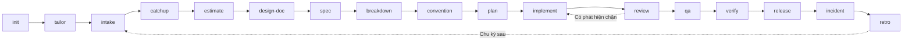

# Tổng quan các skill

Hai mươi mốt skill phủ vòng đời delivery của một team. Mỗi mục nói rõ skill sinh ra gì, khi nào nên
dùng, và khi nào không nên.

Nên đọc phần này trước khi áp dụng bộ kit: mỗi skill chạy độc lập được, và team có thể bắt đầu chỉ
với một skill.

## Vị trí trong vòng đời

Ba skill đáp lại một sự kiện chứ không nằm trong phase nào: `fix` khi có lỗi được báo, ở bất kỳ
điểm nào; `onboard` khi có người vào; `handover` khi có người rời đi, hoặc một phase kết thúc.

`atk:init` chạy một lần cho mỗi dự án. Nó viết ra `.atk/profile.md`, file cho các skill có động tới
mã nguồn biết dự án này test thế nào, build ra sao và chia tầng thế nào. `atk:implement`, `atk:fix`
và `atk:verify` dừng nếu thiếu nó. `atk:plan` vẫn chạy tiếp nhưng nói rõ trong artifact phần nào là
suy đoán. Những skill còn lại chạy mà không cần tới nó.

---

## `atk:init`

**Sinh ra.** File `.atk/profile.md` trong dự án. Nó ghi hình dạng của dự án, kèm bảng các repo thành
viên khi dự án trải trên nhiều repository; lệnh test, build và lint của từng app, bố
cục các tầng kèm tài liệu chuẩn và module mẫu cho mỗi tầng, các thư mục docs, tracker và nơi đặt tài
liệu đặc tả, cùng ai duyệt cái gì. Mục cuối nói cách khởi động ứng dụng và cách xác nhận một tác động
đã thật sự xảy ra trong dữ liệu.

**Dùng khi.** Một team cài `atk` vào dự án lần đầu, và dùng lại khi dự án đã đi xa hơn những gì
profile đang ghi. Cờ `--audit` đối chiếu profile hiện có với repo và không sửa gì.

**Không dùng khi.** Bạn muốn cấu hình kit một lần cho mọi dự án. Một profile chỉ đúng với một dự án
và được commit cùng dự án đó; bản thân kit không giữ sự thật nào của dự án.

**Thói quen tạo ra khác biệt.** Nó đọc repo trước khi hỏi. Câu nào mà file manifest, workflow CI hay
thư mục test đã trả lời được thì nó không đem ra hỏi người. Phần không file nào trả lời được sẽ thành
`TBD` kèm tên người nợ câu trả lời, chứ không thành một phỏng đoán. Nó cũng xác định gốc dự án trước
khi đọc bất cứ thứ gì, nên một parent repository chứa nhiều repo của các team, và một thư mục không
thuộc repository nào, đều được nói thẳng ra kèm việc profile đặt ở đó làm được gì và không làm được
gì, trước khi file được ghi.

---

## `atk:tailor`

**Sinh ra.** File `.atk/overrides/<skill>.md` trong dự án: điều team này muốn một skill làm khác đi,
viết thành mục `## Before`, mục `## After`, hoặc cả hai, kèm tên vai trò sở hữu thứ skill đó sinh ra
đứng ở dòng người duyệt. Với cờ `--feedback` thì thứ sinh ra là một bản ghi, đặt tại
`docs/derived/feedback/<skill>-<date>.md`, theo một bộ khung cố định: lần chạy nằm trong một bảng,
các phát hiện được đếm và chia theo chỗ mỗi phát hiện thuộc về, mỗi phát hiện một dòng mang mức
nghiêm trọng và dòng định nghĩa nó dẫn ra, một mục riêng cho từng phát hiện, và số bước của skill đã
chạy trên tổng số bước.

**Dùng khi.** Team cứ phải sửa đi sửa lại cùng một chỗ trong kết quả của một skill, khi khách hàng
hoặc một chuẩn nội bộ thêm một bước mà kit không biết, hoặc khi một file ghi đè viết từ trước không
còn khớp với skill nó thuộc về. Cờ `--audit` duyệt mọi file ghi đè trong dự án và không sửa gì. Cờ
`--feedback` nhận một lần chạy hỏng rồi xếp từng phát hiện vào một trong ba chỗ: file ghi đè của
team này, bản ghi gửi người viết ra skill đó, hoặc không chỗ nào; bản ghi chỉ rời khỏi dự án khi
được hỏi. Skill đó không nhất thiết phải thuộc kit: một lần chạy skill của chính dự án hay của kit
khác cũng được ghi y như vậy, trừ phần ghi đè, vì chỉ skill `atk` mới đọc file ghi đè. Gọi
`--feedback` mà không kèm tên skill thì nó lấy skill từ phiên làm việc, hỏi lại khi trong phiên có
nhiều skill của kit đã chạy, và hỏi thẳng khi không có skill nào.

**Không dùng khi.** Luật nói về mã nguồn chứ không nói về skill. "Mọi pull request phải có test" là
thứ một người không cài kit vẫn kiểm được, nên nó là một dòng `CONV-NNN` do `atk:convention` viết và
`atk:review` thi hành. "`atk:review` nên kiểm thêm phần i18n của đội mình" là luật về skill và thuộc
về đây. Khi cả hai cách đọc đều hợp, luật về mã nguồn thắng.

**Thói quen tạo ra khác biệt.** Nó biết từ chối. `shared/project-overrides.md` liệt kê bảy thứ phần
ghi đè không bao giờ được gỡ, trong đó có dòng người duyệt, luật một skill không quyết thứ mà một vai
sở hữu, và ranh giới xin phép trước khi bất cứ gì rời khỏi repo cục bộ. Chỉ dẫn bị từ chối không bị
bỏ trong im lặng: skill nói rõ nó phạm điều nào trong bảy điều, rồi đề nghị thứ gần nhất mà không
phạm, thường là một chỉ dẫn đưa quyết định ra sớm hơn thay vì một chỉ dẫn tự quyết.

---

## `atk:intake`

**Sinh ra.** Một tài liệu yêu cầu: trích nguyên văn yêu cầu gốc, mô tả hành vi hiện tại có dẫn đường
dẫn file, các user story, tiêu chí nghiệm thu dạng `Given / When / Then`, danh sách nằm ngoài phạm
vi, các giả định được đánh dấu rõ là giả định, và câu hỏi còn treo kèm tên người phải trả lời.

**Dùng khi.** Yêu cầu tới dưới dạng tin nhắn, biên bản họp, mail hoặc một ticket một dòng, và team
chưa bắt đầu được từ đó. Cũng dùng khi hai người đọc cùng một ticket mà hiểu khác nhau.

**Không dùng khi.** Yêu cầu đã chốt và đã viết ra; bạn cần con số ước lượng (`atk:estimate`) hoặc
hướng kỹ thuật (`atk:design-doc`).

**Thói quen tạo ra khác biệt.** Những tiêu chí kiểu "chạy đúng" hay "nhanh" bị từ chối chứ không
được ghi nhận cho qua. Chúng phải trở thành một con số, một trạng thái, một kết quả nhìn thấy được,
hoặc một câu hỏi còn treo.

---

## `atk:catchup`

**Sinh ra.** Với một epic: công việc là gì và làm cho ai, vì sao làm lúc này, cái gì trong và ngoài
phạm vi, một bảng liệt kê từng thứ công việc chạm tới kèm đường dẫn nó nằm và những vai chạm được
tới nó, ai quyết cái gì, những thuật ngữ người mới sẽ không hiểu, những chỗ dễ làm sai, và phần tự
kiểm hiểu bài mà dev phải trả lời trước khi viết dòng mã nào. Với một pull request: cùng bản
tóm tắt đó nhưng gói trong phạm vi diff, không có phần tự kiểm.

**Dùng khi.** Một người nhận epic mà họ không tham gia soạn, vào một việc đang chạy giữa chừng, hoặc
phải review một pull request ở mảng họ không nắm.

**Không dùng khi.** Người đó mới với cả dự án chứ không riêng phần việc đang làm (`atk:onboard`),
bản thân yêu cầu còn mập mờ chứ không chỉ là lạ lẫm (`atk:intake`), hoặc thứ cần là một tài liệu ghi
lại phần việc đã merge nay làm những gì: đó là `atk:spec`, và nó phải còn đúng rất lâu sau khi bản
tóm tắt bị vứt đi.

**Thói quen tạo ra khác biệt.** Phần tự kiểm do dev trả lời, không phải do skill điền sẵn. Một bản
tóm tắt không bắt ai phản hồi là bản tóm tắt không ai đọc.

---

## `atk:estimate`

**Sinh ra.** Ước lượng từng hạng mục kèm căn cứ và độ tin cậy, phần buffer rủi ro hiện rõ thành một
dòng riêng, bảng tính capacity trong đó ngày nghỉ và các buổi họp là những phép trừ tường minh, cam
kết sprint, và danh sách phần không nhét vừa.

**Dùng khi.** Họp sprint planning, khách hỏi mất bao lâu, hoặc phạm vi đổi và cần ước lượng lại.

**Không dùng khi.** Các hạng mục chưa có tiêu chí nghiệm thu. Skill sẽ đánh dấu `NEEDS INTAKE` thay
vì đoán, đó là câu trả lời đúng nhưng không phải câu bạn muốn nghe.

**Thói quen tạo ra khác biệt.** Mỗi con số đều mang theo căn cứ của nó, thường là một hạng mục tương
tự trong quá khứ tìm được từ lịch sử git. Con số không có căn cứ thì không tranh luận được và cũng
không học được gì từ nó.

---

## `atk:design-doc`

**Sinh ra.** Tài liệu thiết kế kỹ thuật: hiện trạng có trích dẫn `path:line`, tiêu chí ra quyết
định, từ hai phương án trở lên được so sánh, mô hình dữ liệu và API contract được chọn, migration và
cách rollback, rủi ro, danh sách người phải review, cùng ADR tương ứng.

**Dùng khi.** Trước khi implement bất cứ thứ gì đụng tới schema, một public contract, một module
dùng chung, hoặc nhiều hơn một service.

**Không dùng khi.** Thay đổi nhỏ, cục bộ và dễ quay lui. Viết design doc cho một sửa đổi hai file
tốn hơn phần nhận lại.

**Thói quen tạo ra khác biệt.** Một phương án thì là kế hoạch, không phải thiết kế. Tài liệu bắt
buộc có cả phương án mà team sẽ chọn theo quán tính, và nói rõ vì sao nó thua.

---

## `atk:spec`

**Sinh ra.** Tài liệu tham chiếu mà đội còn đọc rất lâu sau khi công việc sinh ra nó đã merge: API
contract theo từng resource trong `docs/api/`, schema theo từng bảng trong `docs/database/`, và hành
vi của từng tính năng trong `docs/features/`. Mỗi chủ thể một file, đặt tên theo chủ thể, ghi đè tại
chỗ. Cờ `--check` báo chỗ tài liệu và code không khớp nhau mà không sửa gì.

**Dùng khi.** Dự án chưa có contract nào được viết ra, một thay đổi đã merge bỏ quên tài liệu, hoặc
không ai còn tin vào tài liệu nữa. Cờ `--sync` gấp thay đổi trên nhánh hiện tại vào đúng những tài
liệu mà nó đụng tới.

**Không dùng khi.** Câu hỏi vẫn là chọn hướng nào. Đó là việc của `atk:design-doc`, vốn so sánh
phương án rồi dừng lại; skill này mô tả thứ đã thực sự làm.

**Thói quen tạo ra khác biệt.** Hình dạng tài liệu lấy từ những tài liệu dự án đang giữ, không lấy
từ kit. Một đội đang có 29 file API cùng một hình dạng là đã có quy ước, và file thứ ba mươi khác
hình dạng làm họ tốn hơn phần thời gian nó tiết kiệm được.

---

## `atk:breakdown`

**Sinh ra.** Các task, mỗi task một sản phẩm bàn giao, có người nhận, kèm đồ thị phụ thuộc với
đường găng được đánh dấu, các làn chạy song song có khai báo file mà mỗi làn sở hữu, và định nghĩa
hoàn thành cho từng task.

**Dùng khi.** Trước khi sprint bắt đầu, hoặc bất cứ khi nào công việc phải chia cho nhiều người.

**Không dùng khi.** Một người làm trọn trong một ngày.

**Thói quen tạo ra khác biệt.** Hai làn chạy song song không được sở hữu cùng một file, cùng một
chuỗi migration hay cùng một file config dùng chung. Khi buộc phải vậy, skill xếp chúng nối tiếp và
nói rõ ra, đó chính là thứ ngăn cú merge conflict mà không ai lường trước.

---

## `atk:convention`

**Sinh ra.** Quy ước của team được rút ra từ chính code và lịch sử git của team, mỗi quy tắc được
phân loại `ENFORCED` (công cụ chặn), `REVIEWED` (người kiểm trong review) hay `ASPIRATIONAL` (không
ai kiểm), kèm công cụ có thể tự động hóa những quy tắc đang phải kiểm bằng tay. Trước đó skill nêu
ra các ngôn ngữ và công nghệ repo dùng, mỗi cái kèm file làm bằng chứng, rồi xếp quy tắc theo từng
cái. Dự án chưa ghi gì thì nhận `docs/standards/`: mỗi công nghệ một tài liệu, cộng một `index.md`
mang review checklist. Khi một công nghệ làm hai việc khác nhau ở hai layer trong profile, chẳng hạn
TypeScript ở client và ở server, các quy tắc khác nhau giữa hai bên được ghi vào
`docs/standards/<layer>/<tech>.md`; layer là của chính dự án, không phải bộ backend, frontend,
mobile cố định. Một team đã có sẵn bộ tài liệu chuẩn thì phần phân loại đó được viết vào
chính bộ tài liệu ấy, theo đúng hình dạng team đang dùng: `docs/standards/` và `docs/conventions.md`
là giá trị mặc định của kit, không phải địa chỉ mà mọi dự án phải chuyển sang. Nếu dự án chưa có `CONTRIBUTING.md`, template pull request hay `CODEOWNERS`, skill đề
nghị soạn và chỉ ghi những file bạn chọn; cờ `--scaffold` đưa ra đề nghị đó mà không chạy lại cả
lượt rút quy ước. File bạn đã có thì để yên, trừ khi chạy `--sync`: lúc đó skill chỉ ra chỗ
checklist hay danh sách người sở hữu đã tụt lại và đề nghị đúng phần thay đổi đó. Cờ `--audit` còn
báo về các nguồn đứng sau đề xuất: nguồn nào đã mất, nguồn nào đã đổi kể từ lần cuối có người kiểm,
và đề xuất nào chưa ai duyệt; `--sync` đưa ra phần thay đổi mà một nguồn đã đổi sẽ gây ra, còn nguồn
đã mất thì thành câu hỏi mở.

**Dùng khi.** Chưa có quy ước viết ra, quy ước đã viết không còn khớp với code, review cứ lặp đi
lặp lại cùng một comment, hoặc repo chưa có `CONTRIBUTING.md`, template pull request và
`CODEOWNERS`.

**Không dùng khi.** Bạn muốn một style guide được áp thẳng vào dự án mà không ai duyệt. Với
`--suggest`, skill đề xuất quy tắc từ một danh sách các bộ chuẩn đã công bố cho stack nó nhận ra,
kèm link tới từng nguồn và không bao giờ chép văn bản của nguồn, và mọi đề xuất nằm chờ trong mục
đề xuất tới khi Tech Lead chấp nhận. Thứ code cho thấy và thứ một tài liệu bên ngoài khuyến nghị
được giữ tách riêng.

**Thói quen tạo ra khác biệt.** Nhóm `ASPIRATIONAL`. Một quy tắc không ai kiểm được gọi đúng tên như
vậy, thay vì để nó trông như chính sách. Các quy tắc `REVIEWED` được viết theo định dạng bản ghi
trong `shared/review-checklist.md`, đó là thứ cho phép `atk:review` trích dẫn chúng theo ID.

---

## `atk:plan`

**Sinh ra.** Mã nguồn hiện đang làm gì, kèm đường dẫn file; các phase mà mỗi phase kết thúc bằng thứ
người review nhìn được; các bước bên trong một phase mà mỗi bước để lại cây mã vẫn chạy được; mỗi
bước động vào đâu và được kiểm bằng gì; phần cố ý để ngoài phạm vi; và phần còn chưa rõ kèm tên người
phải trả lời.

**Dùng khi.** Trước khi bắt đầu một phần việc đủ lớn để cần chia chặng, hoặc khi tiếp quản thứ do
người khác thiết kế mà các bước không hiển nhiên. Cờ `--review` hướng đúng cách đọc đó vào một bản
kế hoạch đã viết sẵn, kể cả bản nằm trong pull request, và ghi báo cáo ra
`docs/derived/reviews/plan-<slug>-<date>.md` thay vì một bản kế hoạch mới; cờ `--comment` đăng kết quả
lên pull request mang bản kế hoạch đó, đưa danh sách ra trước rồi đăng khi được đồng ý.

**Không dùng khi.** Việc phải chia cho nhiều người, đó là `atk:breakdown`; hoặc việc chỉ là một thay
đổi trong một file, khi bản kế hoạch tốn hơn chính phần việc. Soát phần mã sinh ra từ một bản kế
hoạch là việc của `atk:review`.

**Thói quen tạo ra khác biệt.** Một phase không kết thúc được bằng thứ đem duyệt được thì không phải
phase, mà là một quãng nghỉ. Các bước được xếp sao cho cây mã vẫn chạy ở mọi ranh giới, và chính điều
đó khiến việc dừng giữa chừng trở nên an toàn. Và bản kế hoạch được đọc lại trước khi bàn giao: mở
từng đường dẫn nó trích, đối chiếu từng thư viện nó giả định là đã có với chính kho mã, còn thứ cả
hai không xác nhận nổi thì thành câu hỏi mở kèm tên người, thay vì lặng lẽ biến mất.

---

## `atk:implement`

**Sinh ra.** Mã nguồn, cộng một bản ghi triển khai sẽ trở thành phần mô tả pull request: đã đổi gì và
vì sao, phủ những bước nào trong kế hoạch, lệnh đã chạy cho từng tầng kèm output của nó, bước dọn mã
đã đổi những gì, và phần cố ý chưa làm.

**Dùng khi.** Một ticket, một bản kế hoạch, hoặc một yêu cầu đã mô tả rõ đã sẵn sàng để làm, và câu
hỏi còn lại là làm thế nào chứ không phải làm cái gì.

**Không dùng khi.** Yêu cầu còn mập mờ (`atk:intake`), hoặc phần việc là truy nguyên nhân một lỗi
(`atk:fix`).

**Thói quen tạo ra khác biệt.** Cổng kế hoạch có ba mức chứ không phải hai nhánh. Thay đổi nhỏ đi
thẳng vào code. Thay đổi vừa thì gọi `atk:plan`, xác nhận bằng một câu, rồi đi tiếp. Chỉ thay đổi
chạm vào schema, hợp đồng công khai, nhiều service, hoặc còn một quyết định kiến trúc bỏ ngỏ mới dừng
chờ người duyệt. Soạn một danh sách bước thì không cần người duyệt; quyết kiến trúc thì cần.

Khi lượt kiểm chứng đã xanh, thay đổi được đưa qua khả năng dọn mã có sẵn của harness, `/simplify`
trên Claude Code, trước khi gọi review: người review nên dành lượt đọc cho hành vi, chứ không phải
cho đoạn trùng lặp mà tác giả tự bỏ được. Trên harness không có khả năng đó, bản ghi nói rõ bước này
đã không chạy, thay vì để nó biến mất không dấu vết.

---

## `atk:fix`

**Sinh ra.** Lỗi được ghi lại nguyên văn, nguyên nhân được chứng minh chứ không phải đoán, và một
lượt kiểm xem hành vi hiện tại có phải là quyết định ai đó đưa ra có chủ ý. Sau đó là thay đổi nhỏ
nhất gỡ được nguyên nhân, kiểm chứng theo tầng, và báo cáo nói rõ đã kiểm những gì và chưa kiểm những
gì.

**Dùng khi.** Có một bug report, một test đang đỏ, một endpoint hay một màn hình hỏng, hoặc một cuộc
điều tra phải kết thúc bằng lời giải thích chứ không phải phỏng đoán.

**Không dùng khi.** Production đang chết ngay lúc này: `atk:incident` điều phối cuộc ứng cứu, còn
skill này nằm bên trong đó. Hoặc chẳng có gì hỏng và mã chỉ đang khó chịu, vốn không phải một lỗi.

**Thói quen tạo ra khác biệt.** Không file nào đổi trước khi nguyên nhân được chứng minh, và chính
việc chứng minh cũng có trần: ba giả thuyết bị loại thì skill dừng lại và giao cuộc điều tra cho một
người có tên, vì thứ còn lại sau ba lần loại thường nằm trong đầu ai đó chứ không nằm ở một lượt tìm
kiếm nữa. Cờ
`--investigate-only` tồn tại vì lời giải thích thường đã là toàn bộ sản phẩm cần giao, và dừng ở đó
là một kết quả hợp lệ chứ không phải một việc dang dở. Bước dọn mã sau lượt kiểm chứng ở đây hẹp hơn
mọi chỗ khác trong kit: nó chỉ chạm đúng những dòng bản vá đã chạm, vì một bản vá mang kèm một lượt
dọn dẹp cả file xung quanh thì không revert gọn được vào ngày cần revert.

---

## `atk:review`

**Sinh ra.** Một báo cáo review ở `docs/derived/reviews/<pr>-<date>.md`, lần chạy nào cũng viết, kèm
một bản tóm tắt trong phiên nói có bao nhiêu phát hiện ở mỗi mức, nêu tên những phát hiện chặn merge,
và trỏ tới file. Các phát hiện được xếp hạng `BLOCKING`, `SHOULD FIX` và `NIT`, mỗi phát hiện trỏ tới
một dòng cụ thể, nói rõ nó gây hỏng gì và đề xuất một thay đổi cụ thể; nhiều nhất mười phát hiện, hoặc
hai mươi khi chạy `--strict`, và phát hiện chặn merge thì không bao giờ bị cắt. Mỗi phát hiện mang một
mã định danh có tiền tố theo mức nghiêm trọng, `B1`, `S1`, `N1`, nhờ đó cả nhóm gọi tên được một phát
hiện trong buổi họp nhanh hay trong một luồng trao đổi trên pull request; lượt review thứ hai trên
cùng pull request đọc lại báo cáo đầu để những mã ấy vẫn trỏ đúng vào các phát hiện cũ. Báo cáo có hình dạng cố định
chứ không phải mỗi lần chạy dựng lại một kiểu, và không mang điểm số nào, vì người review không phải
người duyệt. Cờ `--out` đổi chỗ file, cờ `--comment` đăng phát hiện thành comment inline trên PR.

**Dùng khi.** Trước khi approve một pull request, hoặc khi cần một ý kiến thứ hai.

**Không dùng khi.** Bạn muốn code được sửa chứ không phải được review, muốn chất vấn chính bản yêu
cầu (`atk:intake`), hoặc thứ cần đọc là một bản kế hoạch chứ không phải một thay đổi, khi đó dùng
`atk:plan --review`: kế hoạch được đối chiếu với kho mã mà nó giả định, không phải với một diff.

**Thói quen tạo ra khác biệt.** Nó xuất phát từ việc thay đổi này lẽ ra phải làm gì, chứ không xuất
phát từ diff, và nó tách lỗi chặn merge khỏi ý kiến sở thích, đó là thứ khiến một lần review được
cảm nhận là công bằng. Một phát hiện về quy ước sẽ trích nguyên văn quy tắc kèm ID, để tác giả tranh
luận với quy tắc chứ không tranh luận với người review.

Không phát hiện nào vào danh sách mà chưa qua thẩm tra. Một phát hiện là `CONFIRMED` khi gọi được tên
đầu vào làm nó xảy ra, và là `PLAUSIBLE` khi cơ chế có thật nhưng điều kiện kích hoạt còn tuỳ thời
điểm, môi trường hay cấu hình; phát hiện `PLAUSIBLE` mang theo đúng một phép kiểm tra đủ để kết luận,
nhờ vậy tác giả đóng được nó trong một phút. Chỉ bỏ một ứng viên khi chính mã chỉ ra chỗ nó sai,
không bao giờ bỏ vì cho rằng khó xảy ra: đó mới là thói quen giữ lỗi race condition và lỗi trên nhánh
hiếm nằm lại trong bản review thay vì trôi ra production. Có danh sách đó rồi thì thêm một lượt đọc
lại diff, chỉ đi tìm thứ chưa nằm trong danh sách, và thà trả về rỗng còn hơn độn thêm cho đủ. Khi
trần cắt bớt danh sách, lỗi đúng sai đứng trên lỗi quy ước và chỗ mã khó đọc, và bản review nói rõ
đã bỏ bao nhiêu phát hiện, ở mức nào.

Bản review chạy theo chín vòng, mỗi vòng một việc, nên không lượt nào phải ôm hết mọi thứ cần để ý
cùng lúc, và cũng không lượt nào bỏ sót đúng một vùng vì cùng một lý do. Mặc định mỗi vòng chạy
đúng một lần. Thay đổi từ 500 dòng trở xuống chạy cả chín vòng trong một agent review mới, không
mang theo gì từ phiên đã viết thay đổi, và chỉ trả về bản tóm tắt; thay đổi lớn hơn thì các vòng có
agent riêng, tối đa bảy agent. Trên harness không tạo được agent, các vòng chạy ngay trong phiên, và
báo cáo ghi rõ người review đã dùng chung ngữ cảnh với tác giả. `--parallel <N>` yêu cầu review
sâu hơn ở mọi kích thước: vòng phải đi lục chạy N bản, mỗi phát hiện của nó mang theo con số bao
nhiêu bản đã nêu, và phát hiện chỉ một bản nêu ra phải được đối chiếu lại với mã trước khi vào báo
cáo. Vòng chỉ đối chiếu diff với một danh sách có sẵn thì trường hợp nào cũng chạy một lượt. Nhiều
bản cùng nói một điều vẫn là công việc của một mô hình, không thay được người đồng nghiệp đọc thay
đổi rồi phê duyệt.

---

## `atk:qa`

**Sinh ra.** Test plan có tiêu chí vào và tiêu chí ra, test case truy vết tới tiêu chí nghiệm thu,
các case âm và biên, và ma trận regression trong đó mỗi dòng đều có lý do là chung module, chung
bảng hay chung endpoint.

**Dùng khi.** Một tính năng chuyển sang QA, một bản release cần chạy regression, hoặc team chưa có
test case viết ra.

**Không dùng khi.** Bạn muốn viết code test tự động. Skill này tạo bản kế hoạch để người chạy tay và
để dev tự động hóa từ đó.

**Thói quen tạo ra khác biệt.** Truy vết chạy cả hai chiều, nên tiêu chí chưa được test và test case
không gắn tiêu chí nào đều lộ ra.

---

## `atk:verify`

**Sinh ra.** Ứng dụng được khởi động đúng cách dự án này khởi động nó, rồi được tác động bằng
request thật. Tác động sinh ra được khẳng định trong dữ liệu chứ không phải trong mã trạng thái, màn
hình được đối chiếu với bản thiết kế khi truyền `--ui`, và báo cáo nói rõ đã chứng minh được gì, chưa
chứng minh được gì.

**Dùng khi.** Bộ test đã xanh mà chưa ai nhìn thấy tính năng chạy, trước khi chuyển ticket cho QA,
hoặc trước khi một bản release đi ra.

**Không dùng khi.** Profile chưa có mục `Verify` nói cách khởi động ứng dụng và cách xác nhận một tác
động. Skill dừng thay vì đoán lệnh khởi động, vì một lệnh đoán mà thoát 0 sẽ được đọc như bằng chứng.

**Thói quen tạo ra khác biệt.** Một mã 200 không phải là kết quả. Skill khẳng định đúng cái dòng dữ
liệu, cái file, hoặc cái tin nhắn mà request lẽ ra phải sinh ra. Nó cũng dừng sau ba vòng và báo lên
một người có tên, thay vì cứ vá cho tới khi có thứ gì đó xanh. Mã mà các vòng thử đã đổi sẽ được dọn
lại, rồi chạy lại đúng ca đang hỏng, trước khi thay đổi được đóng: một bản vá làm ở cuối một lượt
chạy dài vẫn là thay đổi có người phải review.

---

## `atk:git`

**Sinh ra.** Nhánh, các commit, và pull request. Diff được đọc trước khi bất cứ thứ gì được stage,
phần đã stage được quét tìm thông tin đăng nhập và dữ liệu riêng tư, thay đổi được chia sao cho mỗi
commit revert được một mình, và push, pull request, merge đều chờ một lời đồng ý dành riêng cho hành
động đó. Nếu dự án có template pull request, template đó là hình dạng của phần thân và artifact điền
vào, chỉ tick những mục checklist mà lượt chạy này thực sự kiểm chứng.

**Dùng khi.** Một skill hoặc một người đã làm xong và kiểm chứng xong một phần việc, và nó cần đi vào
repository. Cũng dùng khi một nhánh đã tụt lại sau nhánh gốc, khi có conflict chắn đường, hoặc khi
một chồng pull request phụ thuộc nhau cần dịch chuyển.

**Không dùng khi.** Việc chưa xong. Skill này không quyết định giúp bạn chuyện đó, việc ấy thuộc về
người đã làm. Với một lệnh lẻ dùng ngay, gọi thẳng agent của harness nhanh hơn.

**Thói quen tạo ra khác biệt.** Nó không bao giờ stage thứ nó chưa đọc, và một thông tin đăng nhập
nằm trong phần đã stage sẽ chặn cả lượt chạy, chứ không phải được báo rồi commit vòng qua. Một lần
merge chỉ xảy ra với pull request mà một người đã gọi tên, trong chính lượt chạy đó, và chỉ sau một
cửa kiểm tra biết từ chối khi có conflict, có kiểm tra đang hỏng, hoặc có người yêu cầu sửa, kèm câu
nói rõ cái nào trong ba cái đã từ chối. Một thay đổi chạm tới nhiều hơn một repository chạy đúng
trình tự ấy một lần cho mỗi repository, theo thứ tự giữ cho con trỏ submodule không trỏ vào commit
không ai fetch được, và hỏi đồng ý cho từng lần push, từng pull request, từng lần merge kèm tên
repository. Một nhánh đã lệch khỏi bản trên remote được xác định ngay từ đầu, trước khi push được
đưa ra hỏi, chứ không phải tới lúc remote từ chối mới lộ ra; và một pull request đang mở giữ nguyên
phần thân mà người review đã đọc, bằng chứng của lượt chạy này tới dưới dạng comment.

---

## `atk:release`

**Sinh ra.** Danh sách thay đổi lấy từ khoảng commit, ghi chú nội bộ và ghi chú cho khách tách bạch,
danh sách migration kèm khả năng quay lui và yêu cầu downtime, checklist ba giai đoạn mỗi bước có
người phụ trách, kế hoạch rollback, và các chữ ký phê duyệt.

**Dùng khi.** Cắt một phiên bản, deploy lên staging hay production, hoặc viết ghi chú gửi khách.

**Không dùng khi.** Bạn muốn thực thi việc deploy. Pipeline và SRE làm việc đó.

**Thói quen tạo ra khác biệt.** Điều kiện kích hoạt rollback, các bước rollback và người có quyền ra
lệnh rollback đều được viết trước khi deploy, không phải ứng biến lúc đang cháy.

---

## `atk:incident`

**Sinh ra.** Trong lúc sự cố: một Incident Commander được chỉ định, một mức nghiêm trọng, và một
timeline có dấu thời gian. Sau sự cố: nguyên nhân gốc có bằng chứng kèm danh sách giả thuyết đã bị
loại, khoảng trống phát hiện, bản postmortem không quy trách nhiệm cá nhân, các hành động tiếp theo
có người và hạn, cùng runbook.

**Dùng khi.** Đang có sự cố, vừa xử lý xong, hoặc một kiểu hỏng cứ lặp lại.

**Không dùng khi.** Bạn cần tìm và sửa bug. Đó là việc debug; skill này dựng khung ứng phó bao quanh
việc đó.

**Thói quen tạo ra khác biệt.** Nguyên tắc không quy trách nhiệm được áp dụng theo cách kiểm tra
được: không câu nào được nêu tên một người như là nguyên nhân, và mọi hành động tiếp theo phải có
người và hạn, nếu không thì không được đưa vào tài liệu.

---

## `atk:retro`

**Sinh ra.** Kiểm chứng các hành động của retro lần trước kèm bằng chứng, dữ liệu sprint từ tracker,
git và CI, ý kiến của team để tách riêng khỏi dữ liệu đó, tối đa ba hành động mới có người và hạn, và
báo cáo tình hình cho đối tượng nội bộ hoặc khách hàng.

**Dùng khi.** Kết thúc một sprint, một milestone hay một phase, và khi tới hạn báo cáo.

**Không dùng khi.** Bạn muốn đánh giá một cá nhân. Skill sẽ không tạo ra thứ đó.

**Nó hỏi những gì.** Số hiệu sprint là một cái tên, không phải một khoảng ngày. Khi tracker không lưu
ngày mở và ngày đóng của sprint, skill hỏi khoảng thời gian trước khi thu thập bất cứ thứ gì, thay vì
tự suy ra rồi tính lại toàn bộ con số lúc phát hiện suy luận sai. Chỉ số nào tracker không sinh ra
được, chẳng hạn cam kết so với hoàn thành trên một bảng không lưu lịch sử thay đổi trường, xuất hiện
dưới dạng một số thay thế có tên, kèm câu nói rõ nó đo cái gì.

**Thói quen tạo ra khác biệt.** Nó mở đầu bằng câu hỏi các hành động của retro trước đã làm chưa. Một
team không bao giờ đóng được hành động của mình thì không cần thêm một danh sách hành động nữa.

---

## `atk:onboard`

**Sinh ra.** Các bước cài đặt rút ra từ chính repo và được đánh dấu `UNVERIFIED` ở chỗ không kiểm
chứng được, danh sách quyền truy cập ghi rõ ai cấp và có chặn ngày đầu không, bản đồ codebase theo
người sở hữu, các thỏa thuận làm việc của team, và kế hoạch tuần đầu kết thúc bằng đúng phần đóng
góp thật mà vai trò của người mới tạo ra, đã qua review; phần đóng góp ấy khác nhau theo vai trò và
được liệt kê trong `skills/onboard/references/roles.md`. Mỗi vai trò một tài liệu. Lượt chạy nào
phát hiện kho mã nói sai về chính phần cài đặt của nó thì để lại thêm một tệp nữa, báo cáo lỗi gửi
người sở hữu đoạn script hỏng.

**Dùng khi.** Có người mới vào, chuyển team, hoặc quay lại sau thời gian dài vắng.

**Không dùng khi.** Bạn cần đào tạo nghiệp vụ. Phần đó thuộc tài liệu domain của dự án.

**Thói quen tạo ra khác biệt.** Không một credential nào lọt vào tài liệu nào trong hai tệp, chỉ
ghi nơi lưu và người cấp; và một bước cài đặt không kiểm chứng được thì nói thẳng ra thay vì làm
như nó chạy tốt. Phần đóng góp mở đầu mà tracker không cung cấp được, vì không ai đọc nổi tracker, được để
lại cho một người có tên chọn, chứ không bịa ra và cũng không lặng lẽ bỏ đi.

---

## `atk:handover`

**Sinh ra.** Danh sách công việc đang dở kèm trạng thái thật chứ không phải trạng thái trên ticket,
những quyết định mà lý do không nằm trong code, các cái bẫy, kế hoạch chuyển giao quyền truy cập và
nhiệm vụ định kỳ, danh bạ liên hệ, câu hỏi còn treo, và checklist kiểm chứng để người nhận ký.

**Dùng khi.** Một thành viên rời đi hoặc luân chuyển, một phase kết thúc, vendor bàn giao cho khách,
hoặc ai đó sắp vắng dài ngày.

**Không dùng khi.** Người nhận hoàn toàn mới với dự án; chạy `atk:onboard` trước, rồi mới tới skill
này.

**Thói quen tạo ra khác biệt.** Người nhận mới là người phê duyệt. Một cuộc bàn giao được chấp nhận
bởi người tiếp quản, không bao giờ do người rời đi tự tuyên bố là đã xong.

---

## Bắt đầu áp dụng

Bắt đầu từ chặng đang đau nhất. Năm điểm vào thường gặp:

- Yêu cầu tới mập mờ: `atk:intake`, rồi `atk:qa` khi đã có tiêu chí.
- Review thiếu nhất quán: `atk:convention`, rồi `atk:review` dựa trên nó.
- Kiến thức cứ đi theo người: `atk:handover` và `atk:onboard`.
- Lỗi cứ quay lại vì nguyên nhân chưa bao giờ được tìm ra: `atk:fix`.
- Tính năng tới tay QA mà mới chỉ được nhìn thấy xanh trên CI: `atk:init`, rồi `atk:verify`.

`atk:implement`, `atk:fix` và `atk:verify` đòi có `.atk/profile.md` trước khi làm bất cứ việc gì, còn
`atk:plan` có nó thì cho ra kế hoạch tốt hơn. Mọi skill còn lại chạy được trên một bản clone mới
tinh, chưa cài đặt gì.

Các artifact ghép được với nhau, vì mỗi skill sẽ đọc artifact của bước trước nếu có, nhưng không
skill nào bắt buộc phải có nó.
