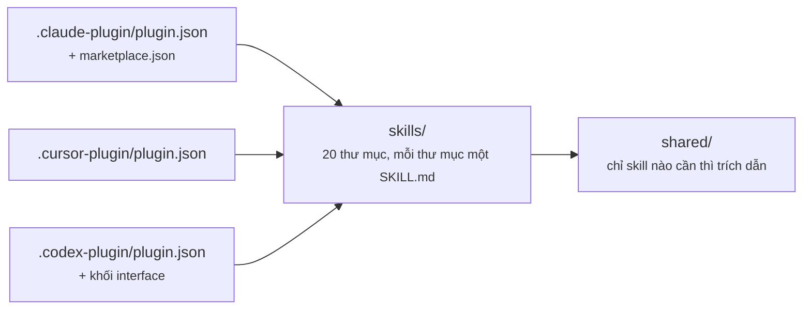
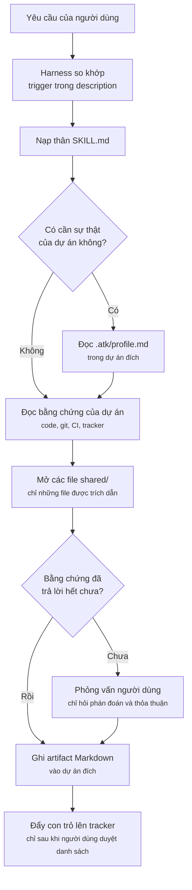

# Kiến trúc hệ thống

## Hình dạng

`atk` là nội dung cộng với manifest. Không có bước build, không bundler, không runtime: harness đọc
thẳng Markdown và JSON từ cây thư mục của repo.

```
aiteamkit/
  .claude-plugin/     plugin.json + marketplace.json     Claude Code
  .cursor-plugin/     plugin.json                        Cursor
  .codex-plugin/      plugin.json (+ khối interface)     OpenAI Codex CLI
  skills/<name>/SKILL.md        20 skill, mỗi skill một thư mục
  skills/<name>/references/*.md chi tiết nạp trễ: template, checklist, playbook
  skills/<name>/evals/*.json    bộ case kiểm trigger của description
  shared/*.md                   lớp DRY dùng chung cho các skill có trích dẫn
  hooks/                        lời nhắc profile và bộ nạp file ghi đè, chỉ Claude Code
  assets/*.svg                  icon và logo cho trang marketplace
  docs/, docs/vi/               tài liệu dự án song ngữ
  .atk/                         hồ sơ và file ghi đè của chính kit, để kit chạy skill lên chính mình
```

Không chỗ nào trong cây này mô tả dự án mà kit được cài vào. Phần đó nằm trong một file thuộc **dự án
đích**, là `.atk/profile.md`, do `atk:init` viết ra và được commit cùng dự án. Thư mục plugin chỉ đọc
và dùng chung cho mọi dự án trên máy, nên nó là chỗ sai để giữ một sự thật chỉ đúng với một dự án.

`.atk/` trong cây trên là của chính kit, chỉ đúng với `aiteamkit`, và nó nằm đó vì kit chạy skill của
mình lên chính mình. Bản cài sao nguyên repo, không manifest nào có ô để loại file ra, nên nó đến tay
mọi người cài plugin. Không skill nào đọc nó cho dự án của họ: mọi chỗ trích dẫn `.atk/` đều giải
đường dẫn từ gốc dự án đích.

## Một cây nội dung, ba manifest

Ba thư mục manifest cùng mô tả một thư mục `skills/` cho ba harness. Nội dung skill không bao giờ bị
nhân bản theo từng harness. Các manifest chỉ khác nhau ở cách khai báo nội dung:

| Manifest | Cách khai báo skill | Phần riêng của harness |
|----------|---------------------|------------------------|
| `.claude-plugin/plugin.json` | không khai báo; Claude Code tự quét `skills/` | có `marketplace.json` đi kèm |
| `.cursor-plugin/plugin.json` | `"skills": "./skills/"` | `displayName` |
| `.codex-plugin/plugin.json` | `"skills": "./skills/"` | khối `interface{}` với `defaultPrompt`, icon, `brandColor` |



Không có lớp `commands/`. Mỗi skill tự là một slash command, lấy tên từ thư mục của nó, và được
harness gắn namespace `atk:` lúc nạp dựa trên `plugin.json`.

## Mô hình nạp

Lúc khởi động, harness chỉ nạp phần frontmatter của mọi `SKILL.md`. Chính phần frontmatter đó, chủ
yếu là trường `description` với các cụm trigger, là thứ bộ định tuyến đem ra so khớp với yêu cầu của
người dùng. Phần thân `SKILL.md` chỉ được đọc sau khi skill đã được chọn.

Điều này sinh ra kỷ luật về kích thước của cả bộ kit:

| Lớp | Nạp khi nào | Ngân sách |
|-----|-------------|-----------|
| frontmatter `description` | Luôn luôn, cho cả 20 skill | Vài dòng; trigger chỉ đặt ở đây, không đặt chỗ khác |
| thân `SKILL.md` | Khi skill được gọi | Dưới 300 dòng |
| `references/*.md` | Chỉ khi một bước trong workflow mở nó | Không giới hạn, nằm ngoài đường đi mặc định |
| `shared/*.md` | Chỉ khi một skill trích dẫn nó | Nhỏ, vì nhiều skill có thể cùng mở |
| `.atk/profile.md` | Một lần mỗi lượt chạy, ở skill nào cần sự thật của dự án | Một trang gồm con trỏ và lệnh, không bao giờ là văn xuôi |

## Lớp `shared/`

Mười ba file giữ những gì các skill sẽ phải lặp lại. Ba file đầu được cả 21 skill trích dẫn:

- `shared/team-roles.md`: bảng vai trò và bảy nguyên tắc mà mọi skill tuân theo.
- `shared/artifact-paths.md`: đường dẫn output mặc định theo từng skill, quy tắc đặt tên, front matter.
- `shared/ticket-adapters.md`: cách phát hiện tracker và bảng ánh xạ từ vựng.

Tám file tiếp theo là hợp đồng giữa một nhóm skill có tên cụ thể, không phải nguyên tắc toàn kit:

- `shared/review-checklist.md`: nơi một dự án đặt quy ước của mình và thứ tự tra ra nơi đó, định
  dạng bản ghi quy tắc mà `atk:convention` viết ra và `atk:review` trích dẫn theo ID, luật rằng một
  dự án đã tự viết quy ước thì giữ nguyên hình dạng của mình, cộng với các mục nền đúng với mọi dự
  án. Nó tồn tại để một quy ước chỉ viết một lần và được kiểm bằng đúng câu chữ đó, thay vì bị chép
  lại ở cả hai skill rồi lệch nhau. Thứ tự tra nằm ở đây cũng vì lý do ấy: `docs/conventions.md` là
  giá trị mặc định chứ không phải địa chỉ, nên một skill đọc thẳng vào đó sẽ báo rằng một team có cả
  một thư mục tài liệu chuẩn là chưa ghi quy ước nào. `atk:implement` đọc file này để lấy thứ tự tra
  ấy và các mục nền, dùng khi dự án thật sự chưa ghi quy ước nào của riêng mình.
- `shared/finalize-steps.md`: trình tự khép lại một phần việc đã xong, gồm nhánh, commit, và ranh
  giới xin phép mà mọi hành động sau commit phải vượt qua. `atk:git` là thứ thi hành nó; file này
  vẫn là hợp đồng, và chính điều đó khiến nhóm skill sửa mã với nhóm skill viết tài liệu khép lại
  theo cùng một đường. Được `atk:fix`, `atk:implement` và `atk:verify` trích dẫn, ba skill giao việc
  cho `atk:git`; được `atk:plan` và `atk:tailor` trích riêng phần ranh giới xin phép; và được mọi
  skill sinh artifact trích phần nói về thay đổi chỉ tạo ra một tài liệu. Không gì rời khỏi repo cục
  bộ mà chưa được hỏi.
- `shared/layer-verification.md`: bảng năm tầng, nói chạy gì cho một tầng, một lượt chạy đạt chứng
  minh được điều gì, và không chứng minh được điều gì. Cùng ba skill đó trích dẫn. Mỗi skill chạy một
  phép kiểm rồi phải nói kết quả có nghĩa gì, và vế thứ hai đó buộc phải giống hệt nhau ở cả ba.
- `shared/diagram-conventions.md`: khi nào một sơ đồ xứng đáng có mặt trong artifact, bốn dạng hình
  mà kit vẽ, và các quy tắc giữ cho chúng dễ đọc trong một pull request ở cả nền sáng lẫn nền tối.
  Được `atk:catchup`, `atk:design-doc`, `atk:plan`, `atk:breakdown` và `atk:incident` trích dẫn, tức
  năm skill có sơ đồ trong artifact. Sơ đồ viết bằng Mermaid nên hiện ra ngay tại nơi người ta đọc
  artifact, và không phải commit thêm file ảnh nào.
- `shared/host-capabilities.md`: những khả năng sẵn có của chính agent chủ mà một skill được phép
  dùng, và cách xử lý trên harness không có chúng. Được `atk:fix`, `atk:implement` và `atk:verify`
  trích dẫn cho bước dọn mã ngay sau lượt kiểm chứng đạt, và `atk:review` trích dẫn cho những lượt
  đọc độc lập chạy song song. Nó vạch một ranh giới mà trước đây kit chỉ vạch theo một chiều: khả
  năng do chính harness cung cấp thì được gọi tên và được dùng, còn lệnh thuộc về một kit khác thì
  không, vì thứ nhất có sẵn với mọi đội đã cài atk trên harness đó, còn thứ hai thì không.
- `shared/tidy-pass.md`: dọn một thay đổi thì tìm những gì, theo ba lăng kính, kèm phần được sửa và
  phần không bao giờ đụng tới. Cùng ba skill sửa mã đó trích dẫn, thông qua `host-capabilities.md`.
  Nó tồn tại để bước dọn mã cho ra cùng một kết quả trên harness có sẵn khả năng dọn và trên harness
  mà skill phải tự đi hết danh sách. Đây cũng là lý do kit không có skill `simplify` riêng: nội dung
  này thuộc về ba skill đang chạy nó, không thuộc về một slash command chẳng sinh artifact và chẳng
  có ai duyệt.

- `shared/spec-docs.md`: điều tách một tài liệu tham chiếu khỏi một tài liệu thiết kế, hình dạng
  của ai thắng khi dự án đã giữ sẵn tài liệu của mình, năm loại thay đổi buộc pull request phải
  mang theo tài liệu tham chiếu, và ranh giới giữa chỗ lệch với câu hỏi chưa ai trả lời. `atk:spec`
  viết ra những tài liệu đó, còn `atk:design-doc`, `atk:fix`, `atk:implement`, `atk:review` và
  `atk:verify` có nghĩa vụ để chúng đúng. Đây là hợp đồng rộng nhất trong nhóm, vì
  `shared/finalize-steps.md` giờ mở đầu bằng chính nghĩa vụ ấy, nên mọi skill đổi mã nguồn đều là
  một bên của nó.
- `shared/host-file-locations.md`: cách nhận ra code host, mọi vị trí mà từng host đọc
  `CONTRIBUTING.md`, template pull request và `CODEOWNERS`, cùng lúc nào một file được tính là đã
  có. `atk:convention` dựa vào đó để biết file nào thiếu mà đề nghị soạn, `atk:git` dựa vào đó để
  tìm template phải điền. Hai skill hỏi cùng một câu từ hai đầu, và chỉ cần một bên trả lời hẹp hơn
  là repo có thêm một template thứ hai đè lên template của chính đội.

Hai file cuối mô tả những file không đi kèm kit:

- `shared/project-profile.md`: nội dung của `.atk/profile.md` bên trong **dự án đích**, và cách từng
  skill cư xử khi file đó vắng mặt. Skill nào chạy lệnh thì dừng; skill nào chỉ đọc diff thì chạy
  tiếp và nói rõ là thiếu profile; skill nào làm việc từ một tin nhắn chat thì không nhắc tới.
  `atk:init` là skill viết ra profile nên không thuộc nhóm nào.

- `shared/project-overrides.md`: nội dung của `.atk/overrides/<skill>.md` bên trong **dự án đích**,
  hai mục mà file đó được phép mang, và bảy thứ phần ghi đè không bao giờ được gỡ. Bảy điều loại trừ
  là thứ giữ cho cơ chế này không biến một bộ công cụ cho team thành trợ lý cá nhân, và một skill bỏ
  qua phần nào của file ghi đè thì nói ra trong artifact chứ không im lặng.

Cơ chế ghi đè là cơ chế duy nhất chạm tới mọi skill bằng hai nửa, và việc tách đôi là cố ý. Nguyên
tắc 7 của `shared/team-roles.md` giữ phần hành vi, viết đúng một lần. Mỗi mục `## Workflow` mang một
dòng gọi tên file ghi đè của chính nó và trỏ về nguyên tắc ấy, bởi một file shared chỉ được đọc khi
có thứ gì đó buộc skill mở nó ra, mà một câu trích dẫn nằm trong mục `## Roles` thì không buộc được.
Dòng đó tốn vài token mỗi lần gọi và đổi lấy điều chắc chắn rằng cơ chế thật sự chạy; còn đưa hẳn
phần hành vi vào 20 file thì thành 20 bản của cùng một nguyên tắc, rồi lệch nhau.

`shared/` nằm ở gốc repo chứ không nằm trong `skills/`, vì một thư mục bên trong `skills/` mà không
có `SKILL.md` sẽ gây nhập nhằng cho cơ chế quét skill. Các skill trích dẫn theo dạng
`shared/<file>.md`, tương đương `../../shared/<file>.md` tính từ một file skill; cả hai cách viết đều
có trong phần đầu của mỗi file shared. `.atk/profile.md` là ngoại lệ: nó được trích từ gốc dự án
đích, vì nó không thuộc kit.

## Hook lúc mở phiên

`hooks/hooks.json` đăng ký một hook `SessionStart` chạy `hooks/check-profile.mjs`. Script trả lời
đúng một câu hỏi, "dự án này đã có profile chưa", và nó nhắc chứ không chặn.

Ranh giới đó là toàn bộ vấn đề. Hook mà chặn thì luật nằm ở hai chỗ, mà luật này vốn không đồng nhất:
mười skill không cần profile, nên một hook chặn tất cả sẽ chặn luôn `atk:intake` biến một tin nhắn
chat thành yêu cầu, việc chẳng cần gì từ repo. Skill nào cần gì và thiếu thì làm sao, tất cả nằm
trong `shared/project-profile.md`.

Trên harness này, ranh giới còn đứng vững nhờ chính hợp đồng của nó. Claude Code ghi rõ `SessionStart`
không chặn được: mã thoát 2 cũng không sinh hành vi chặn, và mọi mã thoát đều đưa stdout vào ngữ cảnh
của mô hình. Dù vậy script vẫn thoát 0 ở mọi nhánh, và im lặng khi không có gì để nói: thư mục không
phải repo git, profile đã có sẵn, hoặc dự án này đã được nhắc rồi. Dấu "đã nhắc" ghi vào
`${CLAUDE_PLUGIN_DATA}` khi harness cung cấp biến đó, ghi vào thư mục trạng thái của người dùng khi
không, và không bao giờ ghi vào repo của người dùng hay vào một thư mục ai cũng ghi được.

### Vì sao hook viết bằng Node chứ không phải shell script

Mục này là nơi giữ lý do. `CLAUDE.md` và phần chú thích đầu script trỏ về đây chứ không chép lại.

Hook được đăng ký ở **dạng exec**: `"command": "node"` kèm mảng `args`. Claude Code ghi rõ dạng exec
tìm file thực thi trên `PATH` rồi gọi thẳng, tự thay `${CLAUDE_PLUGIN_ROOT}`, và không có shell nào
tham gia trên bất kỳ nền nào.

Điều đó quan trọng vì dạng shell không cư xử giống nhau ở mọi nơi. Claude Code chạy hook dạng shell
bằng bash, trừ trên Windows không có Git Bash thì lùi về PowerShell. Một script shell POSIX vì thế sẽ
không khởi động được ở đó, mà hook không khởi động được thì không im lặng: phiên hiện ra dòng
`Failed with non-blocking status code` kèm thông báo của trình thông dịch. Hook lại không có điều
kiện theo hệ điều hành, nên không thể đăng ký thêm một bản PowerShell mà nó không cùng lúc chạy trên
Linux và macOS. Một trình thông dịch chạy được mọi nơi là thứ duy nhất khiến ba nền cư xử như nhau.

Một giới hạn, được chấp nhận:

- **Chỉ Claude Code.** Codex và Cursor cũng đóng gói hook được, nhưng mỗi bên một bộ tên sự kiện và
  một hợp đồng đầu ra riêng, và không bên nào thử được ở đây. Lời nhắc chỉ là tiện nghi; cổng thật
  nằm trong skill và chạy y hệt nhau trên cả ba harness. Hai lớp vỏ còn lại chờ tới khi có người
  kiểm được chúng trên một harness đang chạy.

### Vì sao một hook chỉ được làm đỡ việc, không bao giờ được làm thay

Kit chạy hai hook và sẽ nhận hook thứ ba với đúng một điều kiện: thiếu nó thì kit vẫn cư xử như cũ.

`hooks/load-overrides.mjs` là trường hợp làm điều kiện ấy thành cụ thể. Nó chạy ở `PreToolUse` với
matcher `Skill` và đặt `.atk/overrides/<skill>.md` ra trước skill sở hữu file đó. Mỗi skill cũng gọi
tên chính file ấy ở đầu mục `## Workflow` của mình và tự mở khi không có gì đặt sẵn, nên Cursor và
Codex, vốn không có sự kiện tương ứng, cho ra cùng một kết quả, chỉ chậm hơn một lượt đọc file.

Hướng còn lại đã có sẵn và đã bị loại. Đặt trọn cơ chế ghi đè vào hook thì không phải sửa `SKILL.md`
nào, đổi lại hai trong ba harness không có gì cả. `shared/project-profile.md` đã từ chối đúng nước
đi đó cho luật tiền điều kiện, vì một lý do vẫn đúng ở đây và đáng nhắc lại: ba phương ngữ hook nghĩa
là ba bản của một luật, và ba bản của một luật rồi sẽ lệch nhau.

Vậy ranh giới không phải là "hook chỉ để nhắc". Ranh giới là một hook được phép làm thứ gì đó rẻ đi,
và không bao giờ được là con đường duy nhất tới thứ đó. Phép thử làm bằng máy: chạy một skill trên
một dự án có file ghi đè cho nó, một lần có mục `PreToolUse` trong `hooks/hooks.json` và một lần gỡ
mục đó ra, rồi so hai kết quả. Hai kết quả phải giống nhau.

## Giải phẫu một skill

Mọi `SKILL.md` theo cùng một thứ tự mục, cũng chính là thứ tự đọc mà một agent cần:

```
frontmatter        name, description kèm trigger, argument-hint
tiêu đề + mở đầu   skill này sinh ra gì và thói quen nào làm nó hiệu quả
## Scope           làm gì / KHÔNG làm gì, kèm tên skill tiếp quản phần còn lại
## Roles           ai viết, ai duyệt, ai được hỏi ý kiến
## Invocation      các flag, mỗi flag một dòng chú thích
## Workflow        sơ đồ ASCII, rồi từng bước được đánh số
## Output          đường dẫn artifact và danh sách mục
## Ticket          cách đưa kết quả vào tracker của team
## Definition of done   checklist skill phải thỏa trước khi báo hoàn thành
```

## Luồng dữ liệu lúc chạy



Artifact luôn được ghi vào **dự án đích**, không bao giờ ghi vào chính bộ kit atk.

## Quản lý phiên bản

Một phiên bản trải trên sáu file, năm trong số đó do `extra-files` trong
`release-please-config.json` điều khiển, còn `.release-please-manifest.json` do chính release-please
sở hữu. Workflow release chạy khi push lên `main`. Chi tiết nằm trong `CLAUDE.md`.
