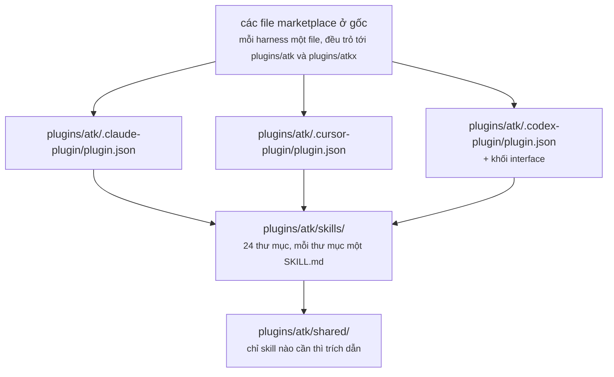
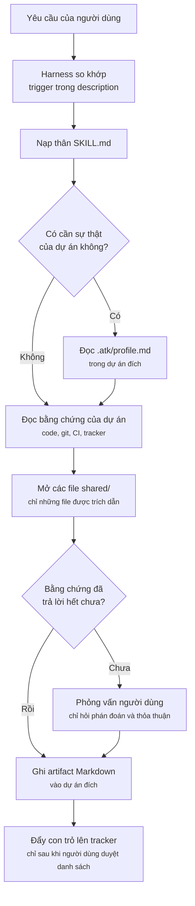

# Kiến trúc hệ thống

## Hình dạng

`atk` là nội dung cộng với manifest. Không có bước build, không bundler, không runtime: harness đọc
thẳng Markdown và JSON từ thư mục plugin.

Repo là một marketplace chứa hai plugin. `atk` nằm ở `plugins/atk/`, `atkx` nằm cạnh ở
`plugins/atkx/`, và mỗi harness tìm ra chúng qua một file marketplace ở gốc repo.

```
aiteamkit/
  .claude-plugin/marketplace.json     liệt kê atk và atkx cho Claude Code
  .cursor-plugin/marketplace.json     liệt kê atk và atkx cho Cursor
  .agents/plugins/marketplace.json    liệt kê atk và atkx cho OpenAI Codex CLI
  plugins/atk/                        plugin; bản cài sao thư mục này và không gì ở trên nó
    .claude-plugin/     plugin.json                        Claude Code
    .cursor-plugin/     plugin.json                        Cursor
    .codex-plugin/      plugin.json (+ khối interface)     OpenAI Codex CLI
    skills/<name>/SKILL.md        24 skill, mỗi skill một thư mục
    skills/<name>/references/*.md chi tiết nạp trễ: template, checklist, playbook
    skills/<name>/references/*.tsv danh sách do một file tham chiếu quản, mỗi dòng một bản ghi
    skills/<name>/evals/*.json    bộ case kiểm trigger của description
    shared/*.md                   lớp DRY dùng chung cho các skill có trích dẫn
    hooks/                        lời nhắc profile và bộ nạp file ghi đè, Claude Code và Codex
    agents/read-only-reviewer.md  agent chỉ đọc của review, phản biện và đọc rộng, Claude Code
    assets/*.svg                  icon và logo cho trang marketplace
    CHANGELOG.md                  do release-please viết cho plugin này
    LICENSE                       bản sao giấy phép ở gốc repo, vì bản cài không mang theo gì khác
  plugins/atkx/                       plugin thứ hai, ba manifest, và skills/skill-eval/
    LICENSE                       cũng bản sao đó
  docs/, docs/vi/               tài liệu dự án song ngữ
  .atk/                         hồ sơ và file ghi đè của chính kit, để kit chạy skill lên chính mình
```

Không chỗ nào trong cây này mô tả dự án mà kit được cài vào. Phần đó nằm trong một file thuộc **dự án
đích**, là `.atk/profile.md`, do `atk:init` viết ra và thường được commit cùng dự án;
`plugins/atk/shared/project-profile.md` giữ hai hình dạng mà không gì theo dõi nó. Thư mục plugin chỉ đọc
và dùng chung cho mọi dự án trên máy, nên nó là chỗ sai để giữ một sự thật chỉ đúng với một dự án.

Chỉ các thư mục plugin được phát hành, mỗi thư mục một bản riêng. Skill, file dùng chung hay hook
nào đọc một file nằm ngoài plugin của nó thì trên máy người dùng sẽ không đọc được gì, và không đường dẫn nào trong manifest được ra khỏi
nó. Vì thế `atk:init` giữ quyền duyệt mặc định theo vai trong
`plugins/atk/skills/init/references/role-defaults.md` chứ không để trong `docs/`. `.atk/` trong cây
trên là của chính kit, chỉ đúng với `aiteamkit`, và nằm đó vì kit chạy skill của mình lên chính mình;
nó ở trên thư mục plugin nên không bao giờ đến tay người dùng.

## Mỗi plugin một cây nội dung và ba manifest

Ba thư mục manifest trong `plugins/atk/` cùng mô tả một thư mục `skills/` cho ba harness, và mỗi file
marketplace ở gốc repo trỏ harness của nó tới `plugins/atk/`, và tới cả `plugins/atkx/`, nơi ba
manifest làm đúng việc đó cho thư mục `skills/` của riêng nó như mục kế tiếp mô tả. Nội dung skill không bao giờ bị nhân
bản theo từng harness. Các manifest chỉ khác nhau ở cách khai báo nội dung, và mọi đường dẫn bên
trong chúng đều tính từ thư mục plugin:

| Manifest | Cách khai báo skill | Phần riêng của harness |
|----------|---------------------|------------------------|
| `plugins/atk/.claude-plugin/plugin.json` | không khai báo; Claude Code tự quét `skills/` | được `.claude-plugin/marketplace.json` ở gốc liệt kê |
| `plugins/atk/.cursor-plugin/plugin.json` | `"skills": "./skills/"` | `displayName`; được `.cursor-plugin/marketplace.json` ở gốc liệt kê |
| `plugins/atk/.codex-plugin/plugin.json` | `"skills": "./skills/"` | khối `interface{}` với `defaultPrompt`, icon, `brandColor`; được `.agents/plugins/marketplace.json` liệt kê |


```mermaid
flowchart TD
    MK["các file marketplace ở gốc<br/><small>mỗi harness một file, đều trỏ tới plugins/atk và plugins/atkx</small>"] --> CP
    MK --> UP
    MK --> XP
    CP["plugins/atk/.claude-plugin/plugin.json"] --> SK["plugins/atk/skills/<br/><small>24 thư mục, mỗi thư mục một SKILL.md</small>"]
    UP["plugins/atk/.cursor-plugin/plugin.json"] --> SK
    XP["plugins/atk/.codex-plugin/plugin.json<br/><small>+ khối interface</small>"] --> SK
    SK --> SH["plugins/atk/shared/<br/><small>chỉ skill nào cần thì trích dẫn</small>"]
```

Không có lớp `commands/`. Mỗi skill tự là một slash command, lấy tên từ thư mục của nó, và được
harness gắn namespace `atk:` lúc nạp dựa trên `plugin.json`.

## Plugin thứ hai: atkx

`plugins/atkx/` nằm cạnh `plugins/atk/` trong cùng marketplace, có đủ ba thư mục manifest như vậy và
một skill, `skill-eval`. Nó dành cho các skill tiện ích không phụ thuộc artifact nào
và không gắn với vòng đời giao hàng. Phụ thuộc chỉ đi một chiều: skill của `atkx` được gọi skill của
`atk`, còn `atk` không bao giờ gọi skill nào của `atkx`, nên `atk` cài riêng vẫn đầy đủ. Chỗ duy
nhất `atk` nhắc tới `atkx` là `atk:help`: với câu hỏi không skill `atk` nào lo được, nó gợi ý skill
`atkx` phù hợp kèm lệnh cài. Danh sách đó nằm ở `plugins/atk/skills/help/references/atkx-skills.md`,
vì trên máy người dùng thư mục `atkx` không nằm cạnh `atk`. Trên
Claude Code, `"dependencies": ["atk"]` trong manifest của `atkx` cài `atk` theo cùng; Cursor và Codex
không có trường này, nên ở đó người dùng cài cả hai, và skill của `atkx` kiểm tra skill `atk` mà nó
gọi có mặt hay chưa rồi mới gọi. Không plugin nào đọc file của plugin kia, và không có symlink nào
nối hai plugin. Mỗi plugin là một package release riêng, gắn tag `atk-v*` và `atkx-v*`. `CLAUDE.md`,
mục "`atkx` sits beside `atk`, and the dependency runs one way", giữ các luật và tiêu chí nhận skill
đầu tiên.

## Mô hình nạp

Lúc khởi động, harness chỉ nạp phần frontmatter của mọi `SKILL.md`. Chính phần frontmatter đó, chủ
yếu là trường `description` với các cụm trigger, là thứ bộ định tuyến đem ra so khớp với yêu cầu của
người dùng. Phần thân `SKILL.md` chỉ được đọc sau khi skill đã được chọn.

Điều này sinh ra kỷ luật về kích thước của cả bộ kit:

| Lớp | Nạp khi nào | Ngân sách |
|-----|-------------|-----------|
| frontmatter `description` | Luôn luôn, cho mọi skill đã cài: 24 skill của `atk`, và skill của `atkx` khi đã cài plugin này | Vài dòng; trigger chỉ đặt ở đây, không đặt chỗ khác |
| thân `SKILL.md` | Khi skill được gọi | Dưới 300 dòng |
| `references/*.md` | Chỉ khi một bước trong workflow mở nó | Không giới hạn, nằm ngoài đường đi mặc định |
| `references/*.tsv` | Chỉ khi file tham chiếu quản nó được đọc | Mỗi dòng một bản ghi, nên nó lớn thêm từng dòng chứ không thêm văn xuôi |
| `plugins/atk/shared/*.md` | Chỉ khi một skill trích dẫn nó | Nhỏ, vì nhiều skill có thể cùng mở |
| `.atk/profile.md` | Một lần mỗi lượt chạy, ở skill nào cần sự thật của dự án | Một trang gồm con trỏ và lệnh, không bao giờ là văn xuôi |

Bên cạnh các skill có một agent đi kèm, `plugins/atk/agents/read-only-reviewer.md`. Claude Code nạp
frontmatter của nó cùng plugin và đặt tên `atk:read-only-reviewer`; phần thân chỉ được đọc khi một
skill tạo agent đó: mọi agent của `atk:review` trừ reviewer band 1, mọi lăng kính của
`atk:design-doc --challenge` và `atk:plan --challenge`, và agent mà mỗi skill trong bảy skill đọc
nhiều giao phần đọc rộng; khi thiếu kiểu agent này thì dùng agent thường với cùng prompt. Danh sách
công cụ của nó là Read, Grep và Glob. Trên Claude Code 2.1.296, agent có danh sách đó không có
công cụ Bash, Edit hay Write nào để gọi, và một lượt review cùng một lượt phản biện kế hoạch chạy ở
đó đều tạo đúng kiểu agent này cho mọi vòng và mọi lăng kính. Một mẫu trong danh sách công cụ chỉ
cho phép `git diff`, `git log` và `git blame` lại để lọt mọi lệnh khác, trong phiên chạy
`bypassPermissions`, còn một luật chặn đường dẫn `.env` trong frontmatter thì gỡ hẳn Read và Grep,
nên agent không có shell và không có luật chặn: agent gọi nó ghi diff cần đọc, đã che bằng phần quét
của `atk:git`, vào thư mục git của repository. Cursor và Codex chưa được thử: Cursor tự tìm thư mục `agents/` và file đặt
`readonly: true` cho nó, plugin của Codex không mang agent, và cả hai điều này lấy từ tài liệu của
họ, đọc ngày 2026-10-10. Trên cả hai, các prompt trong `references/` vẫn là đường đi.

## Lớp `shared/`

Mười tám file giữ những gì các skill sẽ phải lặp lại. Ba file đầu được cả 24 skill trích dẫn:

- `plugins/atk/shared/team-roles.md`: bảng vai trò và chín nguyên tắc mà mọi skill tuân theo.
- `plugins/atk/shared/artifact-paths.md`: đường dẫn output mặc định theo từng skill, cách một cây docs chia theo
  ngôn ngữ dời đường dẫn ấy, artifact rơi vào repository nào khi dự án trải trên nhiều repository,
  quy tắc đặt tên, front matter.
- `plugins/atk/shared/ticket-adapters.md`: cách phát hiện tracker và ba kết cục của nó, gồm cả kết cục tracker
  đã cấu hình nhưng không trả lời, bảng ánh xạ từ vựng, tracker nào lưu ngày mở và ngày đóng của một
  sprint, và báo cáo thế nào khi thiếu lịch sử thay đổi trường.

Mười ba file tiếp theo là hợp đồng giữa một nhóm skill có tên cụ thể, không phải nguyên tắc toàn kit:

- `plugins/atk/shared/review-checklist.md`: nơi một dự án đặt quy ước của mình và thứ tự tra ra nơi đó, định
  dạng bản ghi quy tắc mà `atk:convention` viết ra và `atk:review` trích dẫn theo ID, luật rằng một
  dự án đã tự viết quy ước thì giữ nguyên hình dạng của mình, đường đưa một khoảng trống quy ước từ
  báo cáo review về lại `atk:convention`, cộng với các mục nền đúng với mọi dự án. Nó tồn tại để một quy ước chỉ viết một lần và được kiểm bằng đúng câu chữ đó, thay vì bị chép
  lại ở cả hai skill rồi lệch nhau. Thứ tự tra nằm ở đây cũng vì lý do ấy: `docs/standards/index.md` và `docs/conventions.md`
  là giá trị mặc định chứ không phải địa chỉ, nên một skill đọc thẳng vào đó sẽ báo rằng một team có cả
  một thư mục tài liệu chuẩn là chưa ghi quy ước nào. `atk:implement` đọc file này để lấy thứ tự tra
  ấy và các mục nền, dùng khi dự án thật sự chưa ghi quy ước nào của riêng mình.
- `plugins/atk/shared/finalize-steps.md`: trình tự khép lại một phần việc đã xong, gồm nhánh, commit, ranh
  giới xin phép mà mọi hành động sau commit phải vượt qua, và thứ tự tiến hành một thay đổi trải
  trên nhiều repository. `atk:git` là thứ thi hành nó; file này
  vẫn là hợp đồng, và chính điều đó khiến nhóm skill sửa mã với nhóm skill viết tài liệu khép lại
  theo cùng một đường. Được `atk:fix`, `atk:implement` và `atk:verify` trích dẫn, ba skill giao việc
  cho `atk:git`; được `atk:plan`, `atk:tailor` và `atk:qa` trích riêng phần ranh giới xin phép; và được mọi
  skill sinh artifact trích phần nói về thay đổi chỉ tạo ra một tài liệu. Không gì rời khỏi repo cục
  bộ mà chưa được hỏi.
- `plugins/atk/shared/layer-verification.md`: bảng năm tầng, nói chạy gì cho một tầng, một lượt chạy đạt chứng
  minh được điều gì, và không chứng minh được điều gì, cùng luật về cổng: job CI nào gác một tầng, và
  một lệnh chạy ở máy yếu hơn job đó thì để lại phần nào chưa được kiểm chứng. Cùng ba skill đó trích
  dẫn. Mỗi skill chạy một phép kiểm rồi phải nói kết quả có nghĩa gì, và vế thứ hai đó buộc phải
  giống hệt nhau ở cả ba.
- `plugins/atk/shared/diagram-conventions.md`: khi nào một sơ đồ xứng đáng có mặt trong artifact, bốn dạng hình
  mà kit vẽ, và các quy tắc giữ cho chúng dễ đọc trong một pull request ở cả nền sáng lẫn nền tối.
  Được `atk:catchup`, `atk:design-doc`, `atk:plan`, `atk:breakdown`, `atk:security` và `atk:incident`
  trích dẫn, tức sáu skill có sơ đồ trong artifact. Sơ đồ viết bằng Mermaid nên hiện ra ngay tại nơi người ta đọc
  artifact, và không phải commit thêm file ảnh nào.
- `plugins/atk/shared/host-capabilities.md`: những khả năng sẵn có của chính agent chủ mà một skill được phép
  dùng, và cách xử lý trên harness không có chúng. Được `atk:fix`, `atk:implement` và `atk:verify`
  trích dẫn cho bước dọn mã ngay sau lượt kiểm chứng đạt, `atk:review` trích dẫn cho những lượt đọc
  độc lập chạy song song, `atk:design-doc` và `atk:plan` trích dẫn cho lượt phản biện của mình, và `atk:init` trích dẫn để biết một lượt hỏi được tính ra sao khi harness
  gửi được nhiều câu hỏi trong cùng một lần. Nó vạch một ranh giới mà trước đây kit chỉ vạch theo
  một chiều: khả năng do chính harness cung cấp thì được gọi tên và được dùng, còn lệnh thuộc về
  một kit khác thì không, vì thứ nhất có sẵn với mọi đội đã cài atk trên harness đó, còn thứ hai
  thì không. `atk:run-cases` trích dẫn file này cho khả năng tự động hoá trình duyệt, thứ không thuộc loại nào ở
  trên: nó được gọi theo việc nó làm, không bao giờ theo tên plugin hay server cung cấp nó, và là khả
  năng duy nhất mà thiếu nó thì một skill phải dừng, vì với skill đó trình duyệt chính là công việc,
  còn làm tay thì đã là `atk:qa --record`.
  Mục về giao phần đọc rộng cho một agent được bảy skill đọc nhiều nhất trong cây mã trích dẫn:
  `atk:init`, `atk:catchup`, `atk:spec`, `atk:convention`, `atk:security`, `atk:fix` và
  `atk:onboard`. Agent trả về kết luận kèm `path:line` chứ không trả nội dung file, nên phiên làm
  việc giữ ngữ cảnh của mình cho artifact; harness không có agent thì đọc trực tiếp và ghi rõ đã
  làm vậy.
  `atk:help` trích dẫn file này cho những gì nó được nêu tên khi một yêu cầu nằm ngoài kit, kể cả
  các skill của kit đi kèm. `plugins/atk/shared/design-sources.md` trích dẫn nó để gọi kết nối Figma
  theo việc kết nối đó làm, và `plugins/atk/shared/independent-challenge.md` trích dẫn nó cho các
  agent chỉ đọc mà một lượt phản biện tạo ra.
- `plugins/atk/shared/tidy-pass.md`: dọn một thay đổi thì tìm những gì, theo ba lăng kính, kèm phần được sửa và
  phần không bao giờ đụng tới. Cùng ba skill sửa mã đó trích dẫn, thông qua `host-capabilities.md`.
  Nó tồn tại để bước dọn mã cho ra cùng một kết quả trên harness có sẵn khả năng dọn và trên harness
  mà skill phải tự đi hết danh sách. Đây cũng là lý do kit không có skill `simplify` riêng: nội dung
  này thuộc về ba skill đang chạy nó, không thuộc về một slash command chẳng sinh artifact và chẳng
  có ai duyệt.

- `plugins/atk/shared/spec-docs.md`: điều tách một tài liệu tham chiếu khỏi một tài liệu thiết kế, tài liệu ấy
  là gì khi profile của dự án ghi `Contract: first` cùng field `implemented` cho biết code của nó đã
  có hay chưa, hình dạng của ai thắng khi dự án đã giữ sẵn tài liệu của mình, sáu loại thay
  đổi buộc pull request phải mang theo tài liệu tham chiếu, nghĩa vụ ấy trở thành gì khi tài liệu nằm ở repository khác với
  code, và ranh giới giữa chỗ lệch với câu hỏi chưa ai trả lời. `atk:spec`
  viết ra những tài liệu đó, `atk:design-doc`, `atk:fix`, `atk:implement`, `atk:review` và
  `atk:verify` có nghĩa vụ để chúng đúng, còn `atk:qa`, `atk:run-cases` và `atk:help` đọc chúng. Đây là hợp đồng
  rộng nhất trong nhóm, vì `plugins/atk/shared/finalize-steps.md` giờ mở đầu bằng chính nghĩa vụ ấy, nên mọi
  skill đổi mã nguồn đều là một bên của nó.
- `plugins/atk/shared/host-file-locations.md`: cách nhận ra code host, mọi vị trí mà từng host đọc
  `CONTRIBUTING.md`, template pull request và `CODEOWNERS`, cùng lúc nào một file được tính là đã
  có. `atk:convention` dựa vào đó để biết file nào thiếu mà đề nghị soạn, `atk:git` dựa vào đó để
  tìm template phải điền, còn `atk:init` dựa vào đó để đọc định danh host của cả đội trong
  `CODEOWNERS` thay vì tiêu một lượt hỏi. Hai skill đầu hỏi cùng một câu từ hai đầu, và chỉ cần một
  bên trả lời hẹp hơn là repo có thêm một template thứ hai đè lên template của chính đội.
- `plugins/atk/shared/design-sources.md`: cách một skill đọc design Figma qua bất kỳ kết nối Figma nào harness
  có. Kết nối được tìm theo việc nó làm được chứ không theo tên tool, và được chia thành ba trạng
  thái, vì một kết nối có thể nằm trong danh sách mà vẫn chưa đăng nhập. Khi không kết nối nào
  sẵn sàng, ảnh export thay chỗ, nên không skill nào dừng vì thiếu nó. File này cũng giữ node ID làm
  khóa ổn định của mỗi thành phần và mã băm mà một lần đọc ghi lại; nhờ hai thứ đó, lần chạy thứ hai
  chỉ đụng tới những dòng đã đổi. `atk:spec` trích dẫn nó cho kind `screen`, kind duy nhất lấy design
  làm nguồn, `atk:intake` trích dẫn nó khi yêu cầu là một design, còn `atk:qa` chỉ đọc design cho case `GUI` khi
  màn hình chưa có spec màn hình. Cũng vì file này mà `plugins/atk/shared/host-capabilities.md` có thêm một dòng cho kết nối tới dịch
  vụ bên ngoài: được nêu tên dịch vụ, nhưng không được nêu lệnh của plugin mang kết nối đó.
- `plugins/atk/shared/feature-types.md`: cách phân loại tính năng duy nhất của kit. Mỗi loại mang các câu hỏi
  mà `atk:catchup` thêm vào bài kiểm tra mức hiểu, và mức rủi ro QA mà `atk:estimate` dựa vào để
  ước lượng phần kiểm thử. Chỉ một bảng, vì nếu phân loại một kiểu khi hỏi và một kiểu khác khi
  ước lượng, cùng một tính năng sẽ là luồng thanh toán với người code nhưng chỉ là một form bình
  thường với người ước lượng phần test.
- `plugins/atk/shared/plain-writing.md`: cách viết phần lời của một report ghi lại một lần chạy, cho người đọc
  chưa mở file nào mà report trích dẫn. Gồm mục `In short` ở đầu report, năm quy tắc cho phần lời
  quanh bằng chứng, và những thứ không bao giờ đổi, trước hết là chính bằng chứng. Template report
  của `atk:fix`, `atk:verify`, `atk:review`, `atk:security` và `atk:qa --record` trích dẫn file này,
  `atk:run-cases` cũng tới đây qua hình dạng run record nó dùng lại,
  cùng mục `## Output` của `atk:incident`, vì đó là những report ghi lại một lần chạy và cần một người hành động theo. Một
  report đúng từng dòng vẫn không đọc được khi mỗi nhận định chỉ là một trích dẫn, và một quy tắc
  chép vào sáu template sẽ trôi thành sáu bản khác nhau.
- `plugins/atk/shared/independent-challenge.md`: cách đưa một bản nháp cho các agent đọc nó từ đầu
  mà không biết gì trước, mỗi agent được đưa gì và không bao giờ được đưa gì, một phản biện phải nêu
  những gì, và agent gọi trả lời từng phản biện bằng `Changed` hay `Open` ra sao. `atk:design-doc
  --challenge` trích dẫn file này với mỗi vai trò ký duyệt thiết kế là một góc nhìn, `atk:plan
  --challenge` cũng vậy với mỗi kiểu một kế hoạch có thể hỏng là một góc nhìn. Mỗi skill giữ các góc
  nhìn của mình trong một reference riêng; phần dùng chung là phần sẽ trôi dần, cho tới khi một lượt
  phản biện để agent đọc cả lập luận của tác giả.
- `plugins/atk/shared/secret-scan.md`: phần quét giá trị bí mật, một khối `sh` với bốn chế độ, cùng
  bảng những đường dẫn tự nó đã là phát hiện, cũng chính là danh sách file mà nguyên tắc 9 giữ không
  đọc. `atk:git` trích dẫn file này để đọc diff và quét những gì nó stage, `atk:security` dùng nó trên
  mọi file đã track, còn `host-capabilities.md` dùng nó cho bản diff đã che mà mọi agent được sinh ra
  đều đọc, trên mọi harness. File từng nằm trong references của `atk:git`, cho tới khi những nơi đọc
  khác biến nó thành hợp đồng giữa nhiều skill.

Hai file cuối mô tả những file không đi kèm kit:

- `plugins/atk/shared/project-profile.md`: nội dung của `.atk/profile.md` bên trong **dự án đích**, gốc dự án
  nằm ở đâu và skill đi ngược lên tìm nó ra sao, bốn hình dạng một dự án có thể mang cùng cái giá
  của parent chứa các repo thành viên và của workspace không thuộc repository nào, và cách từng
  skill cư xử khi file đó vắng mặt. Skill nào chạy lệnh thì dừng; skill nào chỉ đọc diff thì chạy
  tiếp và nói rõ là thiếu profile; skill nào làm việc từ một tin nhắn chat thì không nhắc tới.
  Một mục trong Docs, `Contract`, đổi việc skill làm chứ không đổi chỗ nó ghi, và ý nghĩa của mục
  đó nằm ở `plugins/atk/shared/spec-docs.md`.
  `atk:init` là skill viết ra profile nên không thuộc nhóm nào.

- `plugins/atk/shared/project-overrides.md`: nội dung của `.atk/overrides/<skill>.md` bên trong **dự án đích**,
  chỗ thư mục này nằm khi dự án trải trên nhiều repository, hai mục mà file đó được phép mang, và
  chín thứ phần ghi đè không bao giờ được gỡ. Chín điều loại trừ
  là thứ giữ cho cơ chế này không biến một bộ công cụ cho team thành trợ lý cá nhân, và một skill bỏ
  qua phần nào của file ghi đè thì nói ra trong artifact chứ không im lặng. File ghi đè chỉ có hiệu
  lực khi người duyệt đã chuyển nó sang `APPROVED`; trước đó skill chạy như bản gốc và ghi rõ điều
  này, vì một bản nháp mà thay đổi được mọi lần chạy thì chẳng khác gì skill tự duyệt thay cho team.

Cơ chế ghi đè là cơ chế duy nhất chạm tới mọi skill bằng hai nửa, và việc tách đôi là cố ý. Nguyên
tắc 7 của `plugins/atk/shared/team-roles.md` giữ phần hành vi, viết đúng một lần. Mỗi mục `## Workflow` mang một
dòng gọi tên file ghi đè của chính nó và trỏ về nguyên tắc ấy, bởi một file shared chỉ được đọc khi
có thứ gì đó buộc skill mở nó ra, mà một câu trích dẫn nằm trong mục `## Roles` thì không buộc được.
Dòng đó tốn vài token mỗi lần gọi và đổi lấy điều chắc chắn rằng cơ chế thật sự chạy; còn đưa hẳn
phần hành vi vào 20 file thì thành 20 bản của cùng một nguyên tắc, rồi lệch nhau.

`shared/` nằm ở gốc plugin, tức `plugins/atk/shared/`, cạnh `skills/` chứ không nằm trong nó, vì một thư mục bên trong `skills/` mà không
có `SKILL.md` sẽ gây nhập nhằng cho cơ chế quét skill. Các skill trích dẫn theo dạng
`shared/<file>.md`, tương đương `../../shared/<file>.md` tính từ một file skill; cả hai cách viết đều
có trong phần đầu của mỗi file shared. `.atk/profile.md` là ngoại lệ: nó được trích từ gốc dự án
đích, vì nó không thuộc kit.

## Hook lúc mở phiên

`plugins/atk/hooks/hooks.json` đăng ký một hook `SessionStart` chạy `plugins/atk/hooks/check-profile.mjs`, còn
`plugins/atk/hooks/codex-hooks.json` đăng ký đúng script đó trên Codex, nơi nó chạy sau khi người dùng đã
tin cậy nó trong `/hooks`. Script trả lời đúng một câu hỏi,
"dự án này đã có profile chưa", hiểu chữ dự án theo đúng cách `plugins/atk/shared/project-profile.md` hiểu, tức
là profile gần nhất ở chính thư mục phiên mở lên hoặc ở trên nó, và nó nhắc chứ không chặn.

Ranh giới đó là toàn bộ vấn đề. Hook mà chặn thì luật nằm ở hai chỗ, mà luật này vốn không đồng nhất:
mười skill không cần profile, nên một hook chặn tất cả sẽ chặn luôn `atk:intake` biến một tin nhắn
chat thành yêu cầu, việc chẳng cần gì từ repo. Skill nào cần gì và thiếu thì làm sao, tất cả nằm
trong `plugins/atk/shared/project-profile.md`.

Trên harness này, ranh giới còn đứng vững nhờ chính hợp đồng của nó. Claude Code ghi rõ `SessionStart`
không chặn được: mã thoát 2 cũng không sinh hành vi chặn, và mọi mã thoát đều đưa stdout vào ngữ cảnh
của mô hình. Dù vậy script vẫn thoát 0 ở mọi nhánh, và im lặng khi không có gì để nói: thư mục không
phải repo git, profile đã có sẵn, hoặc dự án này đã được nhắc rồi. Dấu "đã nhắc" ghi vào
`${CLAUDE_PLUGIN_DATA}` khi harness cung cấp biến đó, ghi vào thư mục trạng thái của người dùng khi
không, và không bao giờ ghi vào repo của người dùng hay vào một thư mục ai cũng ghi được.

### Vì sao hook viết bằng Node chứ không phải shell script

Mục này là nơi giữ lý do. `CLAUDE.md` và phần chú thích đầu script trỏ về đây chứ không chép lại.

Trong `plugins/atk/hooks/hooks.json`, tức bản đăng ký mà Claude Code đọc, hook nằm ở **dạng exec**:
`"command": "node"` kèm mảng `args`. Claude Code ghi rõ dạng exec tìm file thực thi trên `PATH` rồi
gọi thẳng, tự thay `${CLAUDE_PLUGIN_ROOT}`, và không có shell nào tham gia trên bất kỳ nền nào. Codex
cần hình dạng ngược lại, vì lý do mục kế tiếp nêu dưới tiêu đề "Vì sao Codex có file đăng ký riêng";
script thì vẫn là một.

Điều đó quan trọng vì dạng shell không cư xử giống nhau ở mọi nơi. Claude Code chạy hook dạng shell
bằng bash, trừ trên Windows không có Git Bash thì lùi về PowerShell. Một script shell POSIX vì thế sẽ
không khởi động được ở đó, mà hook không khởi động được thì không im lặng: phiên hiện ra dòng
`Failed with non-blocking status code` kèm thông báo của trình thông dịch. Hook lại không có điều
kiện theo hệ điều hành, nên không thể đăng ký thêm một bản PowerShell mà nó không cùng lúc chạy trên
Linux và macOS. Một trình thông dịch chạy được mọi nơi là thứ duy nhất khiến ba nền cư xử như nhau.

### Vì sao Codex có file đăng ký riêng

Mặc định Codex vẫn đọc `hooks/hooks.json` trong thư mục gốc của plugin, nên mục dạng exec ở trên
không hề bị bỏ qua ở đó: nó được chạy với đường dẫn chưa được thay, và mọi phiên Codex đều mở ra
bằng một hook khởi động hỏng. Hai harness thay gốc plugin ở hai thời điểm khác nhau. Claude Code tự
thay `${CLAUDE_PLUGIN_ROOT}` trong `args`; Codex thay `${PLUGIN_ROOT}` và `${CLAUDE_PLUGIN_ROOT}`
trong chuỗi `command` và không thay gì trong `args`, nên Node nhận đúng chuỗi
`${CLAUDE_PLUGIN_ROOT}/hooks/check-profile.mjs`, hiểu nó là đường dẫn tương đối so với thư mục làm
việc, rồi thoát với `MODULE_NOT_FOUND`.

`plugins/atk/hooks/codex-hooks.json` giữ đúng hai hook đó với đường dẫn nằm trong `command`, và khóa `hooks`
trong `plugins/atk/.codex-plugin/plugin.json` trỏ Codex tới file này, cũng chính là thứ khiến Codex thôi đọc file
của Claude Code. Phần script không đổi: vẫn hai file Node đó, vẫn đọc cùng một bộ biến môi trường, và
không file đăng ký nào mang luật. Lần đo đầu tiên trên codex-cli 0.155.1: repo chưa có profile thì
nhận được lời nhắc và hook chạy xong, repo đã có thì im lặng, và dấu "đã nhắc" ghi vào thư mục dữ
liệu plugin mà Codex cấp qua `CLAUDE_PLUGIN_DATA`.

Đo lại ngày 2026-10-10 trên codex-cli 0.162.0, bản này thêm một điều kiện: Codex bỏ qua hook của
plugin cho tới khi người dùng tin cậy chúng. Ngay sau khi cài, `/hooks` liệt kê cả hai, mục
`SessionStart` và mục `PreToolUse`, là cần duyệt, và TUI mở ra bằng lời nhắc "Hooks need review".
Chưa được tin cậy thì không hook nào chạy, kể cả với `codex exec`: repo chưa có profile không nhận
được lời nhắc và không có dấu nào được ghi. Tin cậy chúng, từ lời nhắc đó hoặc từ `/hooks`, sẽ ghi
vào `config.toml` của người dùng một mục `hooks.state` kèm `trusted_hash` cho mỗi hook, và hook nào
thay đổi thì phải duyệt lại. Từ đó trở đi, repo chưa có profile nhận lời nhắc trong ngữ cảnh của
phiên ngay lượt đầu, dấu "đã nhắc" nằm trong thư mục dữ liệu plugin, còn repo đã có profile thì im
lặng, như lần đo trước trên 0.155.1. Khóa `hooks` trong manifest là dạng mà tài liệu của Codex nay gọi là legacy;
0.162.0 vẫn đọc nó, vì các hook được liệt kê mang khóa `atk@atk:hooks/codex-hooks.json`, nên manifest
giữ nguyên. Codex không đặt `CLAUDE_PROJECT_DIR`, và điều đó không mất gì, vì
cả hai script vốn lùi về thư mục làm việc còn Codex chạy hook từ gốc workspace.

Hai giới hạn, được chấp nhận:

- **Chưa có lớp vỏ cho Cursor.** Cursor cũng đóng gói hook được, nhưng hợp đồng sự kiện của nó không
  thử được ở đây, và Cursor không đọc file nào trong hai file trên. Lời nhắc chỉ là tiện nghi; cổng
  thật nằm trong skill và chạy y hệt nhau trên cả ba harness. Lớp vỏ đó chờ tới khi có người kiểm
  được nó trên một harness đang chạy.
- **Mục `PreToolUse` cho Codex mới là đăng ký, chưa quan sát được.** Chưa xác nhận được trên một
  phiên đang chạy rằng Codex gọi tên công cụ nào khi gọi skill, nên bộ nạp file ghi đè có thể không
  bao giờ khớp ở đó. Đúng đó là mức lùi mà `load-overrides.mjs` được dựng cho: mỗi skill tự mở file
  ghi đè của mình khi không có gì đặt sẵn trước nó.

### Vì sao một hook chỉ được làm đỡ việc, không bao giờ được làm thay

Kit chạy hai hook và sẽ nhận hook thứ ba với đúng một điều kiện: thiếu nó thì kit vẫn cư xử như cũ.

`plugins/atk/hooks/load-overrides.mjs` là trường hợp làm điều kiện ấy thành cụ thể. Nó chạy ở `PreToolUse` với
matcher `Skill` và đặt `.atk/overrides/<skill>.md` ra trước skill sở hữu file đó. Mỗi skill cũng gọi
tên chính file ấy ở đầu mục `## Workflow` của mình và tự mở khi không có gì đặt sẵn, nên harness nào
hook không với tới được cũng cho ra cùng một kết quả, chỉ chậm hơn một lượt đọc file. Cursor không có
sự kiện tương ứng; Codex có mục này trong `plugins/atk/hooks/codex-hooks.json` nhưng chưa ai thấy nó khớp một lần
gọi skill nào, đúng như phần giới hạn đã chấp nhận ở trên ghi lại.

Hướng còn lại đã có sẵn và đã bị loại. Đặt trọn cơ chế ghi đè vào hook thì không phải sửa `SKILL.md`
nào, đổi lại hai trong ba harness không có gì cả. `plugins/atk/shared/project-profile.md` đã từ chối đúng nước
đi đó cho luật tiền điều kiện, vì một lý do vẫn đúng ở đây và đáng nhắc lại: ba phương ngữ hook nghĩa
là ba bản của một luật, và ba bản của một luật rồi sẽ lệch nhau.

Vậy ranh giới không phải là "hook chỉ để nhắc". Ranh giới là một hook được phép làm thứ gì đó rẻ đi,
và không bao giờ được là con đường duy nhất tới thứ đó. Phép thử làm bằng máy: chạy một skill trên
một dự án có file ghi đè cho nó, một lần có mục `PreToolUse` trong `plugins/atk/hooks/hooks.json` và một lần gỡ
mục đó ra, rồi so hai kết quả. Hai kết quả phải giống nhau.

## Giải phẫu một skill

Mọi `SKILL.md` theo cùng một thứ tự mục, cũng chính là thứ tự đọc mà một agent cần:

```
frontmatter        name, description kèm trigger, argument-hint
tiêu đề + mở đầu   skill này sinh ra gì và thói quen nào làm nó hiệu quả
## Scope           làm gì / KHÔNG làm gì, kèm tên skill tiếp quản phần còn lại
## Roles           ai viết, ai duyệt, ai được hỏi ý kiến
## Invocation      các flag, mỗi flag một dòng chú thích
## Workflow        sơ đồ ASCII, rồi từng bước được đánh số
## Output          đường dẫn artifact và danh sách mục
## Ticket          cách đưa kết quả vào tracker của team
## Definition of done   checklist skill phải thỏa trước khi báo hoàn thành
```

Một skill của `atk` gồm file đó, `references/` và `evals/`, không có gì để chạy. `atkx:skill-eval`
là skill duy nhất có thêm thư mục `scripts/`, viết bằng Node như hook và cùng lý do. Các skill mẫu
của nó phải nhận cùng một kết luận ở mọi lần chạy, trong khi che một credential, so một host với
`SKILL.md`, hay cộng một điểm có trọng số thì mỗi lần agent làm lại ra một chút khác. Vì vậy phép
kiểm tra nào cần ra kết quả lặp lại được viết thành script, còn phần cần đọc hiểu nằm trong
`references/`. ADR 0002 ghi lại lựa chọn này.

## Luồng dữ liệu lúc chạy


```mermaid
flowchart TD
    U["Yêu cầu của người dùng"] --> T["Harness so khớp<br/>trigger trong description"]
    T --> S["Nạp thân SKILL.md"]
    S --> P{"Có cần sự thật<br/>của dự án không?"}
    P -->|Có| PR["Đọc .atk/profile.md<br/><small>trong dự án đích</small>"]
    P -->|Không| EV
    PR --> EV["Đọc bằng chứng của dự án<br/><small>code, git, CI, tracker</small>"]
    EV --> SR["Mở các file shared/<br/><small>chỉ những file được trích dẫn</small>"]
    SR --> Q{"Bằng chứng đã<br/>trả lời hết chưa?"}
    Q -->|Chưa| IV["Phỏng vấn người dùng<br/><small>chỉ hỏi phán đoán và thỏa thuận</small>"]
    Q -->|Rồi| W
    IV --> W["Ghi artifact Markdown<br/><small>vào dự án đích</small>"]
    W --> TK["Đẩy con trỏ lên tracker<br/><small>chỉ sau khi người dùng duyệt danh sách</small>"]
```

Artifact luôn được ghi vào **dự án đích**, không bao giờ ghi vào chính bộ kit atk.

## Quản lý phiên bản

Mỗi plugin là một package release riêng trong `release-please-config.json`, gắn tag `atk-v*` và
`atkx-v*`. Version của một package nằm trong ba file `plugin.json` của nó, với `atk` thêm
`package.json` ở gốc, tất cả do `extra-files` của package đó điều khiển, còn
`.release-please-manifest.json` do chính release-please sở hữu. Các file marketplace không mang
version. Workflow release chạy khi push lên `main`. Chi tiết nằm trong `CLAUDE.md`.
