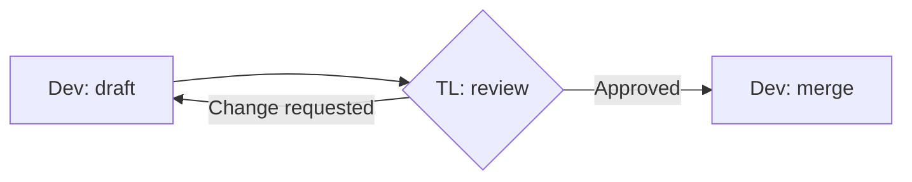
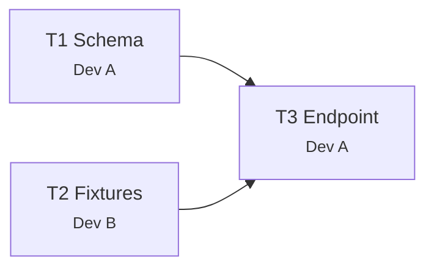
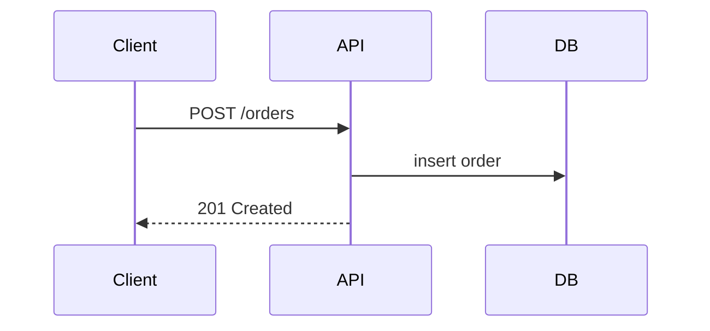
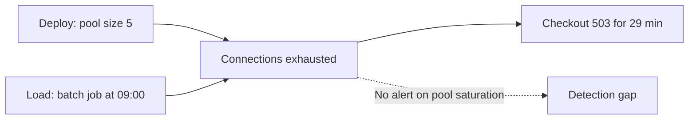

# Diagram conventions

Shared drawing convention for every `atk` skill that puts a diagram in an artifact. Referenced from
`skills/<name>/SKILL.md` as `shared/diagram-conventions.md`, which is
`../../shared/diagram-conventions.md` relative to a skill file.

Artifacts are Markdown read in a pull request, a tracker comment, or a repository browser. All three
render Mermaid and none render an image the author forgot to commit, so a diagram in an atk artifact
is a fenced `mermaid` code block and nothing else. No image file, no ASCII art, no link to a drawing
tool the reader has no account for.

## When a diagram earns its place

Draw one when the shape of the thing is the point: an order that loops back, a fan-out into parallel
lanes, a handoff between roles, a sequence across services. Everything else is a table or a list,
which is searchable, diffable, and does not go stale silently.

Two rules keep a diagram honest:

- **Never the only carrier of a fact.** Owners, dates, paths, and criteria live in the prose or the
  table. A reader who skips the diagram must lose nothing but convenience.
- **One idea per diagram.** A picture that needs a paragraph to decode is two pictures.

## The four shapes

**Approval flow.** Any lifecycle where an artifact is reviewed. The review is a decision node with
both branches drawn, because the loop back is the part teams forget to plan for.

**Dependency graph.** Which task unblocks which, used by `atk:breakdown`. Node id is the task id
from the table, so the diagram and the table are checkable against each other.

**Sequence.** A call path across services or components, used by `atk:design-doc`, and by
`atk:security` for a request that crosses several trust boundaries. Participants are systems, not
people.

**Causal chain.** What led to what, used by `atk:incident`. The clock-ordered timeline stays a
table, because a reader checks it against a log line by line; the diagram shows the causation a
table cannot, including where detection should have fired and did not.

## Rules that keep them readable

- **Break lines with ` `.** It is the documented line break. A literal `\n` inside a label
  depends on the renderer and shows up as two characters where it does not work.
- **Quote every label.** `A["Dev: draft"]` survives the punctuation that `A[Dev: draft]` does not.
- **Name roles, never people.** `TL: review`, not a person's name. Roles come from
  `shared/team-roles.md` and stay true after the person moves team. The one place a name belongs is
  the owner column of the table beside the diagram.
- **Both branches, or no decision node.** A diamond with only the happy path out of it is a
  rectangle that is lying.
- **No hardcoded fill colours.** `style N fill:#e8f5e9` is black text on pale green in a dark theme,
  which is most readers on a tracker at night. Group with `subgraph` instead; where a distinction
  genuinely needs colour, use `classDef` with a stroke and let the theme pick the background.
- **Keep labels to a few words.** The sentence goes in the prose under the diagram.

## Which skills draw what

| Skill | Diagram | Where |
|-------|---------|-------|
| `catchup` | Approval flow or sequence, only where the feature crosses roles or services | In the brief, under section 4 |
| `design-doc` | Sequence and component diagrams for the chosen option | Beside the option it belongs to |
| `plan` | Phase order, only when phases are not a straight line | In the plan index, not in a phase file |
| `breakdown` | Dependency graph, with the task ids from the table | After the task table |
| `security` | Sequence, only where a request crosses more than two trust boundaries | In the threat model, under Data flow |
| `incident` | Causal chain | Under the root cause section, beside the timeline table and never instead of it |

A skill not in this table does not add a diagram to its artifact. Prose and tables are the default;
this file lists the exceptions.
